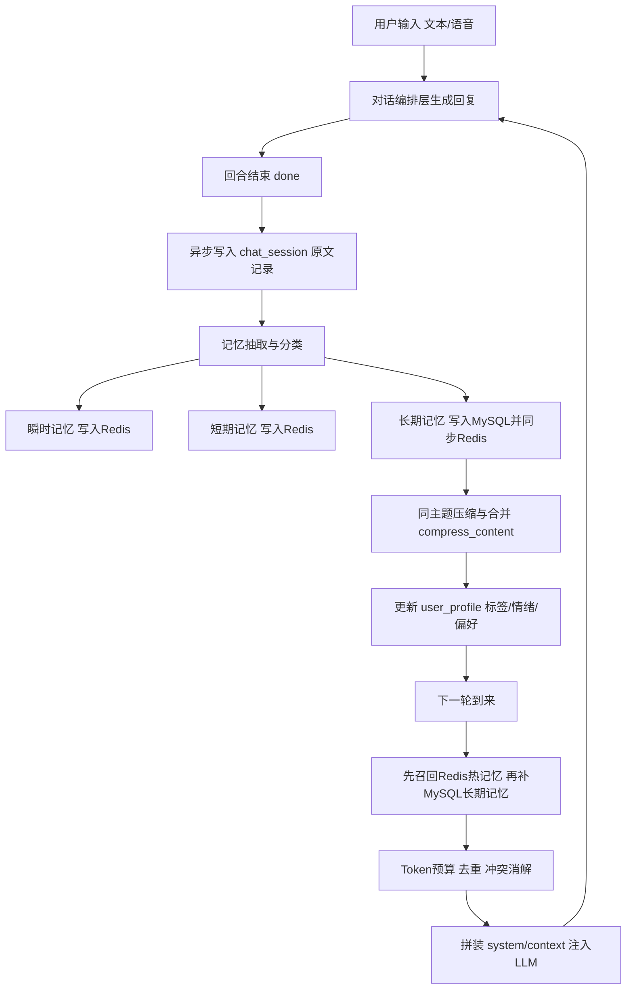
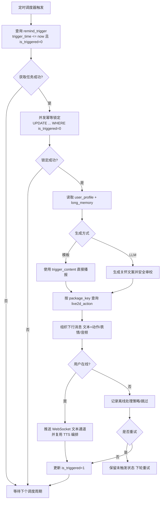

# 学士学位论文正文内容稿

> **排版说明**  
> 全文定稿后须使用北京语言大学教务处规定的《本科生毕业论文》统一模板排版：封面、题名页、原创性声明与知识产权声明、目录与中英文摘要的页码分节、页眉自正文起启用、参考文献与致谢格式等，均应以《论文排版注意事项》及《本科生毕业论文（设计）写作规范》为准。本文 `.md` 稿仅承载章节文字，**不替代** Word 中的字体、行距与标题样式。  
> **题名与作者信息（提交前请全部替换为本人真实信息）**  
> 论文题目：情感交互视角下 Live2D 数字人系统的设计与实现  
> Design and Implementation of a Live2D Digital Avatar System from an Affective Interaction Perspective  
> 学生姓名：□□□　学号：□□□□□□□□　院系：信息科学学院　专业：□□□□□□  
> 指导教师：□□□（仅姓名）　论文完成日期：2026 年 6 月

---

## 中文摘要

本研究聚焦于面向大学生情感支持场景的 Live2D 数字人系统，旨在搭建一条连接情感交互需求与可落地工程实现的“记忆—关怀”闭环路径。论文不再停留于单轮对话体验，而是从交互连续性出发，围绕分层记忆、用户画像与主动关怀机制，系统梳理数字人从被动应答走向长期陪伴的设计逻辑；并在系统架构层面分析前端形象呈现、后端推理编排与数据管理之间的协同关系。技术层面，研究完成了多模态交互主链路与结构化数据底座的实现，形成可复用的模块化方案。实证结果表明，该系统能够有效提升对话的连贯性与情境一致性，并为后续定时关怀与个性化触达提供可扩展基础；同时，记忆自动注入与主动推送仍受部署与调度机制约束，需在后续迭代中继续完善。该研究为情感数字人的工程化实践与持续优化提供了可验证的实现框架。

**关键词：** 情感交互；数字人；Live2D；多模态交互；Web 系统；人机交互

---

## Abstract

This study focuses on a Live2D digital human system for emotional support scenarios among college students, aiming to construct a closed-loop "memory-care" pathway linking emotional interaction demands with implementable engineering practices. Rather than remaining limited to single-round dialogue experience, the paper proceeds from interactive continuity, systematically sorting out the design logic of digital humans evolving from passive responses to long-term companionship around hierarchical memory, user portraits and active care mechanisms. At the system architecture level, it analyzes the collaborative relationship among front-end image presentation, back-end reasoning orchestration and data management. Technically, the research realizes the main multimodal interaction pipeline and structured data foundation, forming reusable modular solutions. Empirical results demonstrate that the system effectively improves dialogue coherence and situational consistency, and provides an extensible foundation for subsequent scheduled care and personalized outreach. Meanwhile, automatic memory injection and active push are still restricted by deployment and scheduling mechanisms, which require further improvement in subsequent iterations. This research provides a verifiable implementation framework for the engineering application and continuous optimization of emotional digital humans.

**Key Words:** affective interaction; digital human; Live2D; multimodal interaction; Web system; human-computer interaction

---

## 目录（结构核对用）

> 正式稿件中，目录应由 Word **根据标题样式自动生成**，不得手工录入页码。下列章节名供与模板目录级别核对一致。

第一章　引言  
第二章　相关技术与开发环境  
第三章　系统需求分析与总体设计  
第四章　系统关键模块的设计与实现  
第五章　系统测试与结果分析  
第六章　结论  
参考文献  
致谢  
附录（必要时）

---

## 第一章　引言

### 1.1 研究背景与意义

人机对话系统从规则型问答发展到基于深度学习的开放域对话，交互渠道也从键盘输入拓展到语音与多模态。用户在教育辅导、导览讲解、娱乐陪伴等场景中，不仅关心回答是否正确，还关心交互是否自然、信息呈现是否友好。数字人界面通过在屏幕上呈现可动的虚拟角色，把“谁在回答”可视化，有助于提升信任感与专注度。

结合本课题关注的大学生群体：**学业压力、社交孤独与情绪支持需求**使“可长期陪伴、能记住用户”的交互形态具有现实动机。涉及人群心理状况的定量表述须在定稿中引用可溯源文献或权威报告；本文在问题陈述层面仅建立问题域与系统设计之间的对应关系：本系统在工程上为“记住偏好—适时关怀—形象化反馈”提供数据结构与接口基础，**不**承担专业心理咨询职能。

在 Web 环境下实现数字人，需要兼顾**跨平台部署**、**实时性**与**开发维护成本**。三维引擎方案效果丰富但对终端性能与资源体积要求较高；Live2D Cubism 以二维网格变形实现角色动画，配合官方 Web 组件可在桌面与移动端浏览器中较稳定运行。另一方面，单次 HTTP 请求难以承载长文本流式输出与连续音频推送，**WebSocket** 全双工通信更适合将语言模型的增量结果与语音合成片段实时送达客户端。

因此，研究并实现一个以 Live2D 为呈现载体、以 WebSocket 为通信骨架、后端对接大模型与 TTS、并具备情感记忆与主动关怀数据层设计的 Web 数字人系统，具有一定的工程实践价值，也可作为探索多模态人机交互与对话系统架构的参考案例。

### 1.2 国内外研究现状简述

国际上，虚拟角色驱动与图形引擎研究成熟，商业与开源方案并存；在 Web 端，基于 WebGL 的渲染与基于 Web Audio 的播放已形成标准能力。国内在智能客服、数字员工、虚拟主播等领域落地较多，典型路径是“语音识别—自然语言理解—对话管理—语音合成—形象驱动”。与本课题直接相关的技术要点包括：流式文本生成的前端展示、唇形或表情动作与语音的同步、弱网环境下的重连与缓冲策略等。现有公开资料中，完整可运行、前后端边界清晰的教学型实现相对分散，本文以本课题软件工程实践为主线归纳设计与实现要点。

在学术与工程交汇处，近年来大模型推动了“工具调用 + 多模态输出”的范式迁移：模型不仅能生成文本，还能触发外部系统执行检索、计算与下单等动作。对数字人前端而言，这意味着表现层指令的来源从“手工规则”扩展到“模型结构化输出”，但同时也带来**可控性与安全性**挑战：若把动作执行权限放得过宽，错误输出可能造成不雅动作或越权操作。本文采用的策略是“白名单 + 服务端校验”思路的客户端侧体现：前端只接受服务端明确给出的表情与动作字段，并将其映射到 Live2D 已存在资源集合中；未经 `服务端`确认的资源名不应被执行。

### 1.3 研究内容与论文结构

本文以 **CubismDemo** 工程为依托，完成以下工作：

（1）**前端**：梳理 Live2D Cubism Web 参考工程结构，实现双栏布局、流式字幕、模型包与背景轮换、语音采集与 ASR 链路、登录态与 API 基址持久化；  
（2）**实时对话服务端**：基于 FastAPI 实现 WebSocket 会话配对与 支持用户通过统一接口上传 Live2D 模型压缩包，服务端自动完成解包、资源扫描与结构化入库，并结合 Ollama 动作/表情决策、聊天流式生成与 GPT-SoVITS 切段合成，由并行 worker 保序下发音频；  
（3）**数据与业务 API**：设计 MySQL 表结构（用户、对话、分层记忆字段、画像、主动关怀触发、人设、动作语义映射、模型资源索引、系统配置），并在 `/api/` 路径树下提供 CRUD 与待扫描触发器查询等接口；  
（4）**记忆—关怀闭环的业务设计**：给出“记忆存储—条件扫描—记忆召回—生成关怀—Live2D 呈现”的闭环说明，并在文中明确**已实现模块**与**尚待接入对话主链路**的边界。

论文结构如下：第二章介绍相关技术与环境；第三章给出需求、闭环设计与数据库方案；第四章分前端、WebSocket 编排、资源索引与持久化 API 描述实现；第五章记录测试与讨论；第六章总结全文并展望记忆注入与主动推送等后续工作。

### 1.4 研究范围与实现边界说明

本工程包含可运行的前后端与数据库脚本，但**系统目标能力**与**当前代码路径**未必一一对应。表 1.1 对二者关系作集中说明，以保证**论述可检验、与实现一致**。

**表 1.1　系统目标能力与当前实现范围对照（摘要）**

| 能力域           | 目标描述                           | 实现状态（截至本文撰写时）                                           |
| ------------- | ------------------------------ | ------------------------------------------------------- |
| 多模态对话与形象驱动    | ASR → LLM → TTS → Live2D 表情/动作 | **已实现**：语音识别 WebSocket、对话与 TTS 编排及前端渲染与播放               |
| 双通道实时性        | WebSocket；文本与音频分路              | **已实现**：`/ws/chat负责发送文本和动作` 与 `/ws/tts负责发送音频`           |
| 用户身份          | 用户注册与用户标识管理                    | **已实现**：用户创建接口、登录子页面与浏览器本地存储                            |
| 对话与记忆落库       | 对话会话表、长期记忆表等                   | **表结构与 API 已实现**；设计口径为“长期记忆写 MySQL 并同步 Redis”，自动持久化接线待补 |
| 画像与标签         | 用户画像表                          | **表结构与 API 已实现**；**未**随每轮对话自动更新画像                       |
| 主动关怀          | 主动关怀触发表、定时扫描                   | **表结构与 API 已实现**（含待扫描查询）；**未**实现常驻定时任务向浏览器推送关怀消息        |
| 瞬时/短期记忆 Redis | Redis 缓存多轮上下文                  | **设计口径**：瞬时/短期记忆仅写 Redis；当前工程 Redis 链路待接入               |
| 知识图谱          | 自动抽取实体关系                       | **未实现独立图数据库**；长期记忆表中事件关联等字段可作为后续演进的结构化基础                |

正文对算法内部细节（具体声码器结构、某一 LLM 的微调方法等）仍保持适度抽象，以符合本科论文篇幅与写作规范；同时将后端划分为对话编排、资源索引、合成客户端与数据服务等逻辑模块，并说明主要消息类型与配置项，以保证论述可理解、可复现。

同时需要说明，数字人系统的最终体验是“算法 + 工程 + 内容”的乘积：同样一套框架，在不同模型资源与对话策略下主观感受差异很大。本文不把用户主观满意度作为严格量化结论；涉及心理健康议题时，强调系统定位为**辅助陪伴工具**，不能替代专业干预。

---

## 第二章　相关技术与开发环境

### 2.1 Live2D Cubism 与 Web 渲染

Live2D Cubism 将静态立绘拆分为可变形网格，通过参数控制实现表情与肢体动作。Cubism Web Framework 提供模型加载、更新循环、运动（Motion）与表情（Expression）播放等能力。示例应用通常以框架提供的入口委托类驱动：在初始化阶段创建画布与子代理，在帧循环中更新与绘制。模型资源以目录形式组织，包含模型描述文件、纹理与动作数据等。

从资源组织角度看，模型描述文件给出模型引用关系与参数标识，动作文件记录关键帧曲线，贴图则承担外观细节。Web 端加载时需关注跨域与缓存：在开发服务器上若路径映射不正确，常出现“模型空白但控制台无明确报错”的现象，因此本项目将 Live2D 资源置于构建输出的公开静态目录并统一 URL 前缀，减少资源定位错误。渲染循环方面，帧更新通常包括物理/惯性（若启用）、参数插值、贴图与网格提交等步骤；当对话系统频繁触发短动作时，需要注意动作优先级与打断策略，否则可能出现“表情未恢复默认就叠加新指令”的杂乱观感。官方示例通过优先级常量进行约束，本论文在实现层遵循该思想，并在测试章节提醒读者关注连续指令场景。

### 2.2 Vite 与模块化前端工程

本项目使用 Vite 作为开发与构建工具，利用 ES Module 进行依赖管理与按需打包，在开发阶段提供较快的热更新体验。静态资源置于前端工程的公开资源目录下，由构建工具映射到站点根路径，便于 Live2D 以 URL 方式加载。

在工程实践中，Vite 的环境变量以 `VITE_` 前缀暴露给客户端，这一机制与本项目的 WebSocket 基地址配置天然契合：同一份代码在实验室、宿舍与云主机上可通过不同 `.env` 切换目标，而无需改动业务逻辑。需要注意的是，任何写入 `import.meta.env` 的值最终都会进入打包产物，因此**不可**把真正的私钥或长期令牌放在此类变量中；本论文涉及的密钥应全部留在服务端，前端仅保存会话标识或短期令牌，并在正文再次强调安全边界。

### 2.3 WebSocket 与流式协议

WebSocket 在单一 TCP 连接上提供全双工通道，适合推送增量数据。本文系统中，文本通道传输 JSON 消息，类型包括资源同步信息、增量文本 `chunk`、结束标记 `done` 与错误 `error`；音频通道在 JSON 元数据之后传输二进制 WAV 分段。客户端需处理异步到达、断线重连与并发播放队列。

### 2.4 浏览器音频与语音识别

录音通过浏览器API采集麦克风音频，语音识别由识别引擎是阿里云（DashScope Fun-ASR）实现；本项目的 `SpeechRecognition` 与 `AudioRecorder` 工具模块对能力探测、开始/停止与回调进行了封装，以便主流程保持可读性。

### 2.5 开发与运行环境

实验与运行环境为现代桌面浏览器。后端默认假设为本地 `ws://localhost:8000`，可通过环境变量 `VITE_WS_BASE`、`VITE_CHAT_TTS_WS_URL`、`VITE_ASR_WS_URL` 覆盖，以适配不同部署拓扑。

### 2.6 流式人机对话与多模态呈现的关系

从信息架构角度看，用户完成一次完整交互至少需要三类信息通道：**意图通道**（文本或语音转写）、**认知通道**（模型生成的回答内容）与**情感/注意力通道**（表情、动作、语调）。在带宽与算力受限的 Web 场景中，三类通道往往并不同步到达：语言模型可以先给出前缀文本，语音合成可以按句或按段滞后生成，而视觉层又必须在收到结构化指令后才能切换表情。若把三类数据混在同一 HTTP 响应体中，客户端只能“全部收到再展示”，难以满足实时对话体验。将文本与音频拆分为两个 WebSocket，本质上是在协议层为不同延迟容忍度的媒体选择不同的推送节奏：文本对首包时延敏感，音频对连续性与抖动更敏感。Live2D 层则扮演“表现层状态机”的角色，把离散的 `expression`/`motion` 指令映射为可在帧循环中插值或混合的参数变化，这一解耦有利于后续替换不同供应商的 LLM 或 TTS 而尽量少改前端。

### 2.7 与本项目相关的质量属性

可用性方面，界面采用左侧会话、右侧角色的分区布局，符合用户“边聊边看”的注意分配习惯；工具栏折叠可减少对画面主体的遮挡。可靠性方面，自动重连与切换模型时的连接整流，降低了异步网络环境下状态错配的概率。可移植性方面，资源路径与 WebSocket 基地址均可配置，便于部署至局域网或云主机。安全性方面，浏览器同源策略与混合内容限制要求在生产环境使用 `wss://` 与 HTTPS；本系统当前实验环境以本地联调为主，正文对前端 `localStorage` 方案的适用边界予以说明，**不**将其等同于生产级身份认证方案。

### 2.8 Web 前端数字人系统的典型架构模式归纳

结合业界常见实践，可以把 Web 数字人系统概括为三种耦合模式：**紧耦合模式**把渲染、对话与语音全部写在一个页面脚本中，上手快但难以测试与替换；**中耦合模式**以 ES Module 拆分通信、渲染与 UI，接口以函数或事件总线连接，是中小型系统的常见选择；**松耦合模式**进一步引入状态管理、消息队列甚至微前端拆分，适合大型团队但复杂度高。本课题采用中耦合模式：通信层对外暴露发送与重连函数，渲染层通过委托对象暴露动作应用接口，从而降低“改一处而动全身”的风险。该选择也意味着：若未来要接入多角色并行、场景切换或 3D 引擎，需要引入更高层的状态机与资源预加载策略，本文在结论部分给出方向性提示。

### 2.9 Python 服务端与 FastAPI

服务端以 FastAPI 构建应用入口，在生命周期启动阶段预热默认模型包资源索引；通过路由组件挂载 WebSocket 与数据访问层 HTTP 接口，并配置 CORS 以允许本地开发源。进程内默认监听本机 8000 端口，与前端 WebSocket 基地址缺省配置一致。环境变量集中于服务端配置文件，在加载路由前统一读入，便于部署复现。

### 2.10 Ollama 与“双模型”职责划分

系统使用 Ollama 本地推理接口（默认模型名可配置为 `qwen2.5:3b` 等）。**聊天模型**（`OLLAMA_MODEL`）仅接收用户句与较短 system 提示，负责流式自然语言正文；**动作/表情模型**（`OLLAMA_ACTION_MODEL`，可与前者同名或更小更快）在单轮用户输入上输出结构化 JSON（`expression`、`motion`、`reason`），服务端再与磁盘扫描得到的合法集合比对、规范化并在**首条**文本 `chunk` 上一并下发。该拆分避免把整份资源目录表塞进聊天上下文，降低 token 消耗与干扰，也便于独立调参。

### 2.11 GPT-SoVITS 语音合成集成

语音合成由独立客户端模块以 HTTP 调用 GPT-SoVITS 推理服务并获取 WAV 数据。对话编排模块中，聊天流按句末标点与可配置策略切段，将句子入队并由若干异步工作协程并行请求合成；通过内存中的完成表与“下一个待发序号”锁，保证发往 `/ws/tts` 的 `audio_chunk` 与二进制帧**严格按序号递增**，即使各句合成耗时不同。环境变量可控制语速、语言、并行工作协程数、累计句末标点再整批送 TTS 等行为，用于在延迟与吞吐之间折中。

### 2.12 MySQL 持久化与 PyMySQL

业务数据使用 MySQL 8（字符集 utf8mb4），连接与访问由数据服务层封装，数据库连接参数由环境变量注入。数据访问层以仓储模式组织，HTTP 层统一采用代码、消息、数据字段的响应结构，便于与浏览器端登录流程的解析逻辑对齐。该层与 WebSocket 对话**解耦**：即使对话主流程暂未写库，管理端或后续定时任务仍可独立使用 REST 接口维护记忆与触发器。

---

## 第三章　系统需求分析与总体设计

### 3.1 需求分析

#### 3.1.1 功能需求

（1）**角色展示**：加载并渲染至少一个 Live2D 模型，支持待机与点击触发动作；支持多模型按目录切换。  
（2）**对话交互**：用户可通过文本输入发送消息；可选通过语音采集与识别转写为文本后发送。  
（3）**流式反馈**：接收服务端增量文本并在界面展示；在增量消息携带表情与动作字段时，驱动 Live2D 表现。  
（4）**语音播报**：接收服务端推送的音频分段并顺序播放。  
（5）**资源管理**：背景图可按配置列表轮换；模型包名变更后，会话应能通知后端扫描对应资源目录。  
（6）**访问控制**：系统前端在加载主界面前检查本地登录信息，未登录则跳转登录页。  
（7）**用户与数据管理**：支持通过 HTTP 创建用户，维护对话记录、长期记忆、画像、主动关怀条目、人设与 Live2D 语义动作映射等，以支撑情感记忆与关怀相关研究目标。  
（8）**主动关怀（目标能力）**：支持在数据库中记录触发时间与文案，并提供待扫描查询接口；完整“到点推送到前端”的守护进程可在后续版本补齐。

#### 3.1.2 非功能需求

（1）**可维护性**：配置常量集中管理，WebSocket URL 拼接规则独立成模块。  
（2）**鲁棒性**：断线后自动重连；切换模型包时避免旧连接的异步回调干扰新连接。  
（3）**性能**：前端渲染维持稳定帧率；音频使用队列顺序播放，避免并发播放混乱。  
（4）**安全性**：当前前端登录为实验性实现；生产环境须采用服务端鉴权、HTTPS/WSS 等机制。

### 3.2 总体架构

系统采用浏览器—服务器（B/S）结构，逻辑上分为**浏览器端**、**服务端应用**与 **MySQL 持久化** 三层。客户端分为**呈现层**（Live2D 画布、UI 布局）、**通信层**（WebSocket 会话管理、消息解析）、**媒体层**（录音、识别、音频播放队列）。服务端除对话推理与 TTS 外，还提供 **REST 业务 API**，用于用户、记忆与关怀数据的维护。

逻辑上，`/ws/chat` 负责业务文本流；`/ws/tts` 负责同会话的音频推送。二者共享 `session` 与 `package` 查询参数，以便服务端绑定一次对话与对应模型资源。服务端在内存中维护 `session → WebSocket` 的 TTS 连接映射，由聊天协程在合成完成后向对应连接推送音频。

从部署视角看，系统至少包含三类进程：静态资源服务（开发态由 Vite 提供，生产态可由 Web 服务器托管构建产物）、对话与合成服务（本课题采用 Python 生态实现）、以及语音识别相关网关（按需启用）。三者不必同机部署，但须保证浏览器可合法访问 WebSocket 端点，并妥善处理跨域与 TLS 证书。正式提交或验收时，可在附录中给出端口、反向代理与 `wss` 终止位置的说明，以降低环境差异带来的影响。

### 3.3 会话与模型包设计

会话标识在页面加载后生成（优先采用浏览器提供的 UUID 能力），用于配对文本与音频连接。模型包标识与 Live2D 资源根目录下的包名一致；用户切换模型时更新包名并主动关闭旧 WebSocket、以新参数重连，避免表情目录与模型不匹配。

### 3.4 用例与交互流程概述

**用例一：文本对话。** 用户于输入栏键入问题并发送；前端校验 `/ws/chat` 已连接后，将 JSON 消息发往服务端；服务端以流式方式返回 `chunk`，前端在字幕区拼接并在完成后将整段文本写入聊天列表，同时若开启 TTS，服务端在并行通道推送音频帧，由前端队列播放。

**用例二：语音对话。** 用户点击录音控件，浏览器请求麦克风权限；采集与识别模块产生最终文本后，自动走与用例一相同的发送路径。该路径把“声学前端”与“对话业务”分离：即便更换 ASR 供应商，只要仍输出文本，主对话逻辑可保持稳定。

**用例三：模型与背景切换。** 用户展开工具栏并触发“切换模型”或“切换背景”；前者更新 `package` 并重建 WebSocket，后者仅影响视图绘制与资源索引，不强制重启会话标识，以减少不必要的服务端状态丢失。

### 3.5 模块划分与依赖关系

**浏览器端**自上而下可分为：页面与 UI 绑定层、WebSocket 通信与地址配置层、Live2D 渲染适配层、录音与语音识别工具层。通信层通过委托接口与渲染层解耦。常量与资源配置集中在一处，避免多处硬编码。

**服务端**可分为：对话与 TTS 编排、语音识别 WebSocket、Live2D 资源目录索引、语音合成客户端、持久化与 REST 接口等模块。其中 WebSocket 对话模块当前不依赖对象关系映射框架，数据库访问集中在 HTTP 接口层，利于分阶段将持久化逻辑接入对话流程而不破坏现有连接管理。

### 3.6 数据流与时序要点

一次问答在客户端形成的典型时序为：用户输入触发文本发送流程 → 清空上一轮字幕/音频队列 → `/ws/chat` 持续接收 `chunk` 直至 `done` → 同步或略滞后地，`/ws/tts` 接收音频分段。由于两路连接独立，客户端不应假设“某文本片段一定对应某音频分段边界”，而应由服务端在元数据中维护对齐策略；本前端实现以“文本完成后再清空字幕”与“音频严格顺序播放”为保守策略，优先保证可懂度与稳定性。

### 3.7 与后端契约的抽象描述

为保证论文读者即使不阅读后端源码也能理解系统行为，这里对契约作抽象说明：服务端在建立 `/ws/chat` 连接后，应能接受包含用户输入字符串的 JSON 消息，并在处理过程中持续向客户端写入事件；其中资源同步事件用于下发当前 `package` 可用的表情与动作集合，为后续自动或半自动驱动提供索引。`chunk` 事件除文本外，允许携带与 Live2D 参数映射相关的字段，使表现层不必二次猜测文本情绪。`/ws/tts` 连接应在同一 `session` 下与聊天过程绑定，推送可被 `<audio>` 或 Web Audio 播放的波形数据；若采用 WAV 容器，客户端实现成本较低。任何 `error` 事件应携带人类可读信息，以便在联调与排障中快速定位配置错误（例如模型包名拼写不一致）。

### 3.8 “记忆—关怀”闭环的业务设计

闭环在**业务语义**上包含四步：（1）**记忆存储**——瞬时记忆与短期记忆仅写入 Redis，长期记忆写入 MySQL 并同步 Redis，将标签与情绪写入用户画像表；（2）**条件扫描**——由定时任务或外部调度读取主动关怀触发表中未触发且已到期记录，并结合画像与节假日等上下文；（3）**记忆召回**——按用户与时间窗口检索 Redis 热记忆与 MySQL 长期记忆，拼装 LLM system 片段；（4）**生成关怀**——由 LLM 生成关怀文案，经语义动作映射或通过动作模型选择表情/动作，再经 TTS 与 Live2D 呈现。上述步骤构成完整业务闭环，用以阐明**系统设计目标**；工程上可通过独立工作进程调用已有 REST 接口与 WebSocket 推送逐步扩展，而不必集中于单一模块。

### 3.9 数据库逻辑设计与 REST 接口概要

数据库建表脚本定义核心实体表：用户表、人设表、系统配置表、模型资源索引表（含可对外访问的 URL 字段，便于对接对象存储）、语义动作映射表、用户画像表、对话会话表（含业务层会话键）、长期记忆表（用于长期层语义记忆与事件关联）、主动关怀触发表（触发时间、文案与是否已触发）等。REST 控制层暴露分页列表、计数、按用户查询、待扫描触发器等接口，响应体统一封装，与登录流程中创建用户的约定一致。接口完整清单见课题配套技术说明文档，本文不逐项罗列。

### 3.10 记忆功能详细设计

**（1）设计目标**  
使数字人能在**多轮之后**仍保持与用户相关的稳定语境：既包含可检索的事实性信息（如偏好、重要日期、近期困扰），也包含可用于调节语气与关怀策略的画像信息。实现上区分为**对话原文沉淀**、**可压缩的语义记忆**与**可演进的用户画像**三条写入路径，并在推理阶段以受控的上下文片段回灌给聊天大模型。  
**边界声明**：本课题当前已完成表结构与 HTTP 管理接口；**在 `/ws/chat` 每轮自动写入对话表、按策略压缩与召回长期记忆、自动刷新画像**仍属后续集成工作，下文给出可落地的设计规格以便实现阶段对照。

**（2）数据模型与表协作关系**  

- `chat_session`：以 `user_id` + `session_key`（与前端 WebSocket 会话键对应）为索引，存 `user_input` 与 `ai_reply` 全量原文，是“最真实”的交互留痕，也是异步压缩任务的输入。可选 `emotion_tag` 记录本轮粗粒度情感，供统计与记忆分类。  
- `long_memory`：面向“能召回”的**长期**语义层，持久化在 MySQL 并同步 Redis 缓存。`memory_content` 存原始或摘录，`compress_content` 存压缩/摘要后文本；`event_relation` 用简短标签串起可触发关怀的实体事件（如考试、生日、重复困扰主题）。`memory_id` 可被 `remind_trigger` 外键引用，形成**记忆—关怀**可解释链路。  
- `user_profile`**：一行一用户。**`user_tags` **存结构化或半结构标签（可逗号分隔或 JSON 文本），**`emotion_state` **为当前状态快照，**`trouble_events` **与** `preferences` **为便于生成关怀话术的中粒度文本字段。与** `long_memory` **的分工是：前者偏**稳定属性与画像，后者偏**时序与事件**。  
- `system_config`**：放置与记忆相关的可调参数，例如**压缩触发的轮数/时间窗口、**单用户注入记忆的最大 token 约数**、**短期记忆保留条数**等，避免硬编码。  
- **Redis 或其它 KV**：用于会话内热上下文、瞬时记忆与短期记忆；长期记忆在写入 MySQL 后同步缓存到 Redis，降低读压力并提升召回速度。

**（3）记忆生命周期（逻辑流程）**  

1. **采集**：在对话主链路中，于每轮 `done` 后异步落库 `chat_session`（避免阻塞流式与 TTS）。
2. **分类与写记忆**：可规则+轻量模型提取候选记忆片段；瞬时记忆与短期记忆仅写 Redis（含 TTL 与窗口控制），长期记忆写 `long_memory`（MySQL）并同步 Redis，且维护 `event_relation`。
3. **压缩与合并**：按配置触发批任务，对同一用户、同一 `event_relation` 的长期记忆做摘要，写入或更新 `compress_content`，并回刷 Redis 缓存。
4. **画像更新**：在压缩阶段或每轮后异步用摘要更新 `user_profile` 的部分字段（如标签、困扰），**避免**在同步路径上做重型推理。
5. **召回**：在组装下一条用户消息到聊天大模型前，优先读取 Redis 中的瞬时/短期记忆，再按需补充 MySQL 中的长期记忆与画像片段，拼入 `system` 或独立 `context` 段落；同时遵守 token 与隐私策略（不注入无关他人类信息）。

**（3.1）记忆功能流程图**

**（4）向大模型注入的结构化策略**  

- **Token 预算**：为记忆与画像保留固定上限，超出则按**时间新→旧**、**与当前 query 字面相交度高→低**截断。  
- **去重与冲突**：同主题多条记忆以最新 `update_time` 或最高置信度（若后续扩展评分字段）为准；若冲突，以**用户最近一次明确陈述**为优先。  
- **可解释与可控**：在服务端日志或调试模式可输出生效的记忆 ID 列表，便于论文实验与问题排查。

**（5）安全与合规模块**  
记忆属于敏感个人数据，设计层要求：用户维度的访问隔离；提供可扩展的**删除/匿名化**（外键已支持级联删除时审慎评估）；生产环境**禁止**在不经鉴权的服务端把记忆回显到错误用户。

### 3.11 定时关怀功能详细设计

**（1）设计目标**  
在**约定时刻**以数字人（文本+TTS+Live2D）向用户呈现关怀内容，使情感交互不局限于“用户主动开口”。**边界声明**：`remind_trigger` 与待扫描类 REST 已存在；**常驻定时任务、到点后向浏览器同会话或在线用户主动推送、与聊天编排的合并策略**需后续实现。下文给出工程化可执行的设计，避免仅停留在概念层。

**（2）`remind_trigger` 与状态**  

- 字段要点：`user_id` 表示归属；`trigger_type` 区分**生日/考试/纪念日/日常关怀**等，便于策略模板选择；`trigger_time` 为**计划触发**时间；`trigger_content` 为关怀文案，可为**预置模板**或**上次生成时缓存**的文本；`is_triggered` 标记**是否已消费**；`memory_id` 可空，非空时表明本次关怀**依据哪条长期记忆**（可解释性、论文叙述友好）。  
- **状态机**：未触发 + 已到期 → 被扫描器锁定并处理 → 已触发。若需“重复发生”（如每日一句），可约定处理后将下一触发时间**写新行**或**更新 trigger_time**；当前表结构为单行单次触发，论文级设计可记明扩展为“系列任务表”的演进方向。

**（3）扫描与调度**  

- **调度周期**：由独立工作进程或 APScheduler/系统 cron 以 **30s～5min** 为量级轮询 `trigger_time <= now` 且 `is_triggered = 0` 的记录，与表上索引 `idx_trigger_time` 一致。  
- **并发与幂等**：多实例部署时需**行级锁**或**乐观更新**（`UPDATE … WHERE is_triggered=0` 影响行数=1 才算获得任务），避免同一触发被重复推达。  
- **失败重试**：生成或推送失败时，可**不**将 `is_triggered` 置 1，并写入重试次数字段或仅依赖日志+告警；最小实现中可**仅重试 N 次后放弃**并标记，以免无限打扰。

**（4）到点触达与在线判定**  

- **在线且已建立双通道 WebSocket**：由服务端维护 `user_id`→ 当前**活跃** `session` 的映射；到点后向**文本通道**注入一条**类型为关怀**的下行消息（在现有 `chunk`/`done` 上扩展 `source=care` ），TTS 与表现层与正常回复共用编排，以复用保序与 Live2D 表现。若用户有多个打开的标签页，需策略（仅推主会话/全部推送/最近活跃）。  
- **离线或连接断开**：目前不考虑计时或者保存。

**（5）关怀内容生成**  

- **模板路径**：`trigger_content` 在插入时已填好，到点**直接播报**，延迟最低。  
- **LLM 路径**：到点时读取 `user_profile` + 关联 `long_memory` + 节令/时段，**单次非流式**生成短文案，再写入 `trigger_content` 或临时变量后走 TTS；需限制长度与**安全审校**（政治暴力等词表拦截）。与对话轮中的聊天模型可**共用**模型端点但**独立 system 提示**，避免与闲聊角色混淆。

**（6）与视觉表现层协同**  
依据 `trigger_type` 与当前模型包，查询 `live2d_action`（`emotion_type` + `package_key`）得动作/表情/音频，与 4.14 的“动作/表情大模型”路径二选一或叠加：**关怀场景可优先走规则匹配**，以保证稳定、可预测。  

**（7）防骚扰与产品策略**  

- **免打扰窗口**、**每日关怀条数上限**、**同类型最小间隔**可放在 `user_profile` 或 `system_config`；若超出则本周期跳过，扫描器不锁定该条到“已触发”，或显式记“跳过原因”字段（扩展时）。  
- 论文表述中可强调：主动关怀的伦理边界——为**辅助陪伴**而非**医疗诊断**，文案风格由 `persona` 与审校控制。

**（8）与记忆闭环的对接点**  
对话中提取的重要日期/压力事件，经确认或规则**写入** `long_memory` 与 **新建** `remind_trigger`（`trigger_time` 前推或当日固定时刻），使 3.8 的闭环在数据层**闭合**；实现顺序上，宜**先**完成记忆注入对话，**再**做定时推送，避免“空有关怀数据却无法个性化”。

**（8.1）定时关怀流程图（Mermaid）**
docs\定时关怀流程图.png

---

## 第四章　系统关键模块的设计与实现

### 4.1 页面布局与入口控制

主页面将界面分为左侧聊天面板与右侧 Live2D 显示区。聊天区包含标题、消息列表与输入栏；右侧保留气泡式流式字幕区域。页面在加载业务脚本前读取浏览器本地存储中的登录信息，校验用户标识与用户名称，未通过则重定向至登录子页面并携带回跳参数，以便登录后回到原路径。

### 4.2 Live2D 应用初始化与资源轮换

前端入口逻辑在页面加载完成事件中首先尝试拉取背景顺序配置文件以确定背景轮换顺序；若失败则回退到内置列表。随后初始化并启动 Live2D 应用委托与渲染循环，并绑定工具栏：切换下一模型时触发 WebSocket 重连；轮换背景并刷新状态标签。

### 4.3 WebSocket 通信实现

地址配置模块统一生成 WebSocket 基地址与查询串，为聊天与 TTS 连接附带会话标识与模型包参数。通信模块维护文本与 TTS 两个套接字，启动顺序为先建立 TTS 再建立文本通道，以降低用户首包发出时音频通道尚未就绪的概率。

文本消息处理：`chunk` 类型将内容追加到字幕元素，并将表情与动作交给 Live2D 委托层；`done` 类型将完整回复追加到聊天列表，并启动定时器在数秒后清空字幕。错误类型在字幕区提示。

音频消息处理：对音频分片元数据后的二进制帧进行队列顺序播放，每段播放结束后释放临时媒体地址，避免内存泄漏。

重连策略：连接关闭后延迟固定秒数重试；在模型包切换时使用跳过计数，避免旧连接关闭事件的自动重连与新连接并发冲突。

### 4.4 文本发送与语音输入

文本发送入口在发送前重置流式状态与音频队列，保证新一轮对话不混入上一轮残留。文本侧栏以气泡形式展示用户与助手消息。

录音交互：若当前未在录音，则请求麦克风并开始识别；若在录音，则停止录音与识别。识别获得最终结果后走与文本发送相同的对话通道。

### 4.5 配置常量与可扩展点

前端常量模块集中定义画布尺寸策略、资源根路径、模型目录数组、动作组名等。新增模型时主要增加资源目录与配置项，并在服务端准备对应的表情/动作元数据用于资源同步下发。

### 4.6 错误处理与用户可见反馈

当 WebSocket 未连接时，文本发送返回失败，界面以提示告知用户检查服务端是否可用；避免静默失败。TTS 连接缺失时允许仅文本模式继续工作，并输出警告，体现降级策略。识别模块在环境不支持或权限拒绝时尽早阻断并提示。页面卸载时统一停止识别与录音并释放 Live2D 实例，降低资源占用。

### 4.7 与官方范例的差异与定制点

本项目在保留 Cubism Web 官方示例核心循环的前提下，主要新增了三类定制：其一，将单页应用布局改为“即时通讯侧栏 + 画布”双栏结构，并引入流式字幕条；其二，以模块化方式组织 WebSocket 与语音能力；其三，以外置配置文件描述背景轮换顺序，使展示素材可在少改构建的前提下调整。同类定制在实践项目中较为常见；须注意 **Live2D 模型与 SDK 的版权与许可**，论文中使用示例资源仅用于说明技术路径。

### 4.8 性能与体验方面的实现取舍

画布尺寸采用 `auto` 策略以适配不同分辨率，但高 DPI 设备上可能出现纹理过滤与锐度问题，可通过限制最大缩放或提供画质选项改进。音频队列顺序播放实现简单，但在弱网时可能引入排队延迟；若服务端支持，可在前端检测队列长度并触发“跳过至最新分段”策略。流式字幕定时清空可避免旧内容长期占据视觉中心，但若用户阅读速度慢，也可能造成信息消失过快，后续可改为“手动关闭或可复制”的交互。

### 4.9 登录与页面跳转的实现要点

登录页与主应用页分离的好处是：主页面脚本不必在每次刷新时处理复杂鉴权分支，入口更清晰。`localStorage` 保存的 `live2d_info` 在实验场景下实现简单，但其安全性取决于站点是否面临 XSS 风险：一旦恶意脚本可读存储，用户信息可能被窃取。工程上应对输入输出做转义、避免把第三方脚本随意注入页面，并在正式系统中改用 HttpOnly Cookie 或服务端会话。本文在实现章节写明该边界，体现对工程风险的基本认识。

### 4.10 背景顺序文件与构建脚本协同

背景顺序列表由构建或维护脚本生成，保证与真实资源一致。若资源缺失或配置语法错误，浏览器端捕获异常并回退默认列表，使应用仍可启动。此类默认与外置配置相结合的策略，有助于提升鲁棒性。

### 4.11 与语音识别链路的衔接方式

识别模块将语音转为文本后复用文本发送路径，使对话核心逻辑只有一条主路径，降低分支数量。该设计也意味着：若识别错误，后续回答会被错误引导，这是端到端系统的共性问题。可在产品层加入“确认后再发送”等交互；本文将其记为体验改进方向，不展开复杂编辑界面实现。

### 4.12 可访问性与交互细节（补充）

从可访问性角度看，工具栏按钮设置了 `aria-expanded` 与 `aria-label`，有利于屏幕阅读器用户理解折叠状态；若面向更广泛用户群体，可继续为聊天列表增加“角色标签”与键盘导航支持。聊天输入框使用回车发送符合桌面用户习惯，移动端宜提示换行与发送的区分，以免与输入法行为冲突。此类细节影响交互完备性，故在实现章节予以记录。

### 4.13 服务端入口、生命周期与跨域策略

应用在启动时加载环境配置并注册对话 WebSocket、语音识别 WebSocket 与数据访问层 HTTP 路由。生命周期钩子中对默认模型包做一次磁盘索引预热，减少首次连接等待。跨域策略在开发环境允许本地前端源；生产环境应改为明确域名列表并配合 HTTPS 与安全 WebSocket。

### 4.14 WebSocket 对话与 TTS 编排

连接建立后，服务端根据查询参数解析会话标识与经校验的模型包键（禁止路径穿越），立即下发资源同步信息。主循环读取用户 JSON 消息体，执行顺序为：**动作/表情大模型推理**（非流式）→ **聊天大模型流式生成**→ **切段入 TTS 队列**。首条下行 `chunk` 可携带规范化后的表情与动作标识，后续 `chunk` 仅追加正文。一轮对话结束时发送 `done`。TTS 侧由环境变量控制句末标点累计批处理、最短字数阈值、无标点时的强制切段与并行工作协程数量；每个合成任务带单调递增序号，通过保序发送逻辑串行化到 `/ws/tts`，先下发 JSON 元数据再下发二进制 WAV。若 TTS 连接缺失，文本对话仍可继续。异常路径通过 `error` 类型 JSON 告知客户端。

### 4.15 Live2D 资源目录索引

索引根目录默认为前端静态资源下的 Live2D 资源根（可通过环境变量覆盖）。对指定模型包递归收集表情与动作描述文件，生成供动作大模型阅读的摘要与资源同步载荷。目录级缓存避免重复读盘；与浏览器端切换包名时重建连接的行为一致。解析失败或非法标识时，可配合环境变量启用回退表情/动作，减少前端空播。

### 4.16 语音识别 WebSocket

该接口为浏览器语音输入提供与对话分离的识别通道（具体帧格式依实现而定），默认路径为 `/ws/asr`，亦可通过前端环境变量覆盖完整地址。识别与聊天解耦，便于更换不同语音识别后端而少改动对话编排模块。

### 4.17 持久化层与 HTTP API

数据服务层包含实体定义、仓储访问与 REST 控制逻辑及请求校验模式。除标准增删改查外，主动关怀触发表提供待扫描列表与计数查询，以支撑后续定时任务。模型资源索引支持按用户与包批量清理，便于重新入库。**对话编排模块当前未内联调用上述仓储**：数据层已就绪，对话落库与记忆注入属于下一阶段集成，与表 1.1 一致。集成时可于每轮对话结束回调中异步写入对话会话表；由独立任务周期性压缩生成长期记忆；在组装聊天大模型请求前拼接画像与压缩记忆片段。**表字段含义、记忆生命周期、定时扫描与到点触达策略**等以第三章 **3.10、3.11** 为设计主文档，实现阶段可直接对照该两节与 `schema.sql` 接线。

### 4.18 登录与 API 基址协同

登录子页面允许填写 HTTP API 基址（如本机默认端口），调用用户创建接口并校验统一响应是否成功。成功后将会话所需的 HTTP 基址、WebSocket 基址及用户标识等写入浏览器本地存储，供主页面入口校验与 WebSocket 地址解析。该流程将**身份创建**置于服务端，将**会话载体**置于浏览器，便于实验环境联调；生产环境须增加密码哈希、完整登录流程、HTTPS 与令牌机制等。

---

## 第五章　系统测试与结果分析

### 5.1 测试环境与方法

在本地启动后端服务（默认端口 8000）与 Vite 开发服务器，使用 Chromium 内核浏览器访问主页面。测试用例覆盖：登录拦截与回调、文本发送与流式显示、TTS 连续播放、模型切换后 `package` 参数是否更新、断网恢复后的自动重连、背景轮换列表加载失败时的回退。

为便于在论文中形成可复核的检查清单，可将用例按“前置条件—操作步骤—期望结果”记录。下表为示例性描述（正式排版时请按院系表格规范调整线型与字号）。

**表 5.1　主要功能测试用例示例**

| 编号    | 前置条件             | 步骤摘要                                    | 期望结果                     |
| ----- | ---------------- | --------------------------------------- | ------------------------ |
| TC-01 | 未写入登录信息          | 直接访问主页面                                 | 跳转登录页，携带 redirect        |
| TC-02 | 已登录且后端可用         | 输入文本并发送                                 | 字幕区增量显示，完成后进入聊天列表        |
| TC-03 | TTS 通道可用         | 触发一轮回答                                  | 扬声器顺序播放，无明显重叠            |
| TC-04 | 双通道已建立           | 切换模型                                    | URL 参数更新并重连，无旧连接干扰       |
| TC-05 | 人为断网 10 秒        | 观察控制台与 UI                               | 触发重连尝试，恢复后可用             |
| TC-06 | MySQL 已启动且环境变量正确 | 调用 `POST /api/users` 创建用户               | 返回 `code=0` 且含 `user_id` |
| TC-07 | 同上               | `GET /api/remind-triggers/pending-scan` | 返回结构符合约定（可为空列表）          |

### 5.2 结果与现象分析

在局域网低时延环境下，文本增量能较平滑地刷新字幕区；音频分段播放依赖服务端分片策略，若分段过细可能导致播放间隙感增强，可在前端增加淡入淡出或合并缓冲策略改进。模型切换后重连机制可避免错配，但会造成短暂不可用窗口，可通过 UI 状态提示“切换中”优化体验。

从主观体验角度，用户更敏感于“首响”与“嘴型是否像在看自己”两类问题。首响时间与后端推理与合成链路强相关，前端能做的是减少无关阻塞、避免重复建连与避免主线程长任务；嘴型同步需将音频特征或音素时间轴反馈给渲染层，本系统未实现细粒度唇形驱动，故现阶段以表情与动作指令的结构化联动为主。若需展示对口型效果，可在后续工作中引入相应算法，并注意素材版权与引用规范。

### 5.3 局限性与改进方向

当前登录为本地存储方案，缺乏令牌刷新与细粒度权限；语音识别依赖外部服务可用性与浏览器实现；Live2D 唇形与语音未做精细对齐。**记忆—关怀闭环**在数据层与 API 层已具备条件，但对话主链路尚未自动读写记忆与触发推送，需在后续版本将仓储访问接入对话编排模块或独立工作进程。**Redis 热缓存与知识图谱**仍属扩展方向：可优先以 MySQL 对话表满足短期上下文，再按需引入 Redis；结构化信息可从长期记忆表中的事件关联字段与对话内容抽取逐步演进。此外还可完善服务端会话鉴权、安全 WebSocket、对口型算法与运维监测等。

### 5.4 指标化观察与讨论

在工程实践中，可记录以下指标辅助评估：**首字延迟**（用户发送到首条 `chunk` 到达的时间）、**首包音频延迟**（首帧 WAV 到达时间）、**重连成功率**（断网恢复后是否在不刷新页面的情况下恢复双通道）、**长时间会话内存占用**（音频 Blob URL 是否按预期释放）。本系统未内建埋点模块，测试阶段以手工记录为主；若后续产业化部署，可引入日志上报或性能监测手段。

### 5.5 兼容性观察

不同浏览器对语音识别、自动播放策略存在差异：部分环境要求用户手势触发后才能播放音频，本项目通过按钮交互与录音流程在一定程度上满足策略门槛。移动端浏览器对后台标签页的计时器节流可能影响重连节奏，必要时需改用 `visibilitychange` 事件在页面重新可见时主动探测连接健康度。

### 5.6 风险与合规提示

涉及语音与对话的系统在公开部署前应评估**隐私与数据最小化**原则：是否存储原始录音、日志是否脱敏、是否提供用户删除与会话导出机制等。本文实现侧重技术验证；公开部署时，隐私与数据治理须按法律法规与学校相关要求另行完备。

### 5.7 回归测试与版本管理建议

研发周期内迭代频繁，宜建立基本回归策略：至少将“登录—发消息—收流式文本—播放音频—切换模型”作为最小冒烟路径，在每次集成前执行；可为 WebSocket 消息解析补充单元测试，校验 JSON 结构与异常输入。版本管理方面，对大体积模型与贴图资源须注意存储与许可，可采用大文件托管或独立资源包分发；使用第三方模型时，应在致谢或附录注明来源与许可，避免知识产权争议。

---

## 第六章　结论

本文设计并实现了一个面向情感交互的 **Live2D 数字人系统**：前端完成形象渲染与双通道 WebSocket 客户端；服务端完成 Ollama 双模型驱动、GPT-SoVITS 并行保序合成与 Live2D 资源索引；数据库层完成与第三章业务模型一致的**用户—对话—记忆—画像—主动关怀—动作映射—资源索引**等表结构与 REST 管理接口。工程上通过 `/ws/chat` 与 `/ws/tts` 分离文本与音频、以 `session` 与 `package` 统一语义，降低联调复杂度。**记忆注入对话主流程、定时主动推送、Redis 与知识图谱**等仍部分处于设计完善与集成阶段，后续宜优先将对话会话表、长期记忆表与聊天大模型请求消息的构造串联，再实现守护进程扫描主动关怀触发表并通过 WebSocket 或推送通道触达在线用户。

从研究收获看，主要有三点：第一，**协议与模块划分利于排障与演进**，文本、音频、ASR、REST 各司其职；第二，**表现层结构化输出（表情/动作）与聊天生成宜解耦**，以降低上下文规模并便于校验；第三，**设计论述与代码路径应可对照**，故在第一章以表格标明实现边界，保证一致性与可检验性。

从应用前景看，该类系统可用于学习陪伴、校园宣传与咨询导览等场景；涉及情绪与健康议题时须明确辅助定位并遵守合规要求。本文可为 Live2D、大语言模型与语音合成在 Web 环境下的工程化集成提供可参考路径；记忆闭环全面接入后，可进一步开展可量化对比实验。

---

## 参考文献

> 下列文献为撰写过程中选用的公开资料，**定稿时须按《本科生毕业论文（设计）写作规范》及院系最新要求统一著录格式**，逐条核对期刊卷期、页码、引用日期等。

[1] Live2D Inc. Cubism SDK Manual — Web [EB/OL]. [https://docs.live2d.com/cubism-sdk-manual/top/](https://docs.live2d.com/cubism-sdk-manual/top/)  
[2] MDN Web Docs. WebSocket API[EB/OL]. [https://developer.mozilla.org/zh-CN/docs/Web/API/WebSocket](https://developer.mozilla.org/zh-CN/docs/Web/API/WebSocket)  
[3] MDN Web Docs. Web Audio API 指南[EB/OL]. [https://developer.mozilla.org/zh-CN/docs/Web/API/Web_Audio_API](https://developer.mozilla.org/zh-CN/docs/Web/API/Web_Audio_API)  
[4] Vite Team. Vite Next Generation Frontend Tooling[EB/OL]. [https://vitejs.dev/](https://vitejs.dev/)  
[5] FastAPI Documentation[EB/OL]. [https://fastapi.tiangolo.com/](https://fastapi.tiangolo.com/)  
[6] WHATWG. HTML Living Standard — Media elements[EB/OL]. [https://html.spec.whatwg.org/](https://html.spec.whatwg.org/)  
[7] Ollama Documentation[EB/OL]. [https://github.com/ollama/ollama](https://github.com/ollama/ollama)  

---

## 致谢

本论文在完成过程中得到了指导教师汪柳萍老师的悉心指导与帮助，在此致以诚挚谢意。同时感谢同窗好友在测试与讨论中提供的建议。由于作者水平有限，文中疏漏之处恳请各位专家批评指正。