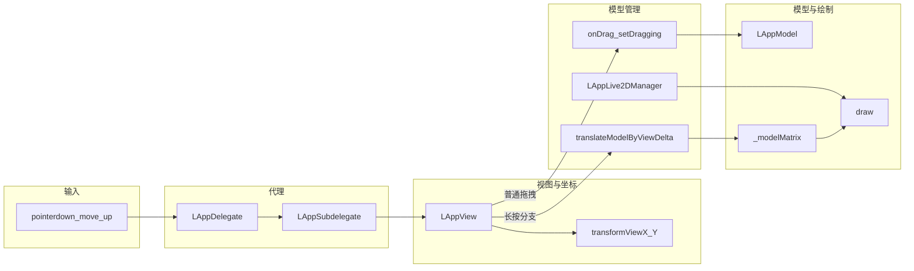

# 前端项目架构说明

> **【重点 · 定时关怀】** 与 **`后端项目正文.md`** **§9.6 / §9.6.1 / §9.6.2** 配套的前端侧已就绪：**`Demo/src/api/ws.js`** 解析 **`remind_trigger`**：仅当 **`trigger_type`** 与 **`delivery_message`** **均非空** 时才 **`appendChatMessage("remind", delivery_message)`**（**不**拼「【类型】」前缀，**无**客户端兜底话术）；**`trigger_content`** 仍为情景描述（与 REST 一致）。样式由 **`chat-item.remind`** 区分。若服务端在 **`REMIND_TRIGGER_USE_TTS`**（或未设时 **`REMIND_TRIGGER_USE_MIMO`**）开启且合成成功，可再收到 **`chunk_audio`（`remind_audio: true`）** + **WAV**：此时 **仅** 设置 **`pendingAudioMeta`** 并入队播放（驱动口型），**不得**再调用 **`applyVisibleTextSegment`** 更新紫色流式 **`chat-item ai`**，避免关怀朗读被重复显示为主对话气泡。每条聊天消息的 **`buildChatWsPayload`** 附带 **`scene_time`**（**`formatUserWorldTimeForChat()`**），与后端 **`remind_extract`** 侧 **Unix 时间戳换算得到的「年月日:时分秒」** 及 **`scene_time`** 解析结果一并写入抽取提示，供模型换算「几分钟后」等相对语义；**`trigger_time`** 由后端 **抽取模型输出 + 服务端解析与校正**（详见 **`后端项目正文.md`** §9.6.2），前端不传触发时刻。后台默认约 **每 60 秒**扫描到期项（可调 **`REMIND_TRIGGER_SCAN_INTERVAL_SEC`**）。联调 UI：**`Demo/index.html`** 左侧聊天栏 **齿轮展开** 后的 **「定时关怀」卡片** 内按钮 **「立即扫描到期项」**，由 **`Demo/src/main.js`** 调用 **`Demo/src/api/remindTriggers.js`** → **`POST /api/remind-triggers/scan-now`**（须保持 **`/ws/chat`** 已连接才可能收到投递气泡）。

## 1. 总览

**`Demo/`** 目录为基于 **Vite** 的浏览器端应用，集成 **Live2D Cubism SDK**（`Core/`、`Framework/`）与自维护的 **`src/`** 应用层代码。静态资源位于 **`Demo/public/`**，其中 **`public/Resources/`** 下的 **`/<模型包名>/`** 与后端扫描的 Live2D 目录约定一致，供运行时加载 **`.model3.json`、表情、动作、纹理** 等。

应用职责可概括为：

**一角色一世界（个性化）**：当前 **`package`**（须与 **`ModelDir` / 画布当前模型** 一致）在后端对应 **`user_id + package_key`** 下的 **独立数字人**——人设、记忆分桶、会话历史、**`catalog`** 等均 **按包隔离**；切换模型即切换到 **另一位活在自身设定里的角色**。上行中的 **`scene_location` / `scene_time`** 分别对应叙事场景与用户真实时间（见 **`后端项目正文.md`** **§1.1**）。

1. **渲染与交互**：初始化 Cubism 与 WebGL 画布，加载多模型（由 **`lappdefine.js`** 中 **`ModelDir`** 声明顺序），处理指针、背景轮换、模型切换等。  
2. **对话与实时语音**：通过 WebSocket 连接后端 **`/ws/chat`** 与 **`/ws/tts`**，发送用户文本或语音识别结果，接收流式正文与分段 **WAV** 并播放；若服务端启用 **合并流**，同一 **`/ws/chat`** 连接上可出现 **`chunk_audio` + 二进制 WAV**（见口型文档）。  
3. **驱动虚拟形象**：根据流式首包中的 **`expression` / `motion`** 标识，调用当前 **`LAppModel`** 的 **`setExpression`** 与 **`startMotionByBasename`**，与后端 **`catalog`** 中同名字段一致。  
4. **登录与资源**：主页面 **`index.html`** 在 **`localStorage.live2d_info`** 无有效登录信息时 **`replace`** 到 **`Demo/src/pages/Login.html`**；登录成功后通常写入 **`user_id`、`username`、`httpBase`**（与 **`Demo/src/api/apiBase.js`** 读取逻辑一致）。已登录用户可按 **`user_id`** 拉取 **`GET /api/live2d-model-assets/packages`** 与逐文件索引，对 **`object_key`** 行调用 **`download-url`** 换 **presigned URL**，构建远程 manifest（见 **`main.js`** 中 **`ensureLive2dRemoteManifests`**）。  
5. **会话历史面板**：**`main.js`** 中 **`refreshChatHistoryFromServer`** 通过 **`fetchChatSessionsForPanel`**（**`Demo/src/api/chatSessions.js`**）请求 **`GET /api/chat-sessions`**（**`page` / `size`**，默认 **`page=1`、`size=50`**），按 **`user_id`** 与 **`package_key`** 拉取 **`chat_session`**；后端 **`create_time DESC`**，前端反转为「旧在上、新在下」写入 **`#chat-list`**（不按浏览器 **`session_key`** 过滤）。**`renderChatHistoryRows`**（**`ws.js`**）对首屏／刷新：**`DocumentFragment`** 批量插入气泡后，临时将容器 **`scroll-behavior`** 设为 **`auto`** 并 **`scrollTop = scrollHeight`**，避免 **`#chat-list`** 全局 **`scroll-behavior: smooth`** 在逐条追加时多次叠加动画导致停在列表中段；实时单条仍走 **`appendChatMessage`** 保持平滑滚动。**`setupChatHistoryScrollPagingOnce`** 在 **`#chat-list`** 上监听滚动，**`scrollTop`** 靠近顶部时 **`loadOlderChatHistoryPage`** 递增 **`page`** 加载更早一页，**`prependChatHistoryRows`**（**`ws.js`**）插入顶部并校正滚动位置；切换模型会重置分页。

以下默认开发时使用 Vite 开发服务器、生产构建输出至 **`Demo/dist/`**（构建脚本可能复制 **`Core`** 等资源，以项目内 **`package.json`** 脚本为准）。

---

## 2. 技术栈与目录结构

| 类别 | 说明 |
|------|------|
| **构建** | Vite；入口 **`index.html`** 引用 **`src/main.js`**（ES Module） |
| **Live2D** | `Core/live2dcubismcore.js`（非打包脚本）；`Framework/` 为 TypeScript 模块，由应用侧 `import` |
| **应用源码** | **`Demo/src/`**：`LAppDelegate`、`LAppModel`、`LAppLive2DManager`、视图与平台封装等 |
| **资源** | **`Demo/public/Resources/<包名>/`**：与后端 `package` 参数及 **`ModelDir`** 目录名一致 |
| **接口层** | **`apiBase.js`**：`VITE_API_BASE` / `live2d_info.httpBase` → **`getApiBase()`**；**`wsConfig.js`**：WebSocket 基址、`session`、`package`、`user_id`；**`ws.js`**：双通道连接、流式正文、`chunk_audio`、TTS 队列与口型；**`renderChatHistoryRows` / `prependChatHistoryRows`** 渲染左侧历史气泡；**`chatSessions.js`**：**`GET /api/chat-sessions`**（**`page` / `size`**）；**`assetUpload.js`**：模型包列表与资源索引；**`storageFetchUrl.js`**：presigned URL 代理（**`VITE_DOWNLOAD_SHARED_OBJECT_BASE`**） |

---

## 3. 分层结构（Live2D 应用）

| 层次 | 职责 | 典型类型 |
|------|------|----------|
| **入口** | 页面 `load` 时 **`LAppDelegate.initialize()`**、**`run()`**（`requestAnimationFrame` 主循环）；`beforeunload` 释放实例。 | `lappdelegate.js` |
| **子代理** | 与画布一一对应；持有 **GL 上下文**、**LAppLive2DManager**、**LAppView** 等。 | `lappsubdelegate.js` |
| **模型管理** | 切换 **`ModelDir`** 场景，维护 **`LAppModel`** 向量，转发拖拽、点击、**`applyChatLive2dActions`** 到当前模型。 | `lapplive2dmanager.js` |
| **用户模型** | 加载 **`.model3.json`**、表情、物理、动作；**`setExpression(id)`**；**`startMotionByBasename`** 按文件名主体匹配 **`motions/*.motion3.json`**。 | `lappmodel.js` |
| **常量** | 画布、资源根路径 **`/Resources/`**、**`ModelDir`** 数组、命中区域名、动作组名等。 | `lappdefine.js` |

表情 **`id`** 来源于 **`model3.json`** 中 **`Expressions[].Name`**，须与后端 **`catalog`**（源自 **`live2d_model_asset`**，经 Redis/MySQL）中的标识名一致。

---

## 4. WebSocket 与会话架构

### 4.1 双连接与配对

- **`getSessionId()`**：单页会话标识，在 **`getChatWsUrl()`** 与 **`getChatTtsWsUrl()`** 中附加 **`session`**，使后端将 **`/ws/chat`** 与 **`/ws/tts`** 绑定到同一 **`_session_tts_ws`** 槽位。  
- **`getLive2dPackage()` / `setLive2dPackage()`**：当前所选模型对应 **`Resources`** 子目录名，默认 **`ModelDir[0]`**；**`getChatWsUrl()`、`getChatTtsWsUrl()`** 附加 **`package`**，供后端 **`get_catalog_for_package`** 使用。

### 4.2 连接时序

模块加载时建立 **`/ws/tts`** 再建立 **`/ws/chat`**，以降低先发言时尚未注册 TTS 连接的概率。断开时按设定间隔自动重连；**`reconnectChatWebSocketsForNewPackage()`** 在用户切换模型后主动关闭并重连两条连接，以携带新的 **`package`**。

### 4.3 消息处理（`ws.js`）

- **`/ws/chat`** 文本帧：**`catalog`** 可打日志；**`chunk`** 拼接到输出区，**首条含 `expression`/`motion` 时** 调用 **`applyChatLive2dActions`**（定义于 **`lappdelegate.js`**，委托 **`LAppLive2DManager`**）；**`done`** 归档到聊天记录并清空流式区；**`error`** 展示错误信息。  
- **`/ws/chat`** 若启用合并流式 TTS：**`chunk_audio`** 声明 **`index`/`size`** 后紧跟 **二进制 WAV**，客户端入队播放；**口型由播放中的音频 RMS 驱动**（**`AudioContext` + `AnalyserNode`** → **`feedChatLive2dTtsAudioLipLevel`**），**不再**根据文本 chunk 模拟口型。详见 **本文附录 · 聊天 TTS 与 Live2D 口型同步**。  
- **`remind_trigger`**（若后端启用定时关怀）：**`trigger_content`** 为**情景描述**（与 **`GET /api/remind-triggers`** 一致）；展示正文为 **`delivery_message`**。**`trigger_type` 为空或 `delivery_message` 为空** 时前端 **不追加气泡**（与后端「无效类型不投递 / 无正文不推送」一致）。后端话术拼装含 MySQL **`persona`**、Redis **瞬时记忆**、可选 **`user_profile`**（见 **`后端项目正文.md`** §9.6.1 / §9.6.2）。其后若出现 **`chunk_audio` 且 `remind_audio === true`**：**关怀朗读专用**，只走音频队列（**§附录 B**），**不**写入流式助手紫气泡。  
- **`/ws/tts`**：**`audio_chunk`** 元数据后接 **ArrayBuffer**，入队顺序播放 WAV。

工具栏 **「总结长期记忆」** 对 **当前登录用户 + 当前模型包** 调用 **`POST /api/long-memories/consolidate-now`**（**`longMemory.js`**），即时生成/追加 **`period_overview`**，**不必等待**服务端后台约 **24 小时**一次的调度（仍需 **Ollama** 与时间窗内有 **`chat_session`**，见 **`后端项目正文.md`** §9.3）。

**「定时关怀」卡片**（**`index.html`** **`#live2d-toolbar`** 展开区）：含简短操作说明与 **`#remind-scan-now-btn`**（文案默认 **「立即扫描到期项」**），由 **`main.js`** 调用 **`triggerRemindScanNow`**（**`remindTriggers.js`**）触发 **`scan-now`**；按钮短暂展示 **`pending_fetched` / `delivered` / `released_no_ws`** 统计（详见 **`后端项目正文.md`** §9.6）。

环境变量 **`VITE_WS_BASE`** 可覆盖默认 **`ws://localhost:8000`**；**`VITE_CHAT_TTS_WS_URL`** 可单独指定 TTS 完整地址（仍应携带 **`session` / `package`** 以与实现一致）。**`VITE_API_BASE`** 指向后端 HTTP 根（无 **`/api`** 后缀），用于开发与跨域部署。

---

## 5. 与后端的协同关系

| 能力 | 前端行为 | 后端依据 |
|------|----------|----------|
| **会话历史列表** | **`fetchChatSessionsForPanel`** 使用 **`page` / `size`**；首屏 **`page=1`**，上滑递增 **`page`** | **`list_by_user`**：**`create_time DESC`**；服务端 **`offset = min((page - 1) * size, 100000)`**（见 **`后端项目正文.md`** §9.2） |
| **表情** | **`setExpression(expressionId)`**，id 为 model3 **Name** | 流式首包 **`expression`**，须属于该 **`package`** 下 **`catalog.expression`** |
| **动作** | **`startMotionByBasename`** 匹配 **`.motion3.json` 文件名无后缀** | 流式首包 **`motion`**，与 **`catalog.motion`** 中标识一致 |
| **资源列表** | 可选使用 **`catalog`** 做 UI（当前实现以驱动为主） | 连接后 **`type: catalog`** |

若 **`ModelDir`** 与 **`package`** 长期不一致，将出现 **动作/表情无法命中** 或 ** catalog 与画布模型不符**，需保持 **`setLive2dPackage(getCurrentModelLabel())`** 与切换模型同步（见 **`main.js`**）。

---

## 6. 页面与业务入口（`main.js`）

- 加载 **`background_order.json`** 覆盖背景轮换列表（失败则用 **`lappdefine`** 内置列表）。  
- 绑定 **「下一模型」**：**`nextModel()`** → **`setLive2dPackage`** → **`reconnectChatWebSocketsForNewPackage`**，并刷新 **`refreshChatHistoryFromServer`**。  
- **会话历史分页**：**`setupChatHistoryScrollPagingOnce()`** 仅绑定一次；首屏 **`page=1`、`size=50`**；上滑由 **`loadOlderChatHistoryPage`** 继续请求，**`chatHistoryLoadGeneration`** 防止与刷新竞态。  
- 绑定 **文本输入 / 发送**、**麦克风与语音识别**（识别终结果经 **`sendChatMessage`** 上传）。  
- 工具栏：**上传模型**、**上传音色**、**角色定义**（打开 **`characterDef.html`**）、**总结长期记忆**、**定时关怀**（卡片内 **立即扫描到期项**，联调 **`scan-now`**）、**退出登录**（清除 **`live2d_info`** 并回登录页）。

语音模块依赖 **`AudioRecorder`**、**`SpeechRecognition`**（与 **`VITE_ASR_WS_URL`** 等配置相关，详见各自工具内注释）。

---

## 7. 实现索引

| 内容 | 路径 |
|------|------|
| 入口与页面逻辑 | `Demo/src/main.js` |
| HTTP API 根路径 | `Demo/src/api/apiBase.js` |
| WebSocket 配置与 URL | `Demo/src/api/wsConfig.js` |
| WebSocket 连接与消息；**`scene_time`**（**`formatUserWorldTimeForChat`**）随 **`buildChatWsPayload`** 上报 | `Demo/src/api/ws.js` |
| 会话历史 REST（`page`/`size` 分页） | `Demo/src/api/chatSessions.js` |
| 关怀立即扫描 REST（`scan-now`）；入口 **`main.js`** 绑定 **`index.html`** 卡片按钮 | `Demo/src/api/remindTriggers.js`、`Demo/src/main.js`、`Demo/index.html` |
| 长期记忆即时周期概要更新 REST | `Demo/src/api/longMemory.js` |
| 模型资源 / 上传 API | `Demo/src/api/assetUpload.js` |
| 登录页 | `Demo/src/pages/Login.html` |
| 聊天 TTS 口型（音频 RMS）说明 | 本文附录 · 聊天 TTS 与 Live2D 口型同步 |
| 委托与 **`applyChatLive2dActions`** | `Demo/src/lappdelegate.js` |
| 模型与表情/动作驱动 | `Demo/src/lappmodel.js`、`Demo/src/lapplive2dmanager.js` |
| 模型与资源常量 | `Demo/src/lappdefine.js` |
| 页面与脚本入口 | `Demo/index.html` |

---

## 8. 构建与运行

- 开发：`Demo` 目录下执行 **`npm install`**、**`npm run start`**（以 **`package.json`** 为准）。  
- 生产：**`npm run build`** 输出 **`Demo/dist/`**；部署时需一同提供 **`Core`**、**`Resources`** 等浏览器可访问路径。  

更细的脚本说明见 **`Demo/package.json`** 内 `scripts` 字段。


---

## 附录 A · Demo/src 目录与调用关系

本文档介绍本仓库 **`Demo/src/`**（Vite 前端应用源码）下主要文件的作用与调用关系。官方 Cubism **Samples** 路径仅作对照；**以本仓库实际路径为准**。

---

## 1. main.js — 应用入口与业务编排

| 方法/逻辑 | 作用 | 调用者 |
|-----------|------|--------|
| `window.addEventListener('load', ...)` | 初始化 Live2D、拉背景列表、按登录用户加载远程模型 manifest（presigned）、建立 WebSocket、绑定 UI | 浏览器 |
| `refreshChatHistoryFromServer` | `GET /api/chat-sessions` 拉取当前用户 + 当前包历史，写入聊天面板 | load / 切模型后 |
| `ensureLive2dRemoteManifests` / `_resolveOneAssetFetchUrl` | 索引行 → `download-url` → 可选下载代理 URL，填入 `lappdefine` 远程 manifest | 已登录且库中有包 |
| `window.addEventListener('beforeunload', ...)` | 释放应用资源 | 浏览器 |

**说明**：在官方 Demo 基础上扩展了 **REST、登录态、远程 Resources、会话历史**；Live2D 帧循环仍由 **`LAppDelegate`** 负责。

---

## 2. lappdefine.js — 常量配置

| 内容 | 作用 |
|------|------|
| 导出常量 | 画布尺寸、视口、资源路径、模型目录、动作组名、命中区域名、优先级、调试开关等 |

**说明**：纯配置模块，无自定义方法，被 `lappdelegate.js`、`lappsubdelegate.js`、`lappmodel.js`、`lappview.js`、`lapplive2dmanager.js` 等引用。

---

## 3. lappdelegate.js — 应用主类（单例）

| 方法 | 作用 | 调用者 |
|------|------|--------|
| `getInstance()` | 获取单例 | main.js |
| `releaseInstance()` | 释放单例 | main.js |
| `initialize()` | 初始化 Cubism SDK、子代理、事件监听 | main.js |
| `run()` | 启动动画帧循环 | main.js |
| `onPointerBegan(e)` | 处理 pointerdown | document 事件 |
| `onPointerMoved(e)` | 处理 pointermove | document 事件 |
| `onPointerEnded(e)` | 处理 pointerup | document 事件 |
| `onPointerCancel(e)` | 处理 pointercancel | document 事件 |
| `onResize()` | 处理窗口 resize | 内部 / ResizeObserver |
| `release()` | 释放资源 | releaseInstance |
| `initializeCubism()` | 初始化 Cubism 框架 | initialize |
| `initializeSubdelegates()` | 创建画布和子代理 | initialize |
| `initializeEventListener()` | 注册 pointer 事件 | initialize |

---

## 4. lappsubdelegate.js — 子代理（单画布管理）

| 方法 | 作用 | 调用者 |
|------|------|--------|
| `initialize(canvas)` | 初始化 GL、纹理、视图、Live2D 管理器 | LAppDelegate |
| `release()` | 释放子代理资源 | LAppDelegate |
| `update()` | 每帧清屏、渲染视图 | LAppDelegate.run() 循环 |
| `onResize()` | 画布尺寸变化时重新初始化 | LAppDelegate / ResizeObserver |
| `onPointBegan(pageX, pageY)` | 触摸/指针按下 | LAppDelegate.onPointerBegan |
| `onPointMoved(pageX, pageY)` | 触摸/指针移动 | LAppDelegate.onPointerMoved |
| `onPointEnded(pageX, pageY)` | 触摸/指针抬起 | LAppDelegate.onPointerEnded |
| `onTouchCancel(pageX, pageY)` | 触摸/指针取消 | LAppDelegate.onPointerCancel |
| `createShader()` | 创建 2D 精灵着色器 | LAppView.initializeSprite |
| `getTextureManager()` | 返回纹理管理器 | LAppView、LAppModel |
| `getFrameBuffer()` | 返回帧缓冲 | LAppModel.doDraw |
| `getCanvas()` | 返回 canvas | LAppView、LAppModel、LAppLive2DManager |
| `getGlManager()` | 返回 GL 管理器 | LAppView、LAppModel |
| `getLive2DManager()` | 返回 Live2D 管理器 | LAppView |
| `resizeCanvas()` | 按设备像素比调整画布尺寸 | initialize、onResize |
| `resizeObserverCallback()` | ResizeObserver 回调 | ResizeObserver |
| `isContextLost()` | 检测 WebGL 上下文是否丢失 | LAppDelegate |

---

## 5. lappmodel.js — Live2D 模型实现

| 方法 | 作用 | 调用者 |
|------|------|--------|
| `loadAssets(dir, fileName)` | 加载 model3.json 并启动 setupModel | LAppLive2DManager.changeScene |
| `setupModel(setting)` | 按配置加载 moc3、表情、物理、姿势等 | loadAssets |
| `setupTextures()` | 加载 PNG 纹理并绑定到渲染器 | setupModel、preLoadMotionGroup |
| `update()` | 每帧更新拖拽、动作、眨眼、表情、呼吸、物理、口型 | LAppLive2DManager.onUpdate |
| `startMotion(group, no, priority, ...)` | 按组和编号播放动作 | startRandomMotion |
| `startRandomMotion(group, priority, ...)` | 在指定组内随机播放动作 | LAppLive2DManager.onTap、update |
| `setExpression(expressionId)` | 播放指定表情 | setRandomExpression |
| `setRandomExpression()` | 随机播放表情 | LAppLive2DManager.onTap |
| `hitTest(hitArenaName, x, y)` | 检测命中区域 | LAppLive2DManager.onTap |
| `preLoadMotionGroup(group)` | 预加载动作组 | setupModel |
| `doDraw()` | 执行模型绘制 | draw |
| `draw(matrix)` | 设置 MVP 并绘制模型 | LAppLive2DManager.onUpdate |
| `setSubdelegate(subdelegate)` | 设置子代理引用 | LAppLive2DManager.changeScene |
| `reloadRenderer()` | 重建渲染器并重新设置纹理 | 上下文恢复等 |
| `releaseMotions()` / `releaseExpressions()` | 释放动作/表情 | 内部 |
| `hasMocConsistencyFromFile()` | 异步检测 MOC3 一致性 | 可选调用 |

---

## 6. lappview.js — 视图与绘制

| 方法 | 作用 | 调用者 |
|------|------|--------|
| `initialize(subdelegate)` | 初始化视口矩阵、设备坐标转换 | LAppSubdelegate |
| `release()` | 释放视图资源 | LAppSubdelegate |
| `render()` | 绘制背景、齿轮、Live2D 模型 | LAppSubdelegate.update |
| `initializeSprite()` | 加载背景和齿轮纹理，创建着色器 | LAppSubdelegate |
| `onTouchesBegan(pointX, pointY)` | 触摸开始 | LAppSubdelegate.onPointBegan |
| `onTouchesMoved(pointX, pointY)` | 触摸移动，更新拖拽 | LAppSubdelegate.onPointMoved |
| `onTouchesEnded(pointX, pointY)` | 触摸结束，处理点击和齿轮 | LAppSubdelegate.onPointEnded |
| `transformViewX/Y(deviceX/Y)` | 设备坐标转视图坐标 | onTouchesMoved、onTouchesEnded |
| `transformScreenX/Y(deviceX/Y)` | 设备坐标转屏幕坐标 | 内部 |

---

## 7. lapplive2dmanager.js — Live2D 模型管理

| 方法 | 作用 | 调用者 |
|------|------|--------|
| `initialize(subdelegate)` | 初始化并加载首个模型 | LAppSubdelegate |
| `onDrag(x, y)` | 将拖拽坐标传给模型 | LAppView.onTouchesMoved/Ended |
| `onTap(x, y)` | 处理点击：头部切表情、身体播动作 | LAppView.onTouchesEnded |
| `onUpdate()` | 更新模型并绘制 | LAppView.render |
| `nextScene()` | 切换到下一个模型 | LAppView.onTouchesEnded（点齿轮） |
| `changeScene(index)` | 按索引切换模型 | nextScene、addModel |
| `addModel(sceneIndex)` | 添加/切换模型 | 外部 |
| `setViewMatrix(m)` | 设置视图矩阵 | LAppView.render |
| `releaseAllModel()` | 清空模型列表 | changeScene |

---

## 8. lappglmanager.js — WebGL 管理

| 方法 | 作用 | 调用者 |
|------|------|--------|
| `initialize(canvas)` | 获取 WebGL2 上下文 | LAppSubdelegate |
| `release()` | 释放资源（当前为空实现） | LAppSubdelegate |
| `getGl()` | 返回 WebGL 上下文 | LAppSubdelegate、LAppTextureManager、LAppSprite、LAppModel |

---

## 9. lapptexturemanager.js — 纹理管理

| 方法 | 作用 | 调用者 |
|------|------|--------|
| `createTextureFromPngFile(fileName, usePremultiply, callback)` | 异步加载 PNG 并创建纹理 | LAppView、LAppModel |
| `setGlManager(glManager)` | 设置 GL 管理器 | LAppSubdelegate |
| `release()` | 释放所有纹理 | LAppSubdelegate |
| `releaseTextures()` | 清空纹理 | 内部 |
| `releaseTextureByTexture/FilePath()` | 按纹理或路径释放 | 内部 |

---

## 10. lappsprite.js — 2D 精灵

| 方法 | 作用 | 调用者 |
|------|------|--------|
| `render(programId)` | 使用指定着色器绘制精灵 | LAppView.render |
| `isHit(pointX, pointY)` | 检测点是否在精灵矩形内 | LAppView.onTouchesEnded |
| `setSubdelegate(subdelegate)` | 设置子代理 | LAppView.initializeSprite |
| `release()` | 释放精灵资源 | LAppView.release |

---

## 11. touchmanager.js — 触摸状态管理

| 方法 | 作用 | 调用者 |
|------|------|--------|
| `touchesBegan(deviceX, deviceY)` | 记录触摸开始 | LAppView.onTouchesBegan |
| `touchesMoved(deviceX, deviceY)` | 记录触摸移动 | LAppView.onTouchesMoved |
| `getX()` / `getY()` | 获取当前触摸坐标 | LAppView |
| `getDeltaX()` / `getDeltaY()` | 获取位移 | 预留 |
| `getFlickDistance()` | 计算滑动距离 | 预留 |
| `calculateDistance()` | 计算两点距离 | getFlickDistance |
| `calculateMovingAmount()` | 计算有效移动量 | 预留 |

---

## 12. lapppal.js — 平台抽象层

| 方法 | 作用 | 调用者 |
|------|------|--------|
| `loadFileAsBytes(filePath, callback)` | 异步读取文件为字节 | 可选 |
| `getDeltaTime()` | 返回帧间时间差 | LAppModel.update |
| `updateTime()` | 更新当前帧时间 | LAppDelegate.run |
| `printMessage(message)` | 输出日志 | 多处 |

---

## 13. lappwavfilehandler.js — WAV 口型同步

| 方法 | 作用 | 调用者 |
|------|------|--------|
| `update(deltaTimeSeconds)` | 更新口型同步 RMS | LAppModel.update |
| `start(filePath)` | 开始播放 WAV | LAppModel.startMotion |
| `getRms()` | 返回 RMS 值用于口型 | LAppModel.update |
| `loadWavFile(filePath)` | 异步加载 WAV | start |
| `getPcmDataChannel()` | 获取指定声道 PCM | 可选 |
| `getWavSamplingRate()` | 获取采样率 | 可选 |

---

## 14. `api/` — HTTP 与 WebSocket

| 文件 | 作用 |
|------|------|
| `apiBase.js` | `getHttpOrigin` / `getApiBase`：`VITE_API_BASE` 或 `localStorage.live2d_info.httpBase` |
| `wsConfig.js` | `session`、`package`、`user_id` 与 WS URL 拼装 |
| `ws.js` | `/ws/chat`、`/ws/tts` 连接、流式正文、`chunk_audio`、TTS 播放队列、口型 **`feedChatLive2dTtsAudioLipLevel`**、`sendChatMessage` |
| `chatSessions.js` | `GET /api/chat-sessions` 封装 |
| `assetUpload.js` | 模型包列表、资源索引、上传 zip 等 |
| `storageFetchUrl.js` | presigned URL 经网关时的可选改写（**`VITE_DOWNLOAD_SHARED_OBJECT_BASE`**） |

---

## 15. `utils/TextChat.js`

独立示例模块（**`connectChat`**）：演示仅用 WebSocket 发一句并处理回复；**当前主流程未在 `main.js` 中引用**，与生产路径 **`api/ws.js`** 并存时注意勿混用两套协议处理逻辑。

---

## 16. `pages/` — 多页面入口

| 文件 | 作用 |
|------|------|
| `Login.html` | 登录；成功后写入 **`live2d_info`** 并跳回 `redirect` |
| `characterDef.html` | 按包编辑人设（`/personas/by-package` 等） |
| `assetUpload.html` / `ttsUpload.html` | 模型 zip / TTS 参考上传 |

---

## 调用关系概览

```
main.js
  └── api/*（ws.js、chatSessions.js、assetUpload.js …）
  └── LAppDelegate (lappdelegate.js)
        ├── LAppSubdelegate (lappsubdelegate.js)
        │     ├── LAppGlManager (lappglmanager.js)
        │     ├── LAppTextureManager (lapptexturemanager.js)
        │     ├── LAppView (lappview.js)
        │     │     ├── LAppSprite (lappsprite.js)
        │     │     └── TouchManager (touchmanager.js)
        │     └── LAppLive2DManager (lapplive2dmanager.js)
        │           └── LAppModel (lappmodel.js)
        │                 └── LAppWavFileHandler (lappwavfilehandler.js)
        └── LAppPal (lapppal.js)
```

整体流程：`main.js` 启动 `LAppDelegate`，由 `LAppDelegate` 创建并管理多个 `LAppSubdelegate`，每个子代理负责一个画布及其 GL、纹理、视图和 Live2D 模型。


---

## 附录 B · 聊天 TTS 与 Live2D 口型同步

本文说明 **`/ws/chat`** 流式回复中 **文本、`chunk_audio` 与二进制 WAV** 的到达顺序，以及 **口型由 TTS 音频音量驱动**（而非根据文本模拟）的前后端约定与调参位置。

---

## 1. 行为概要

| 项目 | 说明 |
|------|------|
| **口型数据来源** | 浏览器端对 **正在播放的 TTS WAV** 做 **Web Audio `AnalyserNode`** 时域采样，计算 **RMS**，映射为 **0～1** 的强度，写入 Live2D 嘴部参数。 |
| **不再使用** | 根据流式 **文本 chunk** 用正弦节奏 **`triggerTextLipSync`** 模拟张嘴（已停用，避免与真实朗读不同步）。 |
| **纯文本模式** | 若后端仅推送 **`chunk`**、无 **`chunk_audio` + WAV**，则 **不会** 因文本对口型（符合「只听音频」策略）。 |
| **与动作配音** | 模型动作自带的 `.wav` 仍通过 **`LAppWavFileHandler`**（`_lipsync` 为真时）走原有 RMS 路径；与聊天 TTS 口型在 **`LAppModel.update`** 中取 **`Math.max`**，二者可并存。 |

---

## 2. 后端：`/ws/chat` 帧类型（与口型相关）

- **`chunk`**：JSON，`content` 为一段可见文本；可用于 UI 与表情/动作字段。
- **`chunk_audio`**：JSON，除 `content` 外声明 **`index`、`size`**；**下一帧**必须为 **二进制**，且为合法 **RIFF/WAVE**，字节数与 `size` 一致。若带 **`remind_audio: true`**（定时关怀朗读），**`content` 不进入主对话流式紫气泡**（关怀正文已由 **`remind_trigger`** 写入橙色系 **`chat-item.remind`**），但仍须在本帧设置 **`pendingAudioMeta`** 以便下一帧二进制入 **`enqueueAudioAndPlay`**。
- **`done`**：本轮结束；前端应停止口型采样并复位（见下）。

TTS 并行合成与有序下发逻辑见 **`PY/router/wschat.py`**（`sentence_queue`、`tts_worker`、`merged_stream` 等）。

### 2.1 流式口型序号变量

消费流式文本并按句送 TTS 时，切段序号 **`tts_sentence_index`** 须在循环前 **初始化为 `0`**，再在每次 flush 时 **`+= 1`**，否则首次切段会触发 **`UnboundLocalError`**（曾被外层异常日志误标为「Ollama 调用失败」）。

---

## 3. 前端：音频口型数据流

1. **`Demo/src/api/ws.js`**  
   - 收到二进制 WAV 后 **`enqueueAudioAndPlay`**。  
   - **`playAudioQueue`** 内：共享 **`AudioContext`**（懒创建，`resume()` 应对自动播放策略）、**`createMediaElementSource(audio)`** → **`AnalyserNode`** → **`destination`**。  
   - **`requestAnimationFrame`** 循环中 **`getByteTimeDomainData`** → RMS → **`feedChatLive2dTtsAudioLipLevel(level)`**。  
   - 每段播放结束 **`finally`**：**取消 RAF**、**`feedChatLive2dTtsAudioLipLevel(0)`**、断开节点；队列清空后同样归零。  
   - **`resetStreamingState`**（用户打断重发等）：**`stopTtsLipRaf`** + **`stopChatLive2dLipSync`**，避免旧会话口型残留。

2. **`Demo/src/lappdelegate.js`**  
   - **`feedChatLive2dTtsAudioLipLevel(level)`**：委托到当前 **`LAppLive2DManager`**。

3. **`Demo/src/lapplive2dmanager.js`**  
   - **`feedTtsAudioLipLevel`** → **`LAppModel.setTtsAudioLipLevel`**。  
   - **`stopLipSync`**：**`clearTtsAudioLip(true)`**（立即闭嘴）并保留 **`stopTextLipSync`** 兼容调用。

4. **`Demo/src/lappmodel.js`**  
   - **`_ttsAudioLipTarget` / `_ttsAudioLipSmoothed`**：按 **`deltaTime`** 做平滑后与 WAV 动作口型一起参与 **`lipSyncValue`**。  
   - **`setTtsAudioLipLevel` / `clearTtsAudioLip`**：供 TTS 专用。

### 3.1 调参

- **口型幅度**：`ws.js` 中 RMS 映射系数（如 **`rms * 4.5`**），过大则嘴张得过开，过小则不明显。  
- **跟随速度**：`lappmodel.js` 中 **`ttsTau`**（与 **`deltaTimeSeconds * ttsTau`** 相关），越大越快贴近目标。

### 3.2 句末定时器与表情

**`scheduleStopOnTextTail`** 仅在句末标点后延迟触发 **`resetChatLive2dExpression`**；**不再**在该定时器内 **`stopChatLive2dLipSync`**，以免 **文本已显示句末而音频仍在播放** 时嘴突然闭合。

---

## 4. MinIO：预签名与 `region`（参考音频等）

**`PY/live2d_db/minio_storage.py`** 创建 **`Minio`** 客户端时传入 **`region`**（默认 **`us-east-1`**，可通过 **`MINIO_REGION`** 覆盖）。

作用：生成 **`presigned_get_object`** 时 **MinIO Python SDK** 否则会发起 **`GetBucketLocation`**；若本机 **`MINIO_ENDPOINT`** 未监听（例如 MinIO 未启动），会连接失败。**显式 region** 可避免此次网络探测。

上传、`bucket_exists` 等仍依赖 MinIO 服务可达。

---

## 5. 相关文件索引

| 角色 | 路径 |
|------|------|
| 聊天 WS、音频队列、Analyser、RAF | `Demo/src/api/ws.js` |
| 委托导出 | `Demo/src/lappdelegate.js` |
| 管理器转发 | `Demo/src/lapplive2dmanager.js` |
| 嘴部参数混合与平滑 | `Demo/src/lappmodel.js` |
| 聊天与 TTS 编排 | `PY/router/wschat.py` |
| MinIO 客户端与预签名 | `PY/live2d_db/minio_storage.py` |

工程级说明：前文为主体架构；人设与 MiMo 导演见 **`后端项目正文.md`**（附录 D · 人设、HTTP/WebSocket 与 MiMo 导演模式）。


---

## 附录 C · 语音识别与 PCM（SpeechRecognition + 音频说明）

本文档说明本仓库 **`Demo/src/utils/SpeechRecognition.js`**（单例 **`SpeechRecognizer`**）的实现：**浏览器麦克风 PCM → WebSocket `/ws/asr` → 服务端转发阿里云 DashScope Fun-ASR**，**不使用**浏览器内置 Web Speech API。

更完整的端到端时序见 **`后端项目正文.md`**（附录 B · 架构与时序图）§1。

---

## 1. 概述

| 项目 | 说明 |
|------|------|
| **协议** | 前端与 **`PY/router/asr_ws.py`** 暴露的 **`/ws/asr`** 建立 WebSocket；上行 **二进制 PCM**，下行 **JSON** |
| **采样** | 麦克风经 **AudioContext** 采集；若非 16 kHz，在前端 **`downsampleTo16k`** 转为 **16 kHz**，再 **`floatTo16BitPCM`** 为小端 **Int16** |
| **云端引擎** | **`fun-asr-realtime`**（见服务端 `Recognition` 配置） |
| **回调** | **`start(onResult)`** 传入 **`(text, isFinal) => void`**；**`isFinal`** 对应服务端 JSON 的 **`partial === false`**（一句结束） |

---

## 2. 服务端下行 JSON 形态

由 **`asr_ws`** 转发 DashScope 回调（句末为最终结果）：

| 字段 | 含义 |
|------|------|
| **`text`** | 当前识别文本 |
| **`partial`** | **`true`**：中间结果；**`false`**：该句最终结果 |
| **`error`** | 异常信息字符串；前端会 **`alert` 并 stop** |

---

## 3. 前端 API

| 方法 | 作用 |
|------|------|
| **`start(onResult?)`** | 连接 **`getAsrWsUrl()`**（默认同源 **`/ws/asr`**，见 **`wsConfig.js`**），打开麦克风并开始 **`onaudioprocess`** 发送 PCM |
| **`stop()`** | 发送 **`{"cmd":"flush"}`**，释放音频节点与 WebSocket |
| **`isRecognizingNow()`** | 是否处于识别中 |
| **`isSupported()`** | 是否具备 **`getUserMedia`** 与 **`WebSocket`** |

说明：源码里部分日志仍写「Vosk」字样，为历史遗留；**实际链路为 DashScope**。

---

## 4. 配置与环境变量

| 变量 | 作用 |
|------|------|
| **`DASHSCOPE_API_KEY`** | 服务端必选；未设置时 **`/ws/asr`** 返回 **`error`** 并关闭连接 |
| **`VITE_ASR_WS_URL`** | 前端可选：覆盖 **`/ws/asr`** 完整 WebSocket URL |
| **`pip install dashscope`** | 服务端依赖；未安装时 **`/ws/asr`** 提示安装 |

---

## 5. 与主对话衔接

**`main.js`** 中通常在 **`isFinal && text`** 时调用 **`sendChatMessage(text)`**，后续与 **文本对话** 相同： **`/ws/chat`** → Ollama → TTS 等（见 **`后端项目正文.md`** 附录 B · 架构与时序图 §1）。

---

## 6. 注意事项

1. **麦克风权限**：HTTPS 或 localhost；用户需允许麦克风。  
2. **与 AudioRecorder**：若页面同时使用 **`AudioRecorder`**，注意并行占用麦克风策略（以 **`main.js`** 实际绑定为准）。  
3. **答辩/论文**：可强调「**端侧仅上传 PCM，识别在云端完成**，便于替换模型商」；局限性包括 **网络延迟**、**API Key 运维**、**供应商绑定（DashScope）**。

本文说明 Demo 中 `SpeechRecognition.js` 涉及的 **单声道**、**Float32**、**重采样** 等概念，以及它们在本项目中的关系。

相关代码：`Samples/JS/Demo/src/utils/SpeechRecognition.js`、`Samples/JS/Demo/src/api/wsConfig.js`；服务端：`PY/router/asr_ws.py` 的 **`/ws/asr`**（阿里云 DashScope **Fun-ASR 实时识别**，需环境变量 **`DASHSCOPE_API_KEY`**）。

---

## 单声道（Mono）

声音可以按 **声道数** 录制与播放：

- **立体声（双声道）**：左、右各一路信号，常见于音乐。
- **单声道**：只有 **一路** 混合信号。

实时识别服务按 **单路麦克风 PCM** 使用，因此 `getUserMedia` 中设置 `channelCount: 1`，只取 **一条声道**。

---

## Float32（32 位浮点样本）

浏览器 **Web Audio API** 中，`AudioBuffer` / `ScriptProcessorNode` 读到的样本通常是 **`Float32Array`**：

- 每个采样点是一个约 **−1.0～1.0** 的浮点数，表示该时刻波形的 **归一化振幅**。
- 代码中 `getChannelData(0)` 得到的即为 **float32 格式** 的波形数据。

服务端需要的是 **16 bit 小端 PCM 字节**（`format=pcm`），因此前端在发送前会用 `floatTo16BitPCM` 从 float32 转为 **Int16** 再发送。

---

## 重采样（Resampling）

**采样率**表示每秒采多少个样本，例如 **48000 Hz** 即每秒 48000 个采样点。

- 浏览器/声卡常见 **44100 Hz、48000 Hz** 等。
- DashScope **fun-asr-realtime** 使用 **16000 Hz（16 kHz）** PCM。

**重采样**：把某一采样率下得到的一串样本，**换算**成 **16 kHz** 的样本序列。

代码中的 `downsampleTo16k` 将当前 `AudioContext` 的采样率（如 48 kHz）下的缓冲 **降为 16 kHz**，再交给后续 PCM 编码与 WebSocket 发送。

---

## 在本项目中的数据流（概要）

```
麦克风 → 单声道 float32 缓冲 → 重采样到 16 kHz → 转为 16 bit PCM 二进制
    → WebSocket（/ws/asr）→ FastAPI → DashScope Fun-ASR → JSON 文本回调
```

一句话：**单声道**是通道数；**float32** 是浏览器里的样本表示；**重采样**是把时间轴上的采样密度改成 **16 kHz**，以符合云端识别要求。

---

## 相关配置

- WebSocket 基地址见 `src/api/wsConfig.js`（默认 `ws://localhost:8000`，与 `python main.py` 一致）。
- 后端配置集中在 **`PY/.env`**（可复制 `PY/.env.example`），由 `main.py` 的 `load_dotenv` 加载。常用项：
  - **`DASHSCOPE_API_KEY`**：百炼语音识别（**不要**提交到 Git）。
  - **`OLLAMA_HOST`**、**`OLLAMA_MODEL`**、**`NO_PROXY`**：与 `/ws/chat` 对话相关。
- 单独覆盖语音识别完整 WebSocket 地址时，可设置 **`VITE_ASR_WS_URL`**（Vite 构建时注入）。


---

## 附录 D · 远程 Live2D、MinIO 与 WebGL 贴图联调

本文记录联调中出现的典型故障及对策，便于部署与论文「系统实现 / 联调」章节引用。实现以本仓库当前代码为准。

---

## 摘要

联调中曾出现三类现象：**对象存储直链返回 403**、**预签名下载接口返回 422**、以及 **WebGL `texImage2D` 跨域安全错误**。成因分别为：私有桶未授权的直接访问、HTTP 路由匹配顺序错误、以及跨域图像未按 CORS 规则供 WebGL 使用。通过对前端 manifest 使用预签名 URL（可选网关嵌套代理）、将字面量路径路由置于路径参数路由之前、为纹理 `Image` 设置 `crossOrigin` 并配置存储侧 CORS（或同源代理），可系统性消除上述故障。

---

## 1. 模型 JSON / 二进制等资源：`403 Forbidden`

### 现象

浏览器直接请求 `http://127.0.0.1:9000/...`（或等价 MinIO 对外基址）加载 `.model3.json`、`.moc3` 等失败，HTTP 403。

### 原因

桶策略为**私有**时，**无签名的对象 URL** 不具备读取权限。数据库索引中的 `public_url` 若为「基址 + 桶 + 对象键」式拼接而非临时授权链接，匿名读会被拒绝。

### 解决方式

- **后端**：对具备 `object_key` 的资源提供预签名下载能力（本仓库：`GET /api/live2d-model-assets/download-url`，见 `PY/live2d_db/http_api.py`）。
- **前端**：登录后按包拉取资源列表，构建 `relative_path → 可 fetch URL` 时，对存在 `object_key` 且 URL 尚不像预签名链接的条目，调用上述接口换取 presigned URL，再写入映射供 `LAppModel._resolveAssetUrl` 使用（见 `Demo/src/main.js`）。
- **可选网关嵌套**：若需将整条目标 URL 编码后走统一下载路径，可配置环境变量 `VITE_DOWNLOAD_SHARED_OBJECT_BASE`，逻辑见 `Demo/src/api/storageFetchUrl.js`（`applyOptionalSharedDownloadProxy`）。

---

## 2. `download-url` 接口：`422 Unprocessable Entity`

### 现象

请求  
`GET /api/live2d-model-assets/download-url?asset_id=...&expires_in=...`  
返回 422。

### 原因

在 FastAPI 中，若 **`GET /live2d-model-assets/{asset_id}` 先于**  
`GET /live2d-model-assets/download-url` 注册，则路径段 `download-url` 会被当成 **`asset_id`**，无法解析为整数，触发校验错误。

### 解决方式

将 **`/live2d-model-assets/download-url` 路由声明在 `/{asset_id}` 之前**（本仓库已在 `PY/live2d_db/http_api.py` 中调整并附注释）。

---

## 3. WebGL：`texImage2D` `SecurityError`（cross-origin data）

### 现象

控制台报错大致为：  
`Failed to execute 'texImage2D' on 'WebGL2RenderingContext': The image element contains cross-origin data, and may not be loaded.`  
堆栈常指向纹理加载（如 `lapptexturemanager.js`）。

### 原因

贴图 URL 与前端页面**不同源**（协议/主机/端口任一不同即不同源）。若 `` 在赋值 `src` 前未设置 **`crossOrigin = 'anonymous'`**，像素对脚本/WebGL 不可导出，`texImage2D` 被拒绝。

### 解决方式

- **前端**：对跨源的 `http(s)` 纹理 URL，在设置 `img.src` **之前** 设置 `crossOrigin = 'anonymous'`（见 `Demo/src/lapptexturemanager.js` 中 `applyCrossOriginForWebGLTexture`）。
- **对象存储**：预签名 URL 所在站点必须在响应中包含 **`Access-Control-Allow-Origin`**，允许前端开发/生产 Origin；MinIO 需在对应 Bucket 配置 CORS（参见 `PY/live2d_db/minio_storage.py` 文件头注释）。
- **替代方案**：通过**与前端同源**的反向代理提供贴图，避免跨域。

---

## 4. 小结对照表

| 现象 | 主要原因 | 对策要点 |
|------|----------|----------|
| 403 | 私有桶 + 无签名直链 | manifest 使用 presigned；可选嵌套代理 |
| 422 | 动态路由吞掉字面路径 `download-url` | 字面路径路由排在 `{asset_id}` 前 |
| WebGL SecurityError | 跨域图未声明 CORS 模式 | `crossOrigin='anonymous'` + 存储 CORS 或同源代理 |

---

## 5. 相关工程位置（便于检索）

| 说明 | 路径 |
|------|------|
| 远程 manifest + presign 并发拉取 | `Demo/src/main.js` |
| 可选下载代理包装 | `Demo/src/api/storageFetchUrl.js` |
| API 基址与环境变量说明 | `Demo/src/api/apiBase.js` |
| 纹理跨域 | `Demo/src/lapptexturemanager.js` |
| 资源 URL 解析 | `Demo/src/lappmodel.js`（`setRemoteAssetUrlMap` / `_resolveAssetUrl`） |
| 下载链接与路由顺序 | `PY/live2d_db/http_api.py` |
| MinIO 预签名与公开基址 | `PY/live2d_db/minio_storage.py` |

---

*文档版本：与仓库实现同步整理；若接口或 env 变更，请以源码为准。*


---

## 附录 E · Live2D Demo 架构（主代理/子代理、画布、Framework、日志、csmVector）

本文档说明 Live2D Cubism SDK for Web 的 TypeScript Demo 中**应用**、**主代理（LAppDelegate）**、**子代理（LAppSubdelegate）** 的含义与关系，以及事件监听与 `.bind(this)`、释放流程等。

---

## 一、应用指什么

在本 Demo 中，**「应用」** 指整个 Live2D Cubism 示例程序，即你在浏览器里打开的这个页面及其背后的一整套逻辑。

- **应用主类**：`LAppDelegate`，负责初始化 Cubism SDK、创建/管理子代理、处理指针事件和窗口 resize 等。
- **应用实例**：通过 `LAppDelegate.getInstance()` 得到的单例，代表当前正在运行的这个应用。
- **应用** 通常指：从页面加载 → 初始化 → 渲染模型 → 响应用户操作 → 直到页面关闭的整条链路。

可简单记为：**应用 = 这个 Live2D 示例网页本身**（包含入口、Delegate、子代理、画布、模型等）。

---

## 二、主代理与子代理

### 2.1 主代理（LAppDelegate）

- **职责**：管“整个应用”。
- **主要工作**：
  - 初始化/释放 Cubism SDK；
  - 根据配置创建多个画布（canvas），并为每个画布创建一个子代理；
  - 注册/移除全局事件（pointerdown / pointermove / pointerup / pointercancel、resize）；
  - 每帧循环中依次调用每个子代理的 `update()`；
  - 把指针事件**分发给所有子代理**（不处理具体命中、拖拽等）。

主代理不直接管某一块画布上的模型、视图或触摸逻辑，只做“广播 + 调度”。

### 2.2 子代理（LAppSubdelegate）

**一个子代理 = 一块画布（canvas）的管家。**

**一个子代理对应一块画布，这块画布上可以放多个模型**。

子代理里有 `_live2dManager`（`LAppLive2DManager`），内部用 `_models`（列表）保存多个 `LAppModel`。当前 Demo 只用了 `_models.at(0)`、一次只显示一个模型并做切换场景，但**结构上已经支持多个模型**，只要在 `onUpdate` 里遍历 `_models` 对每个做 `update()` / `draw()` 即可。

每个子代理负责**一块独立的 Live2D 显示区域**，包括：


| 职责        | 说明                              |
| --------- | ------------------------------- |
| 一块画布      | 持有一个 `<canvas>` 及该画布的 WebGL 上下文 |
| 纹理        | 该画布用到的贴图管理（`_textureManager`）   |
| Live2D 模型 | 在该画布上加载、更新、渲染的模型                |
| 视图/渲染     | 镜头、背景、精灵、绘制（`_view`）            |
| 尺寸        | 画布尺寸、ResizeObserver、onResize    |
| 触摸/指针     | 命中检测、拖拽、是否“捕获”当前指针等             |


配置中的 `CanvasNum` 决定画布数量；当 `CanvasNum > 1` 时，页面上会有多块 canvas，每块对应一个子代理，各自管理自己的 WebGL、模型与交互。

**总结**：子代理用来“按画布拆分职责”，每个子代理负责一块画布上的 Live2D 显示与交互。

---

## 三、释放流程：release() 与 releaseSubdelegates()

- `**release()`**：应用级的“总释放”入口。依次执行：
  1. 释放事件监听器（`releaseEventListener()`）；
  2. 释放子代理（`releaseSubdelegates()`）；
  3. 释放 Cubism SDK（`CubismFramework.dispose()`）；
  4. 清空选项引用（`_cubismOption = null`）。
- `**releaseSubdelegates()**`：具体执行“释放子代理”的逻辑：遍历 `_subdelegates`，对每个子代理调用 `release()`，然后清空列表并置空。

因此，“释放子代理”只在一处实现（`releaseSubdelegates()`），`release()` 只是调用它，没有两套释放逻辑。

---

## 四、事件监听器与 .bind(this)

### 4.1 为什么要存一份监听器引用（如 pointBeganEventListener）

- `addEventListener` 和 `removeEventListener` 必须传入**同一个函数引用**才能正确移除。
- 若写 `addEventListener('pointerdown', this.onPointerBegan.bind(this), ...)`，每次 `bind(this)` 都会生成**新函数**，之后用另一个 `bind(this)` 无法移除之前添加的监听器。
- 因此先 `this.pointBeganEventListener = this.onPointerBegan.bind(this)`，添加和移除时都用 `this.pointBeganEventListener`，才能正确移除。

在 `releaseEventListener()` 里移除监听后，再执行 `this.pointBeganEventListener = null`，表示该引用不再使用，避免误用或重复移除。

### 4.2 .bind(this) 是什么、为什么要绑定 this

- `**this.onPointerBegan`**：不是 JavaScript 内置函数，而是本 Demo 在 `LAppDelegate` 类上定义的实例方法，用于在“指针按下”时把事件分发给所有子代理（例如访问 `this._subdelegates`）。
- **何时调用**：  
  - 初始化时：对象调用 `initializeEventListener()`，此时方法里的 `this` 自然是 LAppDelegate 实例。  
  - 用户点击/移动指针时：是 **document 的事件系统**在调用你传进去的回调，调用方是浏览器，不会把 LAppDelegate 实例当作 `this` 传进去，函数里的 `this` 会变成触发事件的元素或 `undefined`。
- `**.bind(this)` 的作用**：  
在“初始化”这一刻，把当前的 `this`（LAppDelegate 实例）“锁”进这个函数。之后无论谁调用（包括浏览器在事件里调用），函数内部的 `this` 都**始终**是当初绑定的那个 LAppDelegate 实例。

因此：**不绑定**时，事件触发后由浏览器调用回调，`this` 会错；**绑定 this** 后，回调里仍能正确访问 `this._subdelegates` 等，逻辑才能正常运行。

---

## 五、onPointerCancel 的作用

- 对应浏览器的 **pointercancel** 事件，表示本次触摸/指针被**系统中途取消**（如来电、弹窗、手势被识别为滚动、指针离开窗口等），而不是用户正常抬起手指。
- **LAppDelegate.onPointerCancel(e)**：在发生 pointercancel 时，遍历所有子代理，对每个调用 `onTouchCancel(e.pageX, e.pageY)`。
- **LAppSubdelegate.onTouchCancel**：将 `_captured = false`，并调用 `this._view.onTouchesEnded(...)`，让视图结束触摸逻辑（如停止拖拽、恢复姿势）。

这样在“触摸被取消”时，所有子代理都能正确释放捕获并结束触摸状态，避免模型一直处于“正在被拖动”等中间状态。

---

## 六、窗口 resize 与 onResize

- 子代理通过 **ResizeObserver** 监听**画布元素**尺寸变化；若配置为 `CanvasSize === 'auto'`，画布随布局变化时会设置 `_needResize`，在下一帧 `update()` 中调用该子代理的 `onResize()`。
- **LAppDelegate.onResize()** 需要由**窗口 resize** 主动调用才会执行。在 `main.js` 中通过 `window.addEventListener('resize', () => LAppDelegate.getInstance().onResize())` 实现。这样在用户改变浏览器窗口大小时，主代理会遍历并调用每个子代理的 `onResize()`，与 ResizeObserver 一起保证画布随窗口正确调整。

---

## 七、相关文件


| 文件                   | 说明                                  |
| -------------------- | ----------------------------------- |
| `lappdelegate.js`    | 应用主类，主代理                            |
| `lappsubdelegate.js` | 子代理，与画布相关的操作封装                      |
| `Demo/src/main.js`   | 入口：初始化、run、resize 与 beforeunload 监听（本仓库路径） |

**另见**：本文 **附录 G · 模型平移与长按拖拽**（矩阵、名词、`setDragging` 与 `_modelMatrix` 的区别及长按手势）。


本文档说明 Live2D Cubism SDK for Web 的 TypeScript Demo 中**画布（Canvas）**的含义、数量配置与布局逻辑。

---

## 一、画布是什么

在本 Demo 中，**「画布」** 指页面上用来绘制 Live2D 的 **HTML `<canvas>` 元素**。

- **一个画布** = 一个 `<canvas>` + 其 WebGL 上下文 + 对应的子代理（`LAppSubdelegate`）。
- 每个画布拥有独立的：
  - WebGL 上下文与渲染
  - 纹理、模型、视图
  - 尺寸与触摸/指针交互
- 可简单记为：**画布 = 一块独立的 Live2D 显示区域**。

画布由主代理（`LAppDelegate`）在 `initializeSubdelegates()` 中创建，每个画布绑定一个子代理，由子代理负责该画布上的模型加载、更新、绘制与交互。

---

## 二、画布数量配置

画布数量由 **`LAppDefine.CanvasNum`** 控制，定义在 `lappdefine.js` 中：

```javascript
// 画布数量
export const CanvasNum = 1;
```

- 默认值为 **1**，即页面上只有一个画布、一个 Live2D 显示区域。
- 若改为 2 或 3，会创建多块画布，可在同一页面展示多块独立的 Live2D 区域（如多角色、多场景）。

---

## 三、为什么代码里会提到「三个」

代码中的「3」**不是**固定创建三个画布，而是**布局方式的分界点**。

在 `lappdelegate.js` 的 `initializeSubdelegates()` 中：

- **画布数量 ≤ 3**：按**一行**横向排列  
  - 每个画布宽度 = `100% / 画布数量`（如 1 个占满宽，2 个各 50%，3 个各约 33%）。
- **画布数量 > 3**：按**网格**排列  
  - 用 `sqrt(画布数)` 计算列数，再按行×列平分宽高，避免单行过于拥挤。

因此「三个」表示：**少于等于 3 个时用单行布局，超过 3 个时改用多行网格布局**。

---

## 四、布局规则小结

| 画布数量 | 布局方式 |
|----------|----------|
| 1        | 单块画布，宽度 100% |
| 2～3     | 单行，每块宽度 = 100% / 画布数 |
| 4 及以上 | 多行网格，按近似「平方」分配宽高 |

---

## 五、相关文件

| 文件 | 说明 |
|------|------|
| `lappdefine.js` | `CanvasNum`、`CanvasSize` 等画布相关常量 |
| `lappdelegate.js` | `initializeSubdelegates()`：创建画布、计算尺寸、创建并绑定子代理 |
| `lappsubdelegate.js` | 子代理：持有一个画布引用，负责该画布上的初始化、渲染与交互 |

本文档说明 Live2D Cubism SDK for Web 中 **CubismFramework**、**Option** 的定义、作用，以及 **startUp 与 initialize 的区别**与使用方式。

---

## 一、导入方式

```typescript
import { CubismFramework, Option } from '@framework/live2dcubismframework';
```

实现位于：`Framework/src/live2dcubismframework.ts`。

---

## 二、CubismFramework 定义与作用

**CubismFramework** 是 Live2D Cubism SDK for Web 的**入口类（静态类）**，负责：

- SDK 的启动与关闭
- 内部资源的初始化与释放
- 日志回调绑定、ID 管理器等全局资源管理

该类**不可实例化**（构造函数为 `private constructor()`），所有方法均为静态方法。

### 主要 API

| 方法 | 说明 |
|------|------|
| `startUp(option?: Option)` | 启用框架，设置日志等；执行一次即可，重复调用会跳过 |
| `initialize(memorySize?: number)` | 初始化内部资源（ID 管理器、Core 内存等），使模型可加载与渲染 |
| `dispose()` | 释放内部资源（需先执行过 `initialize`） |
| `cleanUp()` | 重置为未启动状态，便于再次 `startUp` |
| `isStarted()` | 是否已执行过 `startUp` |
| `isInitialized()` | 是否已执行过 `initialize` |
| `getIdManager()` | 获取内部 ID 管理器 |
| `getLoggingLevel()` | 获取当前日志级别 |
| `coreLogFunction(message)` | 调用已绑定的 Core 日志函数 |

---

## 三、Option 定义与作用

**Option** 是传给 `CubismFramework.startUp()` 的**配置类**，用于控制日志行为：

```typescript
export class Option {
  logFunction: Live2DCubismCore.csmLogFunction;  // 日志输出函数
  loggingLevel: LogLevel;                        // 日志输出级别
}
```

- **logFunction**：自定义日志回调（如输出到控制台或 UI）
- **loggingLevel**：日志级别（Verbose / Debug / Info / Warning / Error / Off），详见本文 **附录 E** 内 LogLevel 小节

---

## 四、startUp 与 initialize 的区别

两者**职责不同**，且**必须先 startUp，再 initialize**。

### 4.1 概念区别

| | startUp（开始） | initialize（初始化） |
|--|----------------|----------------------|
| **做什么** | 框架层面的“启用” | 资源层面的“初始化” |
| **内容** | 保存 Option、绑定 Core 日志、打印版本信息 | 创建 CubismIdManager、初始化 Core 内存、JSON 静态初始化等 |
| **资源** | 几乎不分配与模型相关的资源 | 分配/初始化模型显示所需资源 |

### 4.2 调用时机

- **startUp**：程序启动时调用一次；重复调用会被跳过。
- **initialize**：在需要加载、显示模型之前调用一次；若未先调用 `startUp`，会打出警告并直接返回。

### 4.3 结束时的对应关系

- **dispose()**：对应 `initialize()`，释放内部资源。
- **cleanUp()**：对应 `startUp()`，将状态重置为未启动，便于再次使用。

---

## 五、推荐使用流程

```typescript
import { CubismFramework, Option, LogLevel } from '@framework/live2dcubismframework';

// 1. 可选：配置 Option
const option = new Option();
option.logFunction = (message: string) => console.log('[Cubism]', message);
option.loggingLevel = LogLevel.LogLevel_Info;

// 2. 启动框架（只需一次）
CubismFramework.startUp(option);

// 3. 初始化资源（加载模型前调用一次）
CubismFramework.initialize();

// 4. 使用 SDK：加载模型、更新、渲染……

// 5. 结束时释放并清理
CubismFramework.dispose();
CubismFramework.cleanUp();
```

**注意**：必须先调用 `startUp` 再调用 `initialize`，否则 `initialize` 会因“未启动”而直接返回。

本文档说明 Live2D Cubism SDK for Web 中 **LogLevel** 的定义、作用及调用/使用方法。

---

## 一、定义

**LogLevel** 是 Framework 中的日志级别枚举，定义在 `Framework/src/live2dcubismframework.ts`：

```typescript
export enum LogLevel {
  LogLevel_Verbose = 0,  // 详细日志
  LogLevel_Debug,        // 调试
  LogLevel_Info,         // 信息
  LogLevel_Warning,      // 警告
  LogLevel_Error,        // 错误
  LogLevel_Off           // 关闭所有日志
}
```

数值越小，输出的日志越多；数值越大，只输出更“严重”的级别。  
过滤规则：**仅当「本条日志的级别 ≥ 当前设定的 CubismLoggingLevel」时才会输出**（数值比较）。

---

## 二、作用

1. **控制 Framework 内部日志量**  
   初始化时通过 `Option.loggingLevel` 传入一个 LogLevel，Framework 内部（如 `CubismDebug.print`）在打日志前会与 `CubismFramework.getLoggingLevel()` 比较，低于设定级别的日志不会输出。

2. **统一业务日志级别**  
   业务代码使用 Framework 提供的 `CubismLogError`、`CubismLogInfo` 等时，同样受该级别控制，便于开发时开详细日志、发布时只保留错误或关闭。

3. **输出目标可配置**  
   通过 `Option.logFunction` 可指定日志实际输出到何处（如控制台、自定义上报等），与 LogLevel 配合使用。

---

## 三、调用方式 / 使用方法

### 3.1 配置全局日志级别（应用侧）

在应用定义文件中设置 **CubismLoggingLevel**，例如 `Samples/TypeScript/Demo/src/lappdefine.js`：

```javascript
import { LogLevel } from '@framework/live2dcubismframework';

// 根据需要选择其一
export const CubismLoggingLevel = LogLevel.LogLevel_Verbose;  // 输出全部
// export const CubismLoggingLevel = LogLevel.LogLevel_Info;  // 仅 Info / Warning / Error
// export const CubismLoggingLevel = LogLevel.LogLevel_Warning; // 仅 Warning / Error
// export const CubismLoggingLevel = LogLevel.LogLevel_Error;   // 仅 Error
// export const CubismLoggingLevel = LogLevel.LogLevel_Off;     // 不输出
```

在委托类初始化 Cubism 时，将该值传给 Framework（无需再写其它代码），例如 `lappdelegate.js`：

```javascript
initializeCubism() {
  LAppPal.updateTime();
  this._cubismOption.logFunction = LAppPal.printMessage;
  this._cubismOption.loggingLevel = LAppDefine.CubismLoggingLevel;
  CubismFramework.startUp(this._cubismOption);
  CubismFramework.initialize();
}
```

之后 Framework 内部所有日志都会按 `CubismLoggingLevel` 过滤。

### 3.2 在业务代码中打日志（受同一级别控制）

推荐使用 Framework 提供的日志函数，这样会与 `CubismLoggingLevel` 一致：

```javascript
import {
  CubismLogError,
  CubismLogInfo,
  CubismLogWarning
} from '@framework/utils/cubismdebug';

// 错误
CubismLogError('加载失败: {0}', [url]);

// 信息
CubismLogInfo('模型已加载: {0}', [modelName]);

// 警告（若 Framework 已导出）
CubismLogWarning('不建议的操作: {0}', [reason]);
```

格式字符串中的 `{0}`、`{1}` 等会被后面数组中的参数替换。

### 3.3 自行根据级别判断后再输出

若使用 `console.log` 等，又希望与当前配置的级别一致，可先读取再判断：

```javascript
import { LogLevel, CubismFramework } from '@framework/live2dcubismframework';

if (CubismFramework.getLoggingLevel() <= LogLevel.LogLevel_Info) {
  console.log('你的调试信息', data);
}
```

这样你的自定义日志也会随 `lappdefine.js` 中的 `CubismLoggingLevel` 一起生效。

---

## 四、级别与使用场景建议

| 级别 | 适用场景 |
|------|----------|
| `LogLevel_Verbose` | 开发调试，需要最详细输出 |
| `LogLevel_Info` | 日常开发，减少无关调试信息 |
| `LogLevel_Warning` | 预发布/测试，只关心警告与错误 |
| `LogLevel_Error` | 生产环境，仅保留错误 |
| `LogLevel_Off` | 完全关闭 Framework 日志 |

---

## 五、相关 API

- **CubismFramework.getLoggingLevel()**  
  返回当前生效的日志级别（来自 `startUp` 时传入的 `Option.loggingLevel`）。

- **CubismDebug.print(logLevel, format, args?)**  
  Framework 内部统一入口；低于 `getLoggingLevel()` 的日志不会输出。

- **Option.loggingLevel**  
  在 `CubismFramework.startUp(option)` 时设置，决定全局日志级别。

- **Option.logFunction**  
  在 `startUp` 时设置，决定日志字符串的实际输出目标（如 `console.log` 或自定义函数）。

## csmVector：Cubism SDK 中的可变数组容器

本文档介绍 Live2D Cubism SDK for Web 中的 `csmVector`：它是什么、有什么作用、为什么使用它，以及在 Demo 中的典型用法。

---

## 一、csmVector 是什么

- **定义位置**：`Framework/src/type/csmvector.ts`
- **类型说明**：源码注释为「ベクター型（可変配列型）」，即**“向量型（可变长数组容器）”**。
- **本质**：对原生数组做了一层封装，提供类似 C++ `csm::Vector` 的接口，用来统一管理 Cubism SDK 内部的“列表类数据”。

简单理解：**`csmVector<T>` = Cubism 自己实现的泛型动态数组容器**。

---

## 二、主要能力与 API

`csmVector<T>` 内部维护：

- `_ptr: T[]`：真正存数据的数组
- `_size: number`：当前元素个数
- `_capacity: number`：预分配的容量

常用方法：

- **构造**：`new csmVector<T>(initialCapacity?)`
- **访问元素**：
  - `at(index: number): T`：按下标读取
  - `set(index: number, value: T): void`：按下标写入
- **增删**：
  - `pushBack(value: T): void`：在末尾追加元素（不够时自动扩容）
  - `remove(index: number): boolean`：按下标删除
  - `clear(): void`：清空所有元素
- **大小与容量**：
  - `getSize(): number`：当前元素个数
  - `resize(newSize: number, value?: T): void`：调整长度
  - `assign(newSize: number, value: T): void`：重置为若干个相同值
  - `prepareCapacity(newSize: number): void`：预分配容量
- **遍历与子区间**：
  - `get(offset?: number): T[]`：从 offset 起返回普通数组副本
  - `getOffset(offset: number): csmVector<T>`：返回从 offset 起的新 `csmVector`
  - `begin()/end()` 与 `iterator<T>`：提供类 C++ 风格的迭代器。

和普通 `Array` 的简单对照：

| 功能     | csmVector           | Array         |
|--------|----------------------|--------------|
| 创建     | `new csmVector()`   | `[]`         |
| 尾部添加  | `pushBack(x)`       | `push(x)`    |
| 按下标读  | `at(i)`             | `arr[i]`     |
| 按下标写  | `set(i, x)`         | `arr[i] = x` |
| 长度     | `getSize()`         | `length`     |
| 清空     | `clear()`           | `arr.length = 0` |

---

## 三、为什么使用 csmVector（好处）

### 1. 与 C++/Native SDK 对齐

Live2D 的 C++/Native SDK 使用 `csm::Vector`。Web 版通过 `csmVector` 复刻了同样的概念和 API：

- 文档/示例更容易在 C++ ⇄ Web 之间对照；
- 从原生实现移植逻辑时，容器接口基本一致；
- 降低“这边用数组，那边用 Vector”的心智切换成本。

### 2. 统一容器类型，便于维护

在 Cubism Framework 里，约定“动态列表 = `csmVector`”。例如：

- 模型参数 ID 列表、眼睛眨眼参数 ID 列表；
- 命中区域、用户数据列表；
- 物理输入/输出、剪裁上下文列表等。

统一用 `csmVector` 带来的好处：

- 接口/类型统一（返回值、参数类型一眼能看懂）；
- 减少“有的地方用 `Array`，有的地方用其它容器”的混乱；
- 更方便后续做统一优化或修改容器实现。

### 3. 封装容量与扩容策略

`csmVector` 内部维护 `_capacity`，在 `pushBack` 时如果空间不够会自动扩容：

- 初始容量默认为 `DefaultSize = 10`；
- 不够时按 2 倍策略增长。

这样 SDK 内部可以：

- 明确控制扩容策略；
- 在性能敏感代码中减少不必要的数组重分配。

对使用者来说，与 `Array.push` 基本一样简单，但行为更可预测。

### 4. 迭代器与区间操作

通过 `begin()/end()` 和 `iterator<T>`，可以实现类似 C++ 的区间操作：

- `insert(position, begin, end)`：把一段区间插入到指定位置；
- `erase(ite)`：删除某个迭代器指向的元素。

这些能力主要在 **Framework 内部** 使用，对应用层业务代码来说不一定需要，但对实现复杂的数据结构和算法会更方便。

---

## 四、在 Demo 中的典型用法

在 `Samples/TypeScript/Demo/src` 里可以看到多处使用 `csmVector`，例如：

- `lappdelegate.js`：
  - `_subdelegates = new csmVector();`：保存所有子代理（每个子代理对应一块 canvas）。
  - `_canvases = new csmVector();`：保存所有画布元素。
- `lappmodel.js`：
  - `_eyeBlinkIds = new csmVector();`：管理眨眼相关参数 ID。
  - `_lipSyncIds = new csmVector();`：管理口型同步参数 ID。
  - `_hitArea = new csmVector();`、`_userArea = new csmVector();`：管理命中区域与用户自定义区域。

在这些地方，`csmVector` 的用法可以概括为：

```ts
import { csmVector } from '@framework/type/csmvector';

// 创建容器
const list = new csmVector();

// 追加元素
list.pushBack(item);

// 遍历
for (let i = 0; i < list.getSize(); i++) {
  const elem = list.at(i);
  // ... 使用 elem ...
}

// 删除/清空
list.remove(0);
list.clear();
```

也就是说：**在 Demo 和 Framework 中，只要看到“需要一个可以动态增删的列表”，基本上就会用 `csmVector` 来管理**。

---

## 五、总结

- `csmVector<T>` 是 Cubism SDK for Web 中的**泛型动态数组容器**，封装了数组、容量和扩容逻辑。
- 它的主要价值在于：
  - 与 C++/Native 版 SDK 的 `csm::Vector` 一致；
  - 统一 Framework 内部的容器类型；
  - 提供可控的扩容策略与迭代器接口。
- 在应用/Demo 代码中，使用方式类似普通数组：`new csmVector()` 创建，`pushBack` 添加，`at(i)` 读取，`getSize()` 获取长度，`clear()` 清空。

在阅读或编写 Cubism 相关代码时，只要把 `csmVector` 理解为“Cubism 框架规定使用的动态数组”即可。


---

## 附录 F · Live2D Cubism Demo 常见问题与交互说明

本文档整理自对 Cubism SDK Web 示例项目的常见问题解答，帮助理解 Demo 的架构与各类职责。

---

## 一、LAppSubdelegate 介绍

### 是什么？

`LAppSubdelegate` 是**与单个画布（canvas）相关的操作封装类**。它把 WebGL 上下文、纹理管理、Live2D 模型管理、视图渲染、画布自适应、以及指针/触摸输入，集中在一个对象里。

### 核心职责

1. **启动时**：`initialize(canvas)` → 初始化 WebGL、设置画布、视图、模型
2. **每帧**：`update()` → 清屏、调用 `_view.render()` 画模型
3. **输入**：`onPointBegan/Moved/Ended` → 坐标转换、转发给 View

### 内部成员


| 成员                | 作用           |
| ----------------- | ------------ |
| `_glManager`      | 管理 WebGL 上下文 |
| `_textureManager` | 管理贴图         |
| `_live2dManager`  | 管理 Live2D 模型 |
| `_view`           | 负责实际绘制和交互    |


---

## 二、WebGL 上下文与贴图

### WebGL 上下文（WebGL Context）

- **含义**：浏览器给 canvas 提供的一套「画图能力」，用来用 GPU 画 2D/3D 图形。
- **类比**：Canvas = 画布，WebGL 上下文 = 画笔、颜料、调色板等工具。
- **获取方式**：`canvas.getContext('webgl')` 或 `'webgl2'`。

### 贴图（Texture）

- **含义**：贴在模型表面的图片，用于给模型上色（皮肤、衣服等）。
- **类比**：模型 = 石膏人偶，贴图 = 贴在表面的彩纸。
- **在 Demo 中**：`LAppGlManager` 负责 WebGL 上下文；`LAppTextureManager` 负责加载和管理贴图。

---

## 三、LAppDelegate 与 LAppSubdelegate 的关系

### 两者都定义并执行方法

两者都**既定义方法，又执行方法**，区别在于**职责和层级**：


|        | LAppDelegate | LAppSubdelegate |
| ------ | ------------ | --------------- |
| **职责** | 调度、协调整个应用    | 实现单个画布的具体逻辑     |
| **角色** | 调度者，决定「何时调用」 | 执行者，实现「具体怎么处理」  |


### 调用关系

- 用户点击 → `LAppDelegate.onPointerBegan(e)` → 遍历 subdelegates → `subdelegate.onPointBegan()`
- 每帧 → `LAppDelegate.run()` → `subdelegate.update()` → `_view.render()`

---

## 四、View 是什么？为什么要每帧画模型？

### View（LAppView）

- **角色**：绘制类，负责「怎么画、画什么」。
- **职责**：设置坐标系、绘制背景/齿轮/Live2D 模型、处理触摸。

### 为什么要每帧画模型？

1. **屏幕不会自动保存画面**：每帧都要重新写入像素。
2. **WebGL 是即时模式**：画完就结束，不会自动保留。
3. **Live2D 是动态的**：眨眼、呼吸、拖拽等，每帧的网格顶点都在变。

### 贴图与「画」的关系

- **贴好了**：贴图已加载到 GPU，UV 映射已定义。
- **画模型**：每帧用这些数据，让 GPU 真正把像素画到屏幕上。

---

## 五、各类的交互顺序

### 整体结构

---

## 六、谁来控制模型表情和动作？

### 1. 用户点击（手动触发）

**LAppLive2DManager.onTap(x, y)** 负责根据点击区域决定播放表情或动作：

- **点击头部** → `model.setRandomExpression()` → 随机切换表情
- **点击身体** → `model.startRandomMotion(TapBody, ...)` → 播放 TapBody 随机动作

命中区域由 `LAppModel.hitTest(hitArenaName, x, y)` 判断，区域名在 `LAppDefine` 中定义（`HitAreaNameHead`、`HitAreaNameBody`）。

### 2. 每帧自动更新

**LAppModel.update()** 每帧执行，负责各类效果的更新：

| 效果 | 控制者 | 说明 |
|------|--------|------|
| 待机动作 | `startRandomMotion(Idle)` | 动作队列为空时自动播放 Idle 待机动作 |
| 眨眼 | `CubismEyeBlink` | 自动眨眼 |
| 表情 | `_expressionManager.updateMotion()` | 播放当前选中的表情 |
| 呼吸 | `CubismBreath` | 呼吸效果 |
| 物理 | `_physics.evaluate()` | 物理模拟 |
| 口型 | `LAppWavFileHandler` | 随 WAV 音频做口型同步 |
| 拖拽 | `_dragManager` | 根据拖拽更新头部/身体角度 |

### 3. 调用链概览

```
用户点击
  → LAppDelegate.onPointerEnded
  → LAppSubdelegate.onPointEnded
  → LAppView.onTouchesEnded
  → LAppLive2DManager.onTap(x, y)
      ├─ hitTest(Head) → model.setRandomExpression()
      └─ hitTest(Body) → model.startRandomMotion(TapBody)

每帧
  → LAppDelegate.run()
  → LAppSubdelegate.update()
  → LAppLive2DManager.onUpdate()
  → model.update()  ← 在这里更新动作、表情、眨眼、呼吸等
```

### 4. 总结

- **LAppLive2DManager**：根据点击区域（头部/身体）决定要播放的表情或动作，并调用 `LAppModel` 的接口。
- **LAppModel**：实际执行表情和动作的播放，并在每帧 `update()` 中更新待机动作、眨眼、呼吸、物理、口型等效果。

表情和动作的数据来自模型配置（`.model3.json` 中引用的 `.exp3.json` 和 `.motion3.json`），由 `LAppDefine` 中的 `MotionGroupIdle`、`MotionGroupTapBody`、`HitAreaNameHead`、`HitAreaNameBody` 等常量与模型资源对应。

---

## 术语与概念说明

在阅读各文件说明前，建议先了解以下术语的含义。

### GL / WebGL

**GL** 即 **OpenGL**（Open Graphics Library），是一套跨平台的图形渲染 API。  
**WebGL** 是 OpenGL 在浏览器中的实现，让网页能用 GPU 进行 2D/3D 绘图，而不依赖插件。

在本 Demo 中，所有 Live2D 模型、背景图、按钮等都是在 Canvas 上通过 WebGL2 绘制的。`getGl()` 返回的便是这个 WebGL 上下文对象，用于创建着色器、纹理、缓冲区并执行绘制命令。

---

### GL 管理器（LAppGlManager）

**GL 管理器** 是对 WebGL 上下文的封装类。它负责：

- 从 Canvas 获取 WebGL2 上下文（`canvas.getContext('webgl2')`）
- 在应用内统一提供 `getGl()`，供纹理管理、精灵、模型渲染等模块使用
- 集中管理 GL 的创建与释放，避免多处重复初始化

可以理解为：GL 管理器是「WebGL 的入口」，其他需要画图的模块都通过它拿到 GL 对象。

---

### 纹理（Texture）

**纹理** 是贴在 3D/2D 表面上的图像数据。在 Live2D 中：

- **模型纹理**：角色皮肤、衣服等 PNG 图片，加载后上传到 GPU，供模型网格采样显示
- **UI 纹理**：背景图、齿轮图标等，同样以纹理形式加载，由精灵绘制

`LAppTextureManager` 负责：从 PNG 文件加载图片 → 用 WebGL 创建纹理对象 → 缓存并管理这些纹理，供模型和精灵使用。

---

### 精灵（Sprite）

**精灵** 是 2D 游戏/应用里常用的概念：一张图片 + 一个矩形区域，可以放在屏幕指定位置绘制。

在本 Demo 中，**LAppSprite** 用于绘制：

- 背景图（`_back`）
- 齿轮图标（`_gear`）

每个精灵有：位置 (x, y)、宽高、纹理 ID。`render()` 会把这些数据传给着色器，在 Canvas 上画出对应的矩形图像。精灵不负责加载图片，只负责「用已有纹理画一个矩形」。

---

### 命中检测 / 检测点（Hit Test）

**命中检测**（Hit Test）指：判断用户点击/触摸的坐标是否落在某个可交互区域内。

在本 Demo 中有两类：

1. **精灵命中**（`LAppSprite.isHit`）：判断点击是否在齿轮图标或背景的矩形范围内，用于「点齿轮切换模型」等逻辑。
2. **模型命中区域**（`LAppModel.hitTest`）：Live2D 模型在编辑器中可定义多个命中区域（如 Head、Body）。`hitTest` 根据模型当前姿态和网格，判断点击是否落在指定区域内，用于「点头部换表情」「点身体播动作」。

「检测点」即用户触摸/点击的屏幕坐标 (x, y)，需要转换到视图/模型坐标系后再做判断。

#### 命中区域不生效（hitTest 始终为 false）

若 `model.hitTest(LAppDefine.HitAreaNameHead, x, y)` 始终不进入，通常是因为 **model3.json 中未配置 HitAreas**。

**解决方法**：在模型的 `.model3.json` 中添加 `HitAreas` 配置，例如：

```json
"HitAreas": [
  { "Id": "HitAreaHead", "Name": "Head" },
  { "Id": "HitAreaBody", "Name": "Body" }
]
```

- `Name`：与 `LAppDefine.HitAreaNameHead`、`HitAreaNameBody` 对应（默认 `"Head"`、`"Body"`）。
- `Id`：必须对应模型 moc3 中某个 **Drawable 的 ID**，否则 `getDrawableIndex` 返回 -1，命中检测失败。

**如何获取 Drawable ID**：开启 `LAppDefine.DebugLogEnable` 后运行 Demo，模型加载完成时会在控制台打印所有 Drawable ID。从中选取覆盖头部、身体的 Drawable ID，填入 `HitAreas` 的 `Id` 字段。

---

### WAV 口型同步（Lip Sync）

**口型同步** 指让角色的嘴型随语音变化。  
**WAV 口型同步** 即：根据 WAV 音频的波形强度，驱动 Live2D 的口型参数，使嘴型与声音节奏一致。

流程大致为：

1. 动作文件（.motion3.json）可配置关联的 WAV 语音文件
2. 播放动作时，`LAppWavFileHandler` 加载并解析 WAV，得到 PCM 采样数据
3. 每帧计算当前时间段的 **RMS**（均方根，表示音量大小）
4. 将 RMS 映射到口型参数（如 `ParamMouthOpenY`），模型嘴部会随音量开合

这样在播放带语音的动作时，角色会「跟着说话」动嘴，而不是嘴型与声音脱节。

---


**PCM** 全称 **Pulse Code Modulation**（脉冲编码调制），是数字音频最基础的表示方式。

### 简单理解

把连续的声音波形按固定时间间隔采样，每个采样点用一个数字表示当时的音量，这一串数字就是 PCM 数据。

- **采样率**：每秒采样多少次（如 44100 Hz = 每秒 44100 个点）
- **位深**：每个采样用多少位表示（如 16 bit）
- **声道数**：单声道 1 个，立体声 2 个

### 和 WAV 的关系

WAV 文件里通常直接存放 PCM 数据（或少量压缩格式）。  
WAV 的头部描述采样率、位深、声道数，后面就是原始 PCM 采样值。

### 在本 Demo 中的用途

在 `LAppWavFileHandler` 中：

1. 解析 WAV 文件，得到 PCM 采样数组（`_pcmData`）
2. 按当前播放时间，取出对应时间段的采样
3. 计算这些采样的 **RMS**（均方根，表示音量大小）
4. 用 RMS 驱动 Live2D 的口型参数，实现嘴型随音量变化

所以这里的 PCM 就是「从 WAV 里读出来的原始音频采样数据」，用来做口型同步。


---

## 附录 G · 模型平移与长按拖拽

本文档说明本 Demo 中 **「在画布上平移整个 Live2D 模型」** 的原理、矩阵与名词含义，以及 **长按后拖拽平移** 的架构与关键函数。另见本文 **附录 E · Live2D Demo 架构**。

---

## 一、概述

在本项目中存在两条不同的「跟手」行为，请勿混淆：

| 行为 | 本质 | 典型入口 |
|------|------|----------|
| **参数拖拽**（转头、眼球等） | 修改模型 **参数**（如 `AngleX`、`EyeBallX`），由 Framework 的 `setDragging` 驱动 | `LAppLive2DManager.onDrag` → `LAppModel.setDragging` |
| **模型平移**（整个人在画面上移动） | 修改 **`CubismModelMatrix`（`_modelMatrix`）** 的平移分量 | `LAppLive2DManager.translateModelByViewDelta` → `getModelMatrix().translateRelative` |

**长按平移**是在用户 **长按** 且命中模型区域后，进入第二种路径；平移过程中不再调用 `onDrag`（避免与参数拖拽叠加）。

---

## 二、名词解释（术语表）

### Projection（投影矩阵）

在 [lapplive2dmanager.js](../Demo/src/lapplive2dmanager.js) 的 `onUpdate` 中，局部变量 `projection` 为 `CubismMatrix44` 实例。根据画布宽高比调用 `scale`，用于把绘制空间与 **画布像素宽高比** 对齐（竖屏/横屏分支见源码）。随后会 **右乘** `_viewMatrix`（见下）。

### View Matrix（`_viewMatrix`）

位于 [lappview.js](../Demo/src/lappview.js) 的 `CubismViewMatrix` 实例，表示 **镜头/视口** 侧变换：例如滚轮缩放时 `onWheel` 里调用 `adjustScale`。每帧渲染前通过 `lapplive2dmanager.setViewMatrix(this._viewMatrix)` 传入管理器，在 `onUpdate` 中并入 `projection`。

### Model Matrix（`_modelMatrix`）

`LAppModel` 继承自 Framework 的 `CubismUserModel`，内部持有 **`CubismModelMatrix`**。模型 JSON 中的 **layout** 在加载流程里通过 `setupFromLayout` 作用到该矩阵，决定 **初始位置与缩放**。在画面上「拖动整个人」时，应对该矩阵做 **平移累加**（本 Demo 使用 `translateRelative`）。

### MVP 链在本 Demo 中的拼接顺序

`onUpdate` 中（简化）：

1. 构造 `projection`（比例适配等）；
2. `projection.multiplyByMatrix(this._viewMatrix)` —— 得到 **含镜头** 的矩阵；
3. `model.draw(projection)` 内再执行 `matrix.multiplyByMatrix(this._modelMatrix)`。

因此从语义上可记为：**最终作用于顶点的矩阵 = Projection × View × Model**（具体左乘/右乘顺序以实现为准，与 `multiplyByMatrix` 的约定一致）。参考：

- [lapplive2dmanager.js `onUpdate`](../Demo/src/lapplive2dmanager.js)（`projection` 与 `_viewMatrix`）
- [lappmodel.js `draw`](../Demo/src/lappmodel.js)（`matrix.multiplyByMatrix(this._modelMatrix)`）

### 逻辑坐标 / 视图坐标

`LAppView.transformViewX` / `transformViewY` 把 **设备像素坐标**（已乘 `devicePixelRatio` 的指针坐标）先经 `_deviceToScreen` 再经 `_viewMatrix.invertTransform*`，得到与 **`hitTest`、`onTap` 一致** 的坐标系。长按平移的 **增量 `dx, dy`** 也在此坐标系下计算，才能保证与手指移动一致。

### devicePixelRatio

浏览器报告的 `window.devicePixelRatio` 用于把 **CSS 像素** 换算为 **画布物理像素**，与 `TouchManager`、`_deviceToScreen` 使用的坐标一致。长按 **slop**（`LongPressSlopPx`）会乘以该比例后再与移动距离比较。

### Slop（容差）

在长按定时器触发前，若手指移动超过一定距离，则 **取消长按**，改回普通的参数拖拽（`onDrag`）。常量见 [lappdefine.js](../Demo/src/lappdefine.js) 中的 `LongPressSlopPx`。

---

## 三、原理：为何平移要改模型矩阵

- 模型顶点先经 **模型空间** 变换，再进入 **视图/投影**。若只想在屏幕上「挪动立绘整体」，应改变 **模型在世界/场景中的位姿**，即 **`_modelMatrix`**，而不是去改 `ParamAngleX` 等 **表情/骨骼参数**。
- **`onDrag` → `CubismUserModel.setDragging`**（Framework）会把指针位置交给内部 **`CubismTargetPoint`**，在 `update()` 里影响 **参数**，实现 **转头、转眼珠** 等，**不会**把整个人平移到另一处。

---

## 四、架构与数据流



**分岔点** 仅在 [lappview.js](../Demo/src/lappview.js)：

- `_modelTranslateActive === true`：按帧计算视图坐标差，调用 `translateModelByViewDelta`，**不**调用 `onDrag`。
- 否则：沿用原有逻辑（`onTouchesMoved` 末尾 `lapplive2dmanager.onDrag(viewX, viewY)`）。

---

## 五、长按平移交互（状态要点）

配置常量（[lappdefine.js](../Demo/src/lappdefine.js)）：

| 常量 | 含义 |
|------|------|
| `LongPressModelMs` | 长按判定时间（毫秒），默认 450 |
| `LongPressSlopPx` | 长按等待期间允许的最大移动（CSS 像素），超过则取消长按 |

**命中条件**：`LAppLive2DManager.isPointOnModel(x, y)` 与 `onTap` 使用的规则一致（Head/Body `hitTest` 或备用矩形）。

**抬起时跳过 `onTap`**：若 `_modelDragDidMove` 或 `_longPressFired` 为真，则本次 **不** 调用 `onTap`，避免与「切换表情 / 播放动作」的点击冲突。长按生效时会先 `onDrag(0, 0)` 清零参数拖拽状态。

---

## 六、函数说明（表格）

### LAppLive2DManager（[lapplive2dmanager.js](../Demo/src/lapplive2dmanager.js)）

| 函数 | 作用 |
|------|------|
| `onDrag(x, y)` | 调用 `model.setDragging(x, y)`，驱动 **参数** 拖拽（转头/眼球等） |
| `isPointOnModel(x, y)` | 判断逻辑坐标是否在模型可交互区域（与 `onTap` 一致） |
| `translateModelByViewDelta(dx, dy)` | 对当前模型的 `getModelMatrix().translateRelative(dx, dy)`，**画布平移** |
| `onUpdate` | 组装 `projection` 与 `_viewMatrix`，调用 `model.draw(projection)` |

### LAppView（[lappview.js](../Demo/src/lappview.js)）

| 函数 | 作用 |
|------|------|
| `transformViewX` / `transformViewY` | 设备坐标 → 与 `hitTest` 一致的逻辑坐标 |
| `onTouchesBegan` | 若在模型上则启动长按定时器；记录起始状态 |
| `onTouchesMoved` | 若已进入平移模式则累加 delta 并 `translateModelByViewDelta`；若在 pending 长按且未超 slop 则只更新 TouchManager；否则进入 `onDrag` |
| `onTouchesEnded` | `onDrag(0,0)`；若未 `skipTap` 则 `onTap`；重置手势状态 |
| `_clearLongPressTimer` | 清除 `setTimeout`，避免泄漏与误触发 |

### LAppModel（[lappmodel.js](../Demo/src/lappmodel.js)）

| 函数 | 作用 |
|------|------|
| `draw(matrix)` | `matrix.multiplyByMatrix(this._modelMatrix)` 后设置 MVP 并绘制 |

### Framework（参考）

| 类型/方法 | 说明 |
|-----------|------|
| `CubismUserModel.setDragging` | 设置内部拖拽目标点，驱动参数，非平移矩阵 |
| `CubismModelMatrix.translateRelative` | 在当前模型矩阵上叠加平移 |

---

## 七、与滚轮缩放的关系

`_viewMatrix` 负责 **镜头缩放**（`onWheel`），`_modelMatrix` 负责 **模型在场景中的位移**。两者在每帧相乘，可同时生效。若平移速度随缩放变化不符合预期，可在 `translateModelByViewDelta` 内对 `dx, dy` 乘以统一系数做手感微调（可选）。

---

## 八、相关文件索引

| 路径 | 说明 |
|------|------|
| [Demo/src/lappview.js](../Demo/src/lappview.js) | 坐标变换、长按与平移逻辑 |
| [Demo/src/lapplive2dmanager.js](../Demo/src/lapplive2dmanager.js) | `onUpdate`、`translateModelByViewDelta`、`onDrag` |
| [Demo/src/lappdefine.js](../Demo/src/lappdefine.js) | `LongPressModelMs`、`LongPressSlopPx` |
| [Demo/src/lappmodel.js](../Demo/src/lappmodel.js) | `draw` 与 `_modelMatrix` |
| [Framework/src/model/cubismusermodel.ts](../Framework/src/model/cubismusermodel.ts) | `setDragging` |
| [Framework/src/math/cubismmodelmatrix.ts](../Framework/src/math/cubismmodelmatrix.ts) | `CubismModelMatrix`、`translateRelative` |


---

## 附录 H · Live2D 资源格式与 model3 / cdi3

本文档说明本仓库 **Cubism Web Demo** 中，`Demo/public/Resources/` 下每个模型目录应遵循的目录结构、命名约定与核心 JSON 字段，便于与 `lappdefine.js` 中的 `ModelDir` 及运行时加载逻辑一致。

适用范围：**Cubism Model 3**（`.model3.json`、`.moc3`、`.exp3.json` 等）。

---

## 1. 目录与命名约定

### 1.1 模型目录名

- 每个模型占用 **`Resources/` 下的一个子目录**，目录名**必须与**该目录内主配置文件 **`{名称}.model3.json` 的文件名（不含扩展名）完全一致**。
- 在 `Demo/src/lappdefine.js` 的 `ModelDir` 数组中填写的字符串即为该子目录名（例如 `Xiaozi`、`Xiaogou`）。

### 1.2 资源文件前缀（推荐）

为减少混淆、便于维护，建议**同一模型**的下列文件使用**统一前缀**（与目录名或 Cubism 导出的模型名一致）：

| 类型 | 示例 |
|------|------|
| MOC | `Xiaogou.moc3` |
| 物理 | `Xiaogou.physics3.json` |
| 显示信息（CDI） | `Xiaogou.cdi3.json` |
| 贴图目录 | `Xiaogou.8192/` 或 `Xiaogou.4096/`（分辨率因工程而异） |

贴图目录内一般为 `texture_00.png`、`texture_01.png` 等，路径写在 `model3.json` 的 `Textures` 数组中。

---

## 2. 目录结构（标准布局）

```
Resources/
└── {ModelName}/                 # 与 {ModelName}.model3.json 同名
    ├── {ModelName}.model3.json  # 必选：模型入口配置
    ├── {ModelName}.moc3         # 必选：模型二进制
    ├── {ModelName}.physics3.json
    ├── {ModelName}.cdi3.json
    ├── {分辨率}/                # 必选：贴图文件夹，名称与 model3 中 Textures 一致
    │   └── texture_00.png
    ├── expressions/             # 推荐：表情 *.exp3.json
    │   └── *.exp3.json
    ├── motions/                 # 可选：动作 *.motion3.json（若使用 Idle/TapBody 等需在 model3 中声明）
    │   └── *.motion3.json
    ├── {ModelName}.vtube.json   # 可选：VTube Studio 导出，Web Demo 可不加载
    ├── items_pinned_to_model.json
    └── 图标.png                 # 可选：与 vtube 中 Icon 字段一致时便于 VTS 使用
```

说明：

- **`motions/`** 为空时，不要在 `model3.json` 里写 `Motions`，或只写空对象，避免引用缺失文件。
- **`expressions/`** 中的每个 `*.exp3.json` 若要在运行时作为**可切换表情**列出，须在 **`model3.json` 的 `FileReferences.Expressions`** 中逐项登记（见下文）。

---

## 3. `*.model3.json`（模型入口）

### 3.1 顶层字段

| 字段 | 说明 |
|------|------|
| `Version` | 固定为 **3**（Model3）。 |
| `FileReferences` | 指向 moc、贴图、物理、显示信息、表情、动作等相对路径。 |
| `Groups` | 眨眼、口型等参数分组（`EyeBlink`、`LipSync` 等）。 |
| `HitAreas` | 可选；命中区域，需与代码中 `HitAreaNameHead` / `HitAreaNameBody` 等一致时再依赖。 |

### 3.2 `FileReferences` 常用键

| 键 | 必选 | 说明 |
|----|------|------|
| `Moc` | 是 | 相对当前目录的 `.moc3` 路径。 |
| `Textures` | 是 | 字符串数组，每项为相对路径的 PNG。 |
| `Physics` | 通常需要 | `.physics3.json`。 |
| `DisplayInfo` | 通常需要 | `.cdi3.json`。 |
| `Expressions` | 推荐 | 数组：`{ "Name": "显示名", "File": "expressions/xxx.exp3.json" }`。未列出时，运行时可能不会加载对应表情。 |
| `Motions` | 可选 | 对象，键为动作组名（如 `Idle`、`TapBody`），值为动作文件列表；与 `lappdefine.js` 中 `MotionGroupIdle`、`MotionGroupTapBody` 对应。 |

### 3.3 `Expressions` 条目示例

```json
"Expressions": [
  { "Name": "微笑", "File": "expressions/smile.exp3.json" }
]
```

`Name` 为逻辑名称；`File` 为相对于模型目录的路径。

### 3.4 `Motions` 示例（与 Xiaozi 一致）

```json
"Motions": {
  "Idle": [
    { "File": "motions/待机动画.motion3.json" }
  ],
  "TapBody": [
    { "File": "motions/泡泡动画.motion3.json" }
  ]
}
```

组名需与 Demo 常量一致（见 `lappdefine.js`）。

---

## 4. `*.exp3.json`（表情）

- 顶层通常包含 `"Type": "Live2D Expression"` 与 `"Parameters"` 数组。
- 每项参数含 `Id`（Cubism 参数 ID）、`Value`、`Blend`（如 `Add`）等。
- 文件名与 `model3.json` 中 `Expressions[].File` 保持一致。

---

## 5. `*.motion3.json`（动作）

- 放在 **`motions/`** 下（或 `model3` 中写的相对路径对应位置）。
- 在 `model3.json` 的 `Motions` 中按组注册后，Demo 才能通过 `MotionGroupIdle` / `MotionGroupTapBody` 等播放。

---

## 6. 可选：VTube Studio 相关

| 文件 | 说明 |
|------|------|
| `{ModelName}.vtube.json` | VTube Studio 模型配置；`FileReferences.Model` 应指向本目录的 `{ModelName}.model3.json`；`Icon` 为同目录下图标文件名。 |
| `items_pinned_to_model.json` | VTS 场景钉选项导出，Web Demo 一般不读取。 |

Web 端运行时**只依赖** `model3.json` 及其引用链；`vtube.json` 便于与 VTS 工作流对齐。

---

## 7. 与本 Demo 代码的对应关系

| 配置位置 | 作用 |
|----------|------|
| `lappdefine.js` → `ResourcesPath` | 资源根 URL 前缀，一般为 `/Resources/`。 |
| `lappdefine.js` → `ModelDir` | 要加载的模型子目录名列表，须与目录名、`*.model3.json` 主文件名一致。 |
| `lappdefine.js` → `MotionGroupIdle` / `MotionGroupTapBody` | 与 `model3.json` 里 `Motions` 的键名一致。 |

加载流程：根据 `ModelDir` 请求 `{ResourcesPath}{目录名}/{目录名}.model3.json`，再按 `FileReferences` 拉取 moc、贴图、物理、表情与动作。

---

## 8. 新增模型检查清单

1. 在 `Resources/` 下新建目录，目录名 = `{ModelName}`。
2. 放入 `{ModelName}.model3.json`，且其中 `Moc`、`Textures`、`Physics`、`DisplayInfo` 路径均存在。
3. 所有需要在界面使用的表情，已写入 `FileReferences.Expressions`。
4. 若需要待机/点击身体动作，已放置 `motions/*.motion3.json` 并在 `Motions` 中注册。
5. 在 `lappdefine.js` 的 `ModelDir` 中追加 `{ModelName}`。
6. 浏览器强缓存时，若更新资源后未生效，可尝试硬刷新或清缓存。

---

## 9. 参考目录

本仓库中的示例：

- **`Resources/Xiaozi/`**：含完整 `Expressions`、`Motions`（`motions/`）、`Xiaozi.model3.json` 聚合入口（引用 `Purple紫.*` 资源文件）。
- **`Resources/Xiaogou/`**：`Xiaogou.model3.json` 与 `Xiaogou.moc3`、`Xiaogou.8192/` 等同前缀；`expressions/` 已登记；含 **`HitAreas`**（`Head` / `Body`，详见本文附录 H 内 model3 小节）。

以上为项目内约定与最佳实践；Cubism 官方格式细节以 Live2D Cubism SDK 文档为准。

本文以 `Demo/public/Resources/Xiaogou/Xiaogou.model3.json` 为例，说明 **Cubism Model3** 入口配置中各 **顶层字段**、**FileReferences** 子项及 **Groups** 的含义与作用。

---

## 1. 文件角色

- **`*.model3.json`** 是运行时加载模型的 **入口**：SDK 先读它，再按其中的相对路径去加载 moc、贴图、物理、显示信息、表情、动作等。
- 路径均 **相对于该 `model3.json` 所在目录**（本例为 `Xiaogou/`）。

---

## 2. 顶层字段

| 字段 | 含义 |
|------|------|
| `Version` | 模型设置格式版本，**Model3 固定为 `3`**。 |
| `FileReferences` | **资源引用表**：列出本模型依赖的所有外部文件。 |
| `Groups` | **参数分组声明**：告诉 SDK 哪些参数用于**自动眨眼**、**口型同步**等特殊逻辑。 |
| `HitAreas` | **点击区域**：将逻辑名 `Head` / `Body` 映射到若干 **Drawable ID**（如 `ArtMesh0`），供 `hitTest` 使用。 |

### 2.1 `HitAreas`（与 `lappdefine.js` 中的命中名一致）

- 每项为 `{ "Id": "<DrawableId>", "Name": "Head" | "Body" }`。同一 `Name` 可重复多条，命中时只要**任一** Drawable 在屏幕坐标下被点中即成立（见 `LAppModel.hitTest`）。
- **`Name`** 须与 `HitAreaNameHead` / `HitAreaNameBody`（默认 `Head`、`Body`）一致。
- **`Id`** 必须是本模型 **moc 中真实存在的 Drawable ID**（运行时调试用日志可打印全部 ID，见 `LAppModel` 纹理加载完成后的 `[APP] 模型 Drawable IDs`）。

**`Xiaogou` 当前配置**：根据 `Xiaogou.moc3` 中出现的 `ArtMesh*` 编号划分——**编号小于 50** 的 Drawable 归为 `Head`，**50～120** 归为 `Body`（与 `Xiaozi.model3.json` 按网格勾选导出不同，属**按编号区间的近似划分**；若点击区域不理想，应在 Cubism Editor 中设置 Hit Area 后重新导出，或按编辑器导出的 ID 列表替换本数组）。

---

## 3. `FileReferences` 详解

### 3.1 `Moc`

```json
"Moc": "Xiaogou.moc3"
```

| 作用 | 指向 **模型核心二进制**（网格、参数、变形等），扩展名 **`.moc3`**。 |
|------|----------------------------------------------------------------------|
| 说明 | 无此文件则无法实例化模型；路径错误会导致加载失败。 |

---

### 3.2 `Textures`

```json
"Textures": [
  "Xiaogou.8192/texture_00.png"
]
```

| 作用 | **贴图 PNG 列表**，按绘制顺序排列；多张时依次写多条路径。 |
|------|----------------------------------------------------------|
| 说明 | `8192` 表示导出时的最大边长等约定目录名；**必须与磁盘上文件夹一致**。 |

---

### 3.3 `Physics`

```json
"Physics": "Xiaogou.physics3.json"
```

| 作用 | **物理模拟**（头发、衣服、挂饰等摇摆），由 **`.physics3.json`** 描述。 |
|------|------------------------------------------------------------------------|
| 说明 | 可不填则无物理；填写后 SDK 每帧会按该文件计算附加变形。 |

---

### 3.4 `DisplayInfo`

```json
"DisplayInfo": "Xiaogou.cdi3.json"
```

| 作用 | **显示信息（CDI）**：参数/部件的**可读名称与分组**，供编辑器与部分运行时用途。 |
|------|-------------------------------------------------------------------------------|
| 说明 | 详见本文附录 H 内 cdi3 小节。 |

---

### 3.5 `Expressions`

数组中每一项为 **`{ "Name": "逻辑名", "File": "相对路径" }`**：

```json
{"Name": "1", "File": "expressions/1.exp3.json"}
```

| 字段 | 作用 |
|------|------|
| `Name` | 表情在 **SDK / 应用中的逻辑名称**，用于按名加载或切换表情。 |
| `File` | **`*.exp3.json`** 相对 `model3.json` 所在目录的路径。 |

本例登记了 `1`～`22` 以及两个带书名号名称的表情文件。**未在数组中出现的 `exp3` 文件**通常不会被当作该模型的「官方表情列表」加载（依实现而定）。

**本文件未包含 `Motions`**：若需待机、点击身体等动作，需增加 `motions/` 下 `*.motion3.json`，并在 `model3.json` 里写 `Motions` 对象（见本文附录 H 内资源标准布局小节）。

---

## 4. `Groups`：特殊参数组

用于声明 **SDK 内置行为**要操作哪些参数，不是普通「文件夹」分组（普通分组在 **cdi3** 的 `ParameterGroups`）。

### 4.1 `EyeBlink`（自动眨眼）

```json
{
  "Target": "Parameter",
  "Name": "EyeBlink",
  "Ids": [
    "ParamEyeLOpen",
    "ParamEyeROpen"
  ]
}
```

| 字段 | 含义 |
|------|------|
| `Target` | 固定为 **`Parameter`**，表示下面 `Ids` 是**参数 ID**。 |
| `Name` | 固定为 **`EyeBlink`**，SDK 据此识别为**眨眼用参数**。 |
| `Ids` | **左眼、右眼开闭**参数在 moc 中的 ID；Demo 中 `LAppModel` 会对这些参数做自动眨眼。 |

若 `Ids` 为空或与模型不匹配，自动眨眼可能无效。

---

### 4.2 `LipSync`（口型同步）

```json
{
  "Target": "Parameter",
  "Name": "LipSync",
  "Ids": []
}
```

| 字段 | 含义 |
|------|------|
| `Name` | 固定为 **`LipSync`**，用于**口型**相关逻辑。 |
| `Ids` | **本例为空数组**：表示未在 model3 层指定口型用参数；口型可能由其它方式驱动或保持默认。 |

若填入嘴部相关参数 ID，SDK 可将音频分析结果映射到这些参数（依应用与 Cubism 版本而定）。

---

## 5. 与本 Demo 代码的对应

| 配置 | 代码位置（概念） |
|------|------------------|
| 加载 `Xiaogou/Xiaogou.model3.json` | `lappdefine.js` 中 `ModelDir` 含 `Xiaogou`，与目录名一致。 |
| `MotionGroupIdle` / `TapBody` | 本 `model3` **未配置 `Motions`**，相关随机动作可能无文件可播或跳过。 |
| `EyeBlink` | `Groups` 中已指定双眼开闭参数，与示例工程的自动眨眼逻辑一致。 |

---

## 6. 参考路径

- 示例文件：`Demo/public/Resources/Xiaogou/Xiaogou.model3.json`
- 含动作与按编辑器导出的 `HitAreas`：`Demo/public/Resources/Xiaozi/Xiaozi.model3.json`
- 含表情与按 Drawable 编号区间生成的 `HitAreas`：`Demo/public/Resources/Xiaogou/Xiaogou.model3.json`

本文以 `Demo/public/Resources/Xiaogou/Xiaogou.cdi3.json` 为例，说明 **Cubism Display Information（CDI）** 文件的结构与字段含义。

---

## 1. 文件是什么、在工程里做什么

- 文件名为 **`*.cdi3.json`**，在 `*.model3.json` 中通过 **`"DisplayInfo": "Xiaogou.cdi3.json"`** 引用。
- 内容由 **Cubism Editor** 导出，本质是 **JSON 数据**，不是可执行代码。
- **作用**：为模型中的 **参数（Parameter）**、**部件（Part）** 提供 **可读显示名** 与 **分组**；方便在编辑器中浏览。运行时 SDK 也可用于显示/调试。
- **变形与绑定关系**在 **`.moc3`** 中定义；**cdi3 只描述「叫什么名字、归哪个组」**，不改变模型的数学结构。

---

## 2. 顶层结构概览

整份文件通常包含以下顶层键：

| 键 | 含义 |
|----|------|
| `Version` | 格式版本，与 Model3 一致为 **3**。 |
| `Parameters` | 每个 **参数** 一条：内部 `Id`、所属分组、显示名。 |
| `ParameterGroups` | **参数分组**（编辑器中类似文件夹）。 |
| `Parts` | 每个 **部件** 一条：内部 `Id`、显示名。 |
| `CombinedParameters` | **组合参数**：把两个参数绑成一对（常见为 X/Y），编辑器中联动调节。 |

---

## 3. `Parameters`：参数列表

每一项对应模型里的一个 **Cubism 参数**（与 `.moc3`、物理、表情中使用的 **`Id` 一致**）。

```json
{
  "Id": "ParamAngleX",
  "GroupId": "ParamGroup7",
  "Name": "角度 X"
}
```

| 字段 | 说明 |
|------|------|
| `Id` | SDK、物理、表情、脚本里引用的 **唯一标识**（如 `ParamEyeLOpen`）。 |
| `GroupId` | 对应下文 **`ParameterGroups`** 中某项的 **`Id`**，表示该参数在 UI 上归哪一组。 |
| `Name` | 给人看的标签，可为中文；**不参与程序逻辑**，主要影响编辑器/部分工具的显示。 |

若出现 `Param24` 等 **Name 为占位符**（如 `xxx`）的情况，说明作者在编辑器中未改全显示名，**以 **`Id`** 为准**。

---

## 4. `ParameterGroups`：参数分组

把多个 `Parameters` 按主题折叠成「分组」，便于在编辑器中浏览。

```json
{
  "Id": "ParamGroup10",
  "GroupId": "",
  "Name": "眼睛"
}
```

| 字段 | 说明 |
|------|------|
| `Id` | 被 **`Parameters[].GroupId`** 引用。 |
| `GroupId` | 多为空字符串 `""`，表示不再嵌套；若需「组中组」可填父组 Id（依工程而定）。 |
| `Name` | 分组标题，如「整体透视」「眼睛」「嘴巴」「表情」等。 |

---

## 5. `Parts`：部件（网格/Drawable 层级）

**Part** 是模型中可开关、可参与绑定的 **部件**；此处同样只做 **显示名映射**。

```json
{
  "Id": "Part",
  "Name": "人物"
}
```

| 字段 | 说明 |
|------|------|
| `Id` | 与 moc 中的部件 ID 一致（如 `Part`、`Part2`）。 |
| `Name` | 编辑器中显示的名称；名称中含「的複製」多为复制部件时的默认命名。 |

---

## 6. `CombinedParameters`：组合参数（成对参数）

每一项为 **长度为 2 的数组**，里面是 **`Parameters` 中已存在的 `Id`**，表示这两个参数在编辑器中作为 **一对**（常见为平面上的 X/Y）：

```json
"CombinedParameters": [
  ["ParamAngleX", "ParamAngleY"],
  ["ParamBodyAngleX", "ParamBodyAngleY"]
]
```

含义示例：**脸部角度 X/Y**、**身体旋转 X/Y** 在 Cubism Editor 中会作为 **二维向量** 一起调节。

---

## 7. 与 `exp3.json`、Web Demo 的关系

- **表情**（`*.exp3.json`）里写的是 **`Param74`、`Param81`** 等 **`Id`**；这些 **Id** 必须在 **moc** 中存在。
- **cdi** 里为同一参数起的 **`Name`**（例如分组「表情」下的 `"1"`、`"2"`）**仅便于在编辑器中辨认**；**运行时改表情仍只认 `Id`**。
- Web Demo **不要求手写 cdi**；一般随 Cubism 工程导出，与 `physics3`、`model3` 保持同步即可。

---

## 8. 修改时注意

- **改 `Name`**：一般只影响显示，**不改变模型行为**。
- **改 `Id`、删条目**：若与 **moc** 或其它 JSON 不一致，可能导致工具列表、调试信息或部分功能对不上。

---

## 9. 参考文件

- 示例：`Demo/public/Resources/Xiaogou/Xiaogou.cdi3.json`
- 与模型入口的关联：见 `Demo/public/Resources/Xiaogou/Xiaogou.model3.json` 中的 `FileReferences.DisplayInfo`

更完整的资源目录约定见：本文附录 H · Live2D 资源格式与 model3 / cdi3。


---

## 附录 I · AudioRecorder（MediaRecorder）

本文档介绍 `Samples/JS/Demo/src/utils/AudioRecorder.js` 的录音流程、API 及使用方式。

---

## 1. 概述

`AudioRecorder` 使用浏览器内置的 **MediaRecorder API** 实现麦克风录音，无需额外依赖。

| 属性 | 说明 |
|------|------|
| `mediaRecorder` | MediaRecorder 实例，控制录音的开始、停止等 |
| `audioChunks` | 数组，存储录音产生的音频数据块 |
| `stream` | MediaStream，麦克风音频流 |

---

## 2. start() 之前的步骤

`this.mediaRecorder.start()` 放在最后，前面的步骤是**准备录音环境**：

### 步骤 1：获取麦克风音频流

```javascript
this.stream = await navigator.mediaDevices.getUserMedia({ audio: true });
```

- 向浏览器申请麦克风权限
- 用户同意后返回 `MediaStream`（麦克风实时音频流）
- 必须先拿到流才能录音

### 步骤 2：创建 MediaRecorder 实例

```javascript
this.mediaRecorder = new MediaRecorder(this.stream);
```

- 用音频流创建 `MediaRecorder`
- 此时只是创建对象，尚未开始录制

### 步骤 3：清空之前的录音数据

```javascript
this.audioChunks = [];
```

- 避免把上一次的录音混入本次

### 步骤 4：注册数据回调

```javascript
this.mediaRecorder.ondataavailable = (e) => {
    if (e.data.size > 0) this.audioChunks.push(e.data);
};
```

- 设置 `ondataavailable` 回调
- 录音过程中，每次有数据就触发，将数据追加到 `audioChunks`
- **必须在 start() 之前设置**，否则可能收不到数据

### 步骤 5：开始录音

```javascript
this.mediaRecorder.start();
```

- 真正开始录制
- 之后麦克风数据会通过 `ondataavailable` 写入 `audioChunks`

### 流程概览

```
1. getUserMedia()        → 获取麦克风流
2. new MediaRecorder()   → 创建录音器
3. 清空 audioChunks     → 准备存储
4. 设置 ondataavailable  → 接收录音数据
5. start()               → 开始录制
```

---

## 3. 内置函数 / 自定义函数对照

### 3.1 内置函数（浏览器 API）

| 来源 | 函数/属性 | 作用 | 结果 |
|------|-----------|------|------|
| `navigator.mediaDevices` | `getUserMedia({ audio: true })` | 申请麦克风权限，获取音频流 | `Promise<MediaStream>` |
| `MediaRecorder` 构造函数 | `new MediaRecorder(stream)` | 创建录音器实例 | `MediaRecorder` 实例 |
| `MediaRecorder` | `start()` | 开始录制 | `void` |
| `MediaRecorder` | `stop()` | 停止录制，触发 `onstop` | `void` |
| `MediaRecorder` | `ondataavailable`（事件） | 有新的音频数据时触发 | 回调参数 `e.data` 为 Blob |
| `MediaRecorder` | `onstop`（事件） | 录音停止时触发 | `void` |
| `MediaRecorder` | `state`（属性） | 当前状态 | `"inactive"` / `"recording"` / `"paused"` |
| `Blob` 构造函数 | `new Blob(chunks, { type })` | 将音频块合并为 Blob | `Blob` 对象 |
| `MediaStream` | `getTracks().forEach(t => t.stop())` | 停止麦克风轨道 | `void` |
| `Promise` | `new Promise((resolve, reject) => {...})` | 创建异步 Promise | `Promise` 实例 |
| `resolve`（Promise 参数） | `resolve(value)` | 标记 Promise 成功并传出结果 | `void` |

### 3.2 自定义函数（AudioRecorder 类）

| 函数 | 作用 | 结果 |
|------|------|------|
| `start()` | 获取麦克风、创建 MediaRecorder、开始录音 | `Promise<void>` |
| `stop()` | 停止录音，合并 audioChunks 为 Blob | `Promise<Blob>` |
| `isRecording()` | 判断是否正在录音 | `boolean` |

---

## 4. 音频流（Audio Stream）说明

**音频流** 指持续产生的音频数据，像水流一样一段段传输，而非一次性完整文件。

- `getUserMedia` 返回的是**麦克风实时音频流**
- 特点：实时、连续、流式
- `MediaRecorder` 接收该流，边录边存到 `audioChunks`，最终可合并为 Blob 文件

---

## 5. 使用示例

```javascript
import AudioRecorder from './utils/AudioRecorder.js';

// 开始录音
await AudioRecorder.start();

// 停止录音，获取 Blob
const blob = await AudioRecorder.stop();

// 判断是否正在录音
if (AudioRecorder.isRecording()) {
    // ...
}
```

---

## 6. resolve 是回调函数吗？

`stop()` 中使用了 `new Promise((resolve, reject) => {...})`，这里的 `resolve` 是什么？

### 角色

`resolve` 是 **Promise 传入的“完成函数”**，不是传统意义上的回调，但用法类似“完成时调用的函数”。

```javascript
return new Promise((resolve, reject) => {
    this.mediaRecorder.onstop = () => {
        const blob = new Blob(this.audioChunks, { type: "audio/webm" });
        resolve(blob);  // 调用 resolve，表示“成功完成”，并把 blob 传出去
    };
    this.mediaRecorder.stop();
});
```

- `resolve`：表示“成功完成”，把结果传给 `.then()` 或 `await`
- `reject`：表示“失败”，把错误传给 `.catch()` 或 `await` 的异常

### 与回调函数的区别

| 概念 | 说明 |
|------|------|
| **resolve** | Promise 提供的函数，你**调用它**来通知“完成了” |
| **回调函数** | 你**传入**的函数，由别人在合适时调用 |

```javascript
// 回调：你传入，别人调用
setTimeout(() => console.log("1秒后"), 1000);

// resolve：Promise 传入给你，你在完成时调用
new Promise((resolve) => {
    setTimeout(() => resolve("完成"), 1000);
});
```

**总结**：`resolve` 是 Promise 给你的函数，用来“标记成功并传出结果”，可理解为一种“完成回调”，更准确的说法是 **Promise 的 resolve 函数**。

---

## 7. 注意事项

1. **HTTPS**：`getUserMedia` 在非 localhost 的 HTTP 下可能被限制
2. **麦克风权限**：首次使用会弹出授权
3. **格式**：默认 `audio/webm`，如需 mp3 需额外库


---

## 附录 J · 登录跳转、CORS 与统一响应（前端笔记）

## 1. `location` 常用字段

浏览器中 `window.location` 表示当前页面 URL 信息。

- `location.pathname`：路径部分（不含域名、参数、锚点）
- `location.search`：查询参数部分（包含 `?`）
- `location.hash`：锚点部分（包含 `#`）

示例 URL：

`http://localhost:5173/HTML/Login.html?from=index#top`

对应值：

- `location.pathname` = `/HTML/Login.html`
- `location.search` = `?from=index`
- `location.hash` = `#top`

---

## 2. `encodeURIComponent`

`encodeURIComponent(str)` 用于把字符串编码成可以安全放入 URL 参数的格式，避免 `?`、`&`、`#`、`=` 等符号破坏参数结构。

示例：

```js
const raw = "/index.html?tab=chat#record";
const encoded = encodeURIComponent(raw);
// encoded: %2Findex.html%3Ftab%3Dchat%23record
```

---

## 3. `redirect` 是什么

`redirect` 是一个“登录后跳转目标”参数，常见于登录门禁场景。

核心目的：

- 用户先访问受保护页面（比如 `index.html`）
- 未登录时跳到登录页
- 登录成功后回到原页面，而不是固定跳某个默认页

---

## 4. 当前项目里的用法

### 4.1 在 `index.html` 里生成跳转参数

```js
const redirect = `${location.pathname}${location.search}${location.hash}`;
const loginUrl = `./HTML/Login.html?redirect=${encodeURIComponent(redirect)}`;
location.replace(loginUrl);
```

含义：

- 先拼出“当前完整路径（不含域名）”
- 再编码后放入 `redirect` 参数
- 最后跳转到登录页

### 4.2 在 `Login.html` 里读取并回跳

```js
const params = new URLSearchParams(window.location.search);
const redirectPath = params.get("redirect") || "../index.html";

function goMain() {
  window.location.href = redirectPath;
}
```

含义：

- 从查询参数读取 `redirect`
- 如果没有，则回退到默认 `../index.html`
- 登录成功后跳转到该地址

---

## 5. 小结

- `pathname/search/hash` 用于拿当前 URL 的路径、参数和锚点
- `encodeURIComponent` 用于“参数安全传递”
- `redirect` 用于“登录后返回原页面”
- 三者组合是常见、可靠的登录回跳实现方式

---

## 6. URL 实例解读

示例：

`http://localhost:5173/HTML/Login.html?redirect=%2F`

逐段解释：

- `http://localhost:5173`：本地开发服务地址
- `/HTML/Login.html`：当前访问的是登录页
- `?redirect=%2F`：登录成功后的目标地址参数

其中：

- `%2F` 是 `/` 的 URL 编码结果
- 解码后等于 `redirect=/`
- 含义就是“登录成功后跳转到站点根路径 `/`”

在 Vite 项目中，`/` 通常会落到主入口页面（一般是 `index.html`）。

---

## 7. `OPTIONS /api/users 405` 与预检处理

### 7.1 报错含义

日志：

`INFO: 127.0.0.1:63069 - "OPTIONS /api/users HTTP/1.1" 405 Method Not Allowed`

表示浏览器在正式发 `POST /api/users` 之前，先发了一个 CORS 预检请求 `OPTIONS /api/users`，但后端未放行该预检，所以返回了 405。

常见触发条件：

- 前端与后端跨域（如 `5173` 请求 `8000`）
- 请求头为 `Content-Type: application/json`

### 7.2 方案一（推荐）：后端正确处理 CORS

在 FastAPI 入口（通常是 `main.py`）添加 `CORSMiddleware`：

```python
from fastapi import FastAPI
from fastapi.middleware.cors import CORSMiddleware

app = FastAPI()

app.add_middleware(
    CORSMiddleware,
    allow_origins=[
        "http://localhost:5173",
        "http://127.0.0.1:5173",
    ],
    allow_credentials=True,
    allow_methods=["*"],  # 包含 OPTIONS
    allow_headers=["*"],
)
```

效果：

- 浏览器预检 `OPTIONS` 可正常通过
- 后续 `POST /api/users` 才会继续发送

### 7.3 方案二（开发期常用）：Vite 代理改同源

目标：前端改请求 `/api/users`，由 Vite 代理到 `http://localhost:8000`，避免浏览器跨域预检。

`vite.config.js` 示例：

```js
import { defineConfig } from "vite";

export default defineConfig({
  server: {
    proxy: {
      "/api": {
        target: "http://localhost:8000",
        changeOrigin: true,
      },
    },
  },
});
```

前端请求示例（`Login.html` 或 JS 模块）：

```js
const res = await fetch("/api/users", {
  method: "POST",
  headers: { "Content-Type": "application/json" },
  body: JSON.stringify({
    username,
    password,
    nickname,
    status: 1,
  }),
});
```

### 7.4 建议组合

- 本地开发：优先使用 Vite 代理（前端体验更顺）
- 后端服务：仍建议保留 CORS 配置（接口独立部署时更稳）

---

## 8. 一句话结论

- “消除预检”并不是首选目标，正确目标是“让预检通过”
- 最稳做法：后端加 CORS；开发时再配 Vite 代理


### 9.4 本项目的统一响应封装是怎么工作的

`PY/live2d_db/http_api.py` 中自定义了 `UnifiedResponseRoute(APIRoute)`，核心流程：

1. 通过 `super().get_route_handler()` 拿到父类原始处理器（不破坏 FastAPI 默认流程）
2. 在外层包一层 `custom_route_handler`
3. 先执行原处理器拿到 `Response`
4. 仅对 JSON 响应做二次封装，统一为 `code/message/data`

统一规则：

- 成功（2xx）：`{"code":0,"message":"ok","data":原数据}`
- 失败（非 2xx）：`{"code":状态码,"message":错误信息,"data":null}`

这样前端解包时就能固定写法：

```js
if (resp.code === 0) {
  // 使用 resp.data
} else {
  // 提示 resp.message
}
```


---

## 附录 K · 流式 TTS 前端播放与 UI 调整纪要（摘自工程纪要）

### 摘自原《wschat-TTS流式流水线与MiMo优化纪要》中与前端相关段落

## 4. 前端：语速偏快与分段衔接「抽搐」

### 问题

- 多段 WAV 用多个 **`<audio>`** 顺序播放时，段间存在微小间隙；口型在每段 **`ended`** 时被置零，易产生 **顿挫**。  
- 合成内容主观 **偏快** 时，浏览器端未统一降速。

### 方案（**`Demo/src/api/ws.js`**）

- 在支持 **Web Audio API** 时： **`decodeAudioData` + `AudioBufferSourceNode`**，按 **`AudioContext.currentTime`** **无缝排程**下一段起点（**`ttsNextScheduleTime`**），减少断档。  
- 默认 **`playbackRate = 0.88`**（可通过 **`globalThis.__TTS_PLAYBACK_RATE__`** 覆盖）。  
- **`AnalyserNode.smoothingTimeConstant`** 适度增大，减轻口型 RMS 抖动。  
- 无 AudioContext 时回退 **`<audio>`**，同样设置 **`playbackRate`**。  
- 打断／重连：**`ttsPlaybackGeneration`** 递增并 **`stop()`** 已排程音源，避免旧会话泄漏。

> **与既有文档的关系**：口型仍由 **AnalyserNode → RMS → `feedChatLive2dTtsAudioLipLevel`** 驱动；具体播放管线已由「MediaElement 队列」升级为「BufferSource 时间轴队列」，详见 **`聊天TTS与Live2D口型同步.md`** 中的概念小节，实现细节以 **`ws.js`** 为准。

---

## 5. 主界面移除 `#output` 气泡

### 问题

- Live2D 区域不再需要 **`#output`** 悬浮文本层。

### 方案

- **`Demo/index.html`**：**`<main id="live2d-panel">`** 内去掉 **`#output`**，并删除相关 CSS。  
- **`Demo/src/api/ws.js`**：**`chunk` / `chunk_audio`** 不再依赖 **`#output`** 是否存在，保证 **`#chat-list`** 流式更新；错误帧在无 **`#output`** 时仍更新聊天列表。  
- **`Demo/src/lappdelegate.js`**：点击穿透判断去掉对已删除节点的 **`#output`** 引用。

---

## 6. 环境变量速查

| 变量 | 作用提要 |
|------|-----------|
| **`MIMO_TTS_WS_SINGLE_SHOT`** | `1`：全文结束后单次 MiMo 合成。 |
| **`TTS_FLUSH_EVERY_N_SENTENCE_END`** | 每 **N** 个标点攒一批再 TTS；默认代码侧 **4**（若未设 env）。 |
| **`TTS_STREAM_PIPELINE_SLOTS`** | 并行 **`tts_worker`** 数量（优先于 **`TTS_PARALLEL_WORKERS*`**）。 |
| **`TTS_PARALLEL_WORKERS_MIMO`** / **`TTS_PARALLEL_WORKERS`** | MiMo／默认并行 worker（未被 pipeline slots 覆盖时生效）。 |
| **`MIMO_VOICE_DATAURL_CACHE`** | 参考音 Data URL 缓存（减轻重复编码，**不减少**上行 Payload 体积）。 |
| **`MIMO_TTS_TIMEOUT`** | 单次 MiMo HTTP 超时（秒）。 |
| **`TTS_DEBUG`** | `1`：输出 **`mimo_http`** 等调试日志。 |

---

## 7. 涉及文件（仓库路径）

| 路径 | 变更类型 |
|------|-----------|
| **`PY/router/wschat.py`** | 单次合成开关、标点默认、流水线 **`TTS_STREAM_PIPELINE_SLOTS`**、文档字符串与注释。 |
| **`PY/utils/tts.py`** | （既有）MiMo 请求／调试字段；参考音缓存逻辑。 |
| **`PY/.env`** | 注释与可选示例（勿将密钥提交公开仓库）。 |
| **`Demo/src/api/ws.js`** | Web Audio 无缝播放、`playbackRate`、流水线兼容的前端队列与打断。 |
| **`Demo/index.html`** | 移除 **`#output`** 及样式。 |
| **`Demo/src/lappdelegate.js`** | **`#output`** 相关交互选择器移除。 |

---

## 8. 数据化验证脚本（仓库内）

在 **`PY`** 目录执行：

| 脚本 | 作用 |
|------|------|
| **`scripts/benchmark_streaming_tts_metrics.py`** | **默认 dry-run**：对齐 **`wschat`** 切段规则，输出 **段数、总字数、串行/多 worker FCFS 墙钟估算、克隆 Payload 总 MB**；支持 **`--every-n-end 1 4`**、**`--json`**；结果追加 **`PY/logs/streaming_tts_metrics.jsonl`**。可选 **`--live-mimo`** 对前几段真实调用 MiMo（慎用）。 |
| **`scripts/compare_streaming_tts_flush.py`** | 仅对比 **every_n_end=1 vs 3** 切块与粗延迟模型（不调 API）。 |
| **`scripts/benchmark_tts.py`** | 单段 **GPT-SoVITS / MiMo** 冷启动与多次采样耗时（与流式切段无关）。 |

调参建议：将 **`benchmark_streaming_tts_metrics.py`** 的 **`--latency-base-ms`** / **`--latency-per-char-ms`** 对齐日志里 **`wschat_mimo_tts_fin wall_ms`** 与 **`text_chars`**，便于 dry-run 接近实测。

---

## 附录 L · 原 docs/README 说明（论文稿）

**毕业论文正文内容稿（说明）**

**使用建议**

2. 正文避免大段源代码；必要内容可经整理后放入**附录**（规范建议程序类材料宜放附录）。
3. 参考文献定稿时按院系规定的著录格式统一核对。
4. 服务端 HTTP 接口与配置细则可参见工程内《后端项目正文》等技术说明，以保持正文篇幅适中；**正文稿中刻意不写工程目录名与源文件名**，与定稿论文语体一致。

---

### 还可写入论文或附录的要点（按需裁剪）

下列内容在分散文档里多有涉及，若答辩材料要「一页说清」，可考虑单独做 **附录：部署清单 / 验收用例 / 局限与展望**：

| 主题 | 建议写法 | 已有参考 |
|------|----------|----------|
| **前端构建与环境变量** | 汇总 `VITE_API_BASE`、`VITE_WS_BASE`、`VITE_CHAT_TTS_WS_URL`、`VITE_ASR_WS_URL`、`VITE_DOWNLOAD_SHARED_OBJECT_BASE` 及与 `live2d_info.httpBase` 的优先级 | `Demo/src/api/apiBase.js`、`wsConfig.js` |
| **生产环境安全** | HTTPS/WSS、密钥仅放服务端 `.env`、MinIO **预签名 TTL**、用户密码存储方式（若有哈希实现需在正文一笔带过） | `后端项目正文`、本文 **附录 D**（远程 MinIO / WebGL） |
| **主动关怀** | `remind_trigger` 表与 REST 已实现；**浏览器推送通道**若未接 Web Push/短信，应在论文写清「数据与接口具备，触达方式可扩展」 | `后端项目正文` §9.6、同书 **附录 B** 用例图 |
| **语音识别** | **已实现路径为 `/ws/asr` + DashScope**，非浏览器 Web Speech API | 本文 **附录 C** |
| **局限与对比** | 合并流 vs 双通道 TTS、ASR 供应商绑定、周期概要更新依赖 Ollama 可用性等 | `后端项目正文` **附录 G**、**附录 C** |
| **`live2d_info` 本地缓存** | 登录后写入字段（如 `user_id`、`username`、`httpBase`）与 **`wsConfig` `user_id` 对齐**的重要性 | `前端项目正文`、`Login.html` |
| **静态资源路径** | `index.html` 引用 **`./dist/Core/live2dcubismcore.js`** 与 **`./src/main.js`**：开发与构建后目录需一致，避免 Core 404 | `Demo/index.html` |


**与课题实现的对应关系（不写路径，仅作分工提示）**

- 浏览器端：Vite、Live2D Cubism Web、主页面与即时通讯式布局、WebSocket 客户端、录音与识别、登录态（未登录跳转登录页）、按需 presigned 加载远程模型资源、左侧会话面板拉取历史 `chat_session`。
- 服务端：FastAPI（含 **CORS**，可通过环境变量追加允许的 Origin）、`/ws/chat` 与 `/ws/tts` 对话与 TTS 编排（支持 MiMo 合并流下 **`chunk_audio`**）、语音识别 WebSocket、**`live2d_model_asset` 索引 + Redis catalog 缓存** 与对象存储、GPT-SoVITS / MiMo 等合成客户端；进程 **`lifespan`** 内启动 **长期记忆周期概要更新后台任务**（周期性扫描 **`chat_session`** 时间窗，写入 **`long_memory.period_overview`** 并刷新 Redis 长期正文）。
- 数据层：MySQL 建表与 `/api` REST；Redis 承载瞬时/短期记忆与长期记忆 prompt 片段。


---

## 附录 M · 迭代备忘（原《计划.md》）

```
1、TTS生成，嘴巴动起来
2、各种表建立
3、测试表情、动作的触发
4、记忆
5、定时扫描
```
