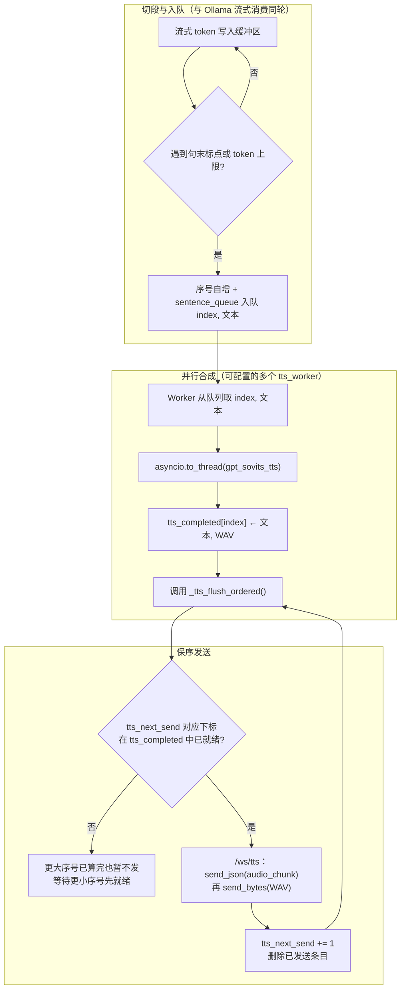
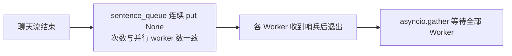
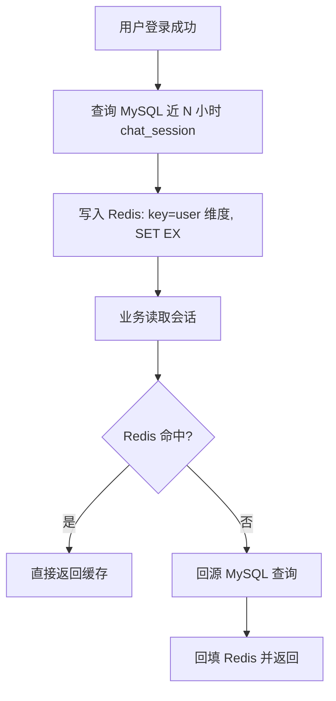
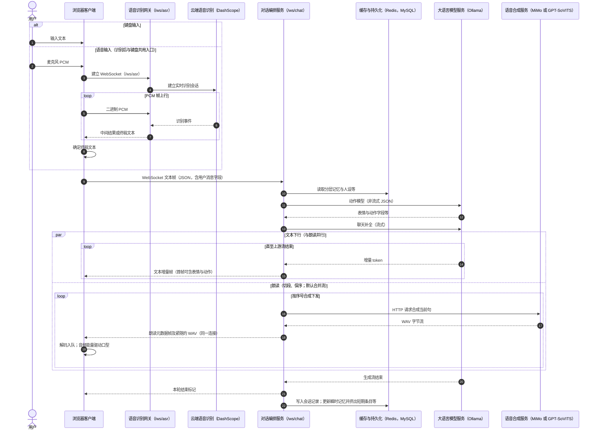
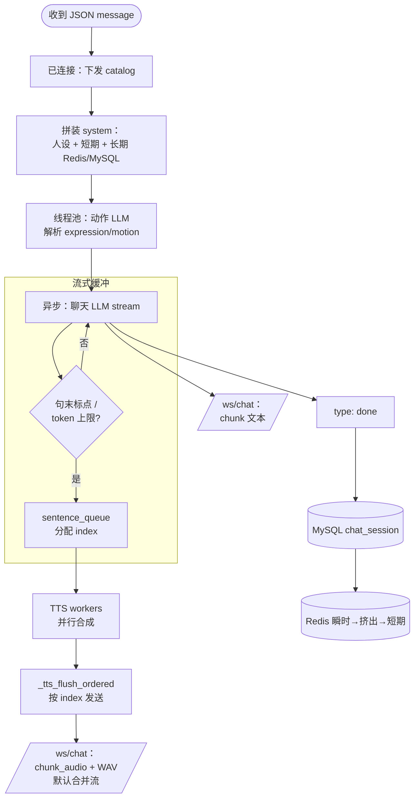
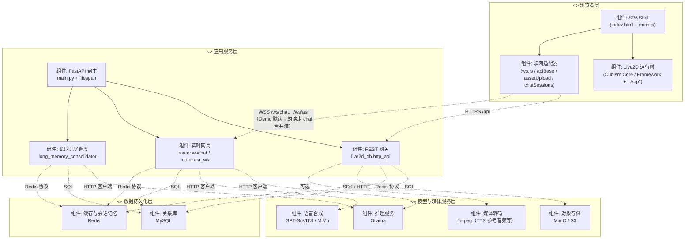

# 后端项目架构说明

> **【重点 · 定时关怀】** 本项目 **定时关怀（主动关怀）全链路已实现并可联调**：对话轮末异步抽取（**`PY/utils/remind_extract.py`**：先取 **Unix 时间戳** 换算为服务器 **本地「年月日:时分秒」** 字符串写入提示词，并与 **`scene_time`** 解析得到的 **对话语境参考时间**（同一中文日历格式展示）一并注入；**`trigger_time` 以模型输出为主**，服务端另做 **字符串解析、相对「N 分钟后」锚点校正、无依据年份收回、同日时刻顺延与跨年度日历滚转** 等，详见 **§9.6.2**）、**`remind_trigger`** 表与 REST（**§9.6**）、**`remind_trigger_scheduler`** 常驻扫描（**`PY/main.py`** lifespan，**默认约每 60 秒**，可调）、**`POST /api/remind-triggers/scan-now`**、投递瞬间话术（**`PY/utils/remind_delivery.py`**：可选 Ollama；**人设**从 MySQL **`persona`** 经 **`PersonaRepository.resolve_persona_for_package`** 读取，与主对话包级人设同源；可与主对话一致注入 **`user_profile`**）、**`/ws/chat`** 帧 **`remind_trigger`**、离线用户重连补发（**`flush_pending_reminders_for_connection`**），以及 **与主对话同源**的 **关怀 TTS**（**`PY/router/wschat.py`** **`_deliver_remind_trigger_on_websocket`**：在 **`REMIND_TRIGGER_USE_TTS`** 未关闭时按 **`TTS_PROVIDER`** 合成——**MiMo**（需 **`MIMO_API_KEY`**）或 **GPT-SoVITS**（须库内参考音频 **`refer_wav_path` + `prompt_text` + `prompt_language`** 齐全，与 **`/ws/chat`** 合并流一致）；成功则紧跟 **`chunk_audio`**（**`remind_audio: true`**）+ **WAV**。未设置 **`REMIND_TRIGGER_USE_TTS`** 时行为与旧 **`REMIND_TRIGGER_USE_MIMO`** 开关兼容。**帧字段**：**`trigger_content`** 在 REST 与 WebSocket 中均为**情景描述**；生成台词见 WS 的 **`delivery_message`**；话术拼装与后处理见 **§9.6.1**。

## 1. 总览

本仓库 **`PY/`** 目录承载基于 **FastAPI** 的应用层服务，默认通过 **`python main.py`** 或 **`uvicorn`** 监听 **`0.0.0.0:8000`**。服务在进程启动时加载 **`PY/.env`**（由 **`main.py`** 在导入路由前执行 `load_dotenv`），为 Ollama、GPT-SoVITS、Live2D 资源路径等提供配置。**具体环境变量键名不在正文罗列**，一律以 **`PY/.env` 内注释**为准；下文只说明「配什么、起什么作用」。应用通过 **`CORSMiddleware`** 允许常见本机开发 Origin；若前端运行在不同端口或域名，可在同一套部署配置中用**逗号分隔的 Origin 列表**追加（与代码中默认列表合并，见 **`PY/main.py`**）。

核心职责可概括为三类：

1. **对话与驱动数据**：通过 WebSocket（主要为 **`/ws/chat`**）接收用户文本，调用 **Ollama** 完成「动作/表情决策」与「聊天回复」两类推理，并将结构化结果与流式正文下发浏览器。  
   **动作/表情选型**（与主对话模型分离的一次 Ollama 调用）的 **`user`** 由 **`wschat._action_llm_user_content_sync`** 拼装：已登录时可含 **MySQL 人设**、**Redis 瞬时记忆**（与主对话同源 **`read_instant_turns_chronological`**）、**本轮用户输入**及 **【选题对象】** 提示；输出的 **`expression`/`motion` 表示 Live2D 虚拟角色（助手）应切换的资源，不是真人用户的表情或动作**。  
   **主对话 `system`**（**`_build_memory_for_model`** 首条基底来自 **`_chat_system_prompt_for_session`**）：除 **`PY/.env`** 中的 **`OLLAMA_CHAT_SYSTEM`** / **`OLLAMA_CHAT_OUTPUT_GUARD`** 与可选护栏外，**`_chat_system_prompt`** 固定追加一条 **提醒预告禁令**（大意：**严禁**预告「X 分钟后我会对你说……」「我稍后会提醒你……」等；若要记录提醒 **直接答已记下**，**勿**描述助手将来的行为），以降低主模型「剧透」定时关怀话术。**已登录用户**还可注入 **【叙事与现实语境】**（前端可选上行 **`scene_location`**：当前背景逻辑名；**`scene_time`**：用户设备本地真实时间）、**MySQL `user_profile` 摘要块**（是否注入由部署开关控制，见 **`PY/utils/user_profile_refresh.py`** 与 **`PY/.env`** 注释）。**定时关怀**投递瞬间由 **`PY/utils/remind_delivery.py`** 生成对用户台词时：**人设**从 MySQL **`persona`** 解析（与主对话同源）；若启用 LLM 且 **`USER_PROFILE_IN_CHAT`**（**`chat_inject_enabled()`**，与主对话一致）未关闭、库内 **`user_profile`** 存在非空字段，则将 **`format_profile_for_chat_system`** 输出的同一 **【用户画像】** 段落拼入该次 Ollama 调用的 **User** 消息（与瞬时记忆、情景描述、`session_id` 对应单轮等并列），见 **§9.6.1**。  
   **用户画像维护**：以「旧 **`user_profile`** + 当前 Redis **瞬时记忆**」调用 LLM，回写 **`user_profile`**——**①** 按 **`(user_id, package_key)`** 每 **N** 轮（默认 **5**，N 在 **`PY/.env`** 可调）在 **`_append_turn_to_redis_history`** 写 Redis 后触发；**②** **`/ws/chat`** 连接 **`finally`**（关页、刷新、断开）再触发一次（不计轮次）。详见 **§9.6.1** 与 **附录 A**。  
   **短期记忆周期摘要（可选）**：同一 **`_append_turn_to_redis_history`** 路径上，在画像刷新之后可调用 **`maybe_push_short_term_summary_after_turn`**（**`PY/utils/short_term_summary.py`**）：独立 Redis 计数、每 **N** 轮将短期 **`rule`** 与瞬时窗口拼成材料，经 Ollama 写入 **`type: summary`** 并 **`prune_rule_turn_times`** 去重；默认 **`SHORT_TERM_SUMMARY_ENABLED=0`** 关闭，见 **附录 B**。  
2. **语音合成**：在对话流式输出过程中，将待朗读文本分段提交至 **GPT-SoVITS** HTTP 接口，并将生成的 **WAV** 推送到与用户会话绑定的 **`/ws/tts`** 连接。  
3. **周边能力**：可选挂载 **语音识别** WebSocket、**Live2D 数据库** HTTP API 等扩展路由。

### 1.1 角色的独立世界（个性化）

**每一位 Live2D 角色**由 **`user_id` + `package_key`** 锚定，语义上应理解为 **角色活在自己的设定里**，而非与用户共用一套「中立助手」模板。**`persona`** 给出性格与口吻；**瞬时 / 短期 / 长期记忆**、**`chat_session`**、**表情动作 catalog** 等均 **按包分桶**，不同角色对话脉络 **互不串线**。前端可选上行 **`scene_location`**（叙事场景）与 **`scene_time`**（用户真实时间），便于区分 **角色所处舞台** 与 **现实时间**。**`user_profile`** 描述 **真人用户**，**人设** 描述 **虚拟角色**，二者 **分列**，勿混为同一主体。

以下表述若未特别说明，均默认服务已成功启动且依赖服务（Ollama、按需启用的 GPT-SoVITS）可达。

---

## 2. 分层与模块划分

| 层次 | 说明 | 主要位置 |
|------|------|----------|
| **入口与生命周期** | 创建 FastAPI 实例；在 `lifespan` 中调用 `init_catalog()`，对 **默认模型包**（包名在 **`PY/.env`** 可选配置）做一次资源索引预热；并 **`await start_long_memory_consolidator()`** 启动长期记忆后台循环（退出时 **`stop_long_memory_consolidator()`**）。 | `PY/main.py` |
| **WebSocket 对话与 TTS 编排** | `/ws/chat` 接单轮用户消息；主对话 **`system`** 可含人设 + **可选用户画像** + 场景块 + 短/长期记忆（见 **`_build_memory_for_model`**）；动作 LLM **`user`** 可含人设+瞬时（**`_infer_expression_motion`** / **`_action_llm_user_content_sync`**）；轮末写 Redis 后可 **按轮刷新 `user_profile`**，连接 **`finally`** 再 **断线刷新**（**`utils/user_profile_refresh.py`**）；聊天流式、切段入队；**多协程并行 TTS** + **`_tts_flush_ordered`** 保序（合并流时音频亦可走同连接 **`chunk_audio`**，以代码为准）。 | `PY/router/wschat.py`、`PY/utils/user_profile_refresh.py` |
| **Live2D 表情动作索引（`catalog`）** | 从 MySQL **`live2d_model_asset`** 聚合当前 **`user_id` + `package_key`** 下的 **`.exp3.json` / `.motion3.json`** 路径；**优先 Redis**、未命中回源 MySQL 并回写；进程内另有 dict 缓存；资源变更时 **`invalidate_live2d_catalog_cache`**。 | `PY/utils/live2d_catalog.py` |
| **TTS 客户端** | 以 HTTP POST 调用 GPT-SoVITS 默认 `/` 接口，上传文本与语言等参数，返回 WAV 二进制。 | `PY/utils/tts.py` |
| **语音识别** | 单独路由，供浏览器端语音输入等场景（具体协议见对应路由实现）。 | `PY/router/asr_ws.py`（含子模块） |
| **Live2D 数据库 API** | REST 风格接口，与 `live2d_db` 包内持久化、存储等逻辑配合。 | `PY/live2d_db/http_api.py` 等 |
| **记忆分层** | Redis 瞬时/短期列表读写（短期含 **`rule`** / **`summary`**）、长期 Redis 字符串、拼装进对话 **`system`**（与 **`user_profile` 摘要块**叠加）；长期 MySQL 行与 Redis 正文缓存由 **周期概要更新** 任务与读路径共同维护。 | `PY/live2d_db/memory_layers.py`、`PY/router/wschat.py` |
| **长期记忆 · 周期概要更新** | 后台按 **`LONG_MEMORY_SCAN_POLL_INTERVAL_SEC`**（默认 **300** 秒，模块内 **`_POLL_INTERVAL_SEC`**）轮询候选；从 **`chat_session`** **最近 24 小时**窗口（**`_SOURCE_WINDOW_SEC`**）读入 → **Ollama** 写入 **`long_memory.period_overview`**（含修补/扩写等）→ **`upsert`** 并 **`write_long_memory_text`** 刷新 Redis。同一 **user×包** 两次合并仍受 **`_MIN_GAP_SEC`**（默认 **86400** 秒）约束。手动全量回填：`python -m live2d_db.long_memory_consolidator`。对指定用户+模型包可 **`POST /api/long-memories/consolidate-now`**，即时调用 **`consolidate_one`**，**不受**后台最短间隔限制。 | `PY/live2d_db/long_memory_consolidator.py`、`PY/live2d_db/http_api.py` |

---

## 3. 运行时架构：WebSocket 与双通道

### 3.1 会话与模型包

- 浏览器为一次页面访问生成 **`session`**（UUID 等），并在 **`/ws/chat`** 与 **`/ws/tts`** 的 Query 中传入 **相同** 的 `session`（或 `sid`），服务端用字典 **`_session_tts_ws[session_id]`** 持有当前 TTS 专用 WebSocket。  
- **`package`**（或 `live2d_package` / `model`）为 **逻辑模型包键**，与前端画布当前包、MySQL **`live2d_model_asset.package_key`** 对齐（浏览器加载资源可走本地 **`Resources/<package>`** 或 **presigned URL**，与索引来源无关）。连接 **`/ws/chat`** 时解析该参数（经安全校验，禁止 `..` 与路径分隔符），调用 **`get_catalog_for_package(..., user_id=…)`** 得到索引，用于：**`type: catalog`** 与 **动作/表情 LLM**。  
- 同一进程内按 **`(user_id, package_key)`** 缓存 **`Live2dCatalog`**；索引来自 **Redis → MySQL**，非服务端扫描本地磁盘。
- `chat_session` 已引入 **`package_key`** 字段；同一 `user_id` 下按 **`package_key + session_key`** 区分会话，避免 A/B 模型的历史对话互相混入。

### 3.2 `/ws/chat` 行为概要

1. **`accept`** 后根据 **`session` + `package`** 记录日志并 **`send_json(catalog)`**。  
2. 循环 **`receive_json`**，读取 **`message`**；可选 **`scene_location`**（或 **`scene_label`**）、**`scene_time`**，写入主对话 **`system`** 与 MiMo 导演前缀（见 **§8**）。  
3. 在线程池中执行 **表情/动作选型** 的 Ollama 调用（非流式，与聊天模型分离）：**`system`** 为 **`action_llm_system_text`**（**`live2d_catalog`**：当前包资源表 + 「为 **Live2D 角色** 选型」规则）；**`user`** 见 **`_action_llm_user_content_sync`**（人设 **`_package_persona_chat_extra_sync`**、瞬时 **`_format_instant_turns_for_action_llm`**、本轮句；访客或无多段上下文时仅为本轮句）。**动作模型不读取**主对话 **`system`** 里的短期/长期记忆块。解析 **`expression` / `motion`** 后经规范化、集合校验与可选 **单侧补全回退**（相关开关在 **`PY/.env`**，见注释），与后续聊天流第一段一并 **`_chunk_json(..., expression=, motion=)`** 下发。  
4. 使用 **异步队列 + 线程池** 消费 Ollama **`stream=True`** 的聊天输出，按 token 迭代写入缓冲区；**仅首条 `chunk` 携带 `expression`/`motion`**，其余增量仅含 **`content`**。  
5. 与此同时，将缓冲区按 **句末标点**（及可选的 token 兜底策略）切句，为每句分配序号后入 **`sentence_queue`**，由若干个 **`tts_worker`** 协程（并行路数在 **`PY/.env`** 可调，见注释）并行调用 **`gpt_sovits_tts`**，经 **`_tts_flush_ordered`** 向 **`_session_tts_ws[session]`** 按 **`index`** 从小到大发送 **`type: audio_chunk`**，再发送 **二进制 WAV**（详见 **第 6 节**）。  
6. 流结束发送 **`type: done`**；异常路径发送 **`type: error`**。  
7. **（画像）** 每轮若成功写入 Redis 瞬时记忆，可能按计数触发 **`user_profile`** LLM 合并；**`/ws/chat`** 的 **`finally`**（用户断开连接）亦会 **`asyncio.to_thread`** 调用 **`refresh_user_profile_on_disconnect`**，用当前包下瞬时列表与库内旧画像做一次总结（瞬时为空则跳过，见 **`PY/utils/user_profile_refresh.py`**）。

因此：**文本流始终经 `/ws/chat` 下发**；**朗读音频经同会话的 `/ws/tts` 下发**，二者通过 **`session`** 配对，而非在同一条 WebSocket 上混传 JSON 与音频。

**合并流式 TTS（MiMo 等）**：当 **`wschat`** 判定 **`merged_stream`** 为真（例如已配置 MiMo 且引擎走合并路径）时，语音帧可在 **`/ws/chat`** 上以 **`type: chunk_audio`**（JSON 含 **`index` / `text` / `size`** 等）后紧跟 **二进制 WAV** 下发，浏览器侧见 **`前端项目正文.md`**（附录 · 聊天 TTS 与 Live2D 口型同步）。此时 **`/ws/tts`** 仍可并存于其它合成路径；具体以当前 **`PY/router/wschat.py`** 分支为准。

### 3.3 `/ws/tts` 行为概要

连接后注册到 **`_session_tts_ws`**，本体仅需维持连接以接收服务端推送的 **`audio_chunk` 元数据 + 二进制帧**；不负责上传合成文本（合成由 `/ws/chat` 侧逻辑触发）。

---

## 4. 大模型职责划分

| 角色 | 输入特点 | 输出用途 |
|------|----------|----------|
| **聊天模型** | **`system`**：**`PY/.env`** 中的全局指令与可选护栏 + 可选 **包级人设** + **可选 `user_profile` 画像块**（是否注入见部署开关）+ 可选叙事场景块；再叠加 **长期 / 短期** 段落；**`messages`** 中含 Redis **瞬时**多轮。**不**附带全量表情/动作表 | 流式自然语言回复正文 |
| **动作/表情选型模型** | **`system`**：`action_llm_system_text`（catalog + 角色选型语义）；**`user`**：可选人设 + 瞬时格式化正文 + 本轮输入（见 **`wschat.py`**） | 严格 JSON：`expression`、`motion`、`reason`，语义均指向 **虚拟角色** 的演绎资源；解析回退后写入 **本轮首条可见 chunk**（合并流首段 **`chunk_audio`** 亦可携带，以实现为准） |

所用 **Ollama 服务地址、各任务模型名、流式长度上限** 均在 **`PY/.env`** 配置，键名见该文件注释。

两套调用相互独立：先完成动作/表情决策，再启动聊天流式；聊天内容 **不再** 反向写入表情/动作字段。**表情/动作是为 Live2D 角色选择，不是为用户选择。**

---

## 5. Live2D 表情动作索引与 `catalog`

以 MySQL **`live2d_model_asset`** 为权威来源（通常由 **`upload-zip`** 等写入对象存储并建索引）：

- **筛选**：**`asset_type=exp3`** 或路径以 **`.exp3.json`** 结尾 → 表情；**`motion3`** 或 **`.motion3.json`** → 动作。  
- **读取顺序**：进程内 dict → **Redis**（键前缀默认 **`live2d:catalog`**，JSON 存 **`expression_paths`/`motion_paths`**，TTL 见 **`LIVE2D_CATALOG_REDIS_*`**）→ **MySQL**；MySQL 命中后 **回写 Redis**。资源变更时 **`invalidate_live2d_catalog_cache`**。  
- **`resources_root`**：字段保留兼容；**不**再用于服务端扫描生成列表。  
- **`ws_catalog_message()`**：下行 **`package_key`**、标识数组与路径数组；标识须与前端 **`setExpression`** / **`model3.json`** 一致。  

**`init_catalog()`**：预热默认 **`user_id` + 包名`**；**`get_catalog_for_package`** 按连接参数懒加载。

---

## 6. 语音合成切段策略

以下阈值与开关均在 **`PY/.env`** 可调，**键名与默认值以该文件注释及代码为准**；正文只描述语义。

- **默认**：按 **句末标点攒批阈值 N**（代码侧常见默认 **3**）累计 **句末标点**（**`？。！；` 及英文 `.;` 等**，与代码中 **`_SENTENCE_PUNC`** 一致）次数，**满 N 次**再将当前缓冲**整段**送 TTS，并**清空缓冲与计数**，后续正文重新攒；本轮回复**流结束**时若仍有残留，**不足 N 次也会刷净**并同样清空。  
- **可选**：将 **N 设为 1**：恢复「每遇到一处句末标点即切段」；此时可配合**最短字数门槛**（常见默认 **8**）避免极短一句单独送 TTS。  
- **可选**：**超长无标点切段**：超长无标点时仍可按 token 数强制切段（阈值 **≥4**）；关闭或未设则不启用。  
- **语速、合成语言**等亦在同一套部署配置中指定（见 **`PY/utils/tts.py`** / **`wschat.py`** 读取处）。

### 6.1 当前实现：切段 → 队列 → 多协程并行合成 + 保序发送

实现位于 **`PY/router/wschat.py`**：

- 流式正文按标点（及可选 token 上限）切成 **句子字符串**；每句入队前分配 **固定序号** `1..N`，以 **`(index, text)`** 形式 **`put`** 进 **`sentence_queue`**。  
- **并行 TTS worker 数**（默认 **2**，范围 **1～8**，在 **`PY/.env`** 配置）个 **`tts_worker`** 协程从队列取任务，各自 **`asyncio.to_thread(gpt_sovits_tts, ...)`**；多句可 **同时推理**。  
- 合成结果写入 **`tts_completed[index] = (text, wav)`**，再调用 **`_tts_flush_ordered()`**：在 **`tts_send_lock`** 下循环，**仅当** **`tts_next_send` 对应序号已有结果** 时才向 **`/ws/tts`** 发送 **一条 JSON + 一段 WAV**，然后 **`tts_next_send += 1`**；若 **`index == 3`** 先算完而 **`2` 未就绪**，则 **3** 暂存在字典中，**不会**抢先下发。  
- **并行 worker 数为 1** 时等价于单 worker 串行推理（仍走同一套保序逻辑）。  
- 合成异常或 **`/ws/tts` 未连接** 时，该句 **`wav` 为空 `bytes`**，仍占用 **`index`** 并尽力发送（**`size` 可为 0**），避免 **`next_send`** 永久阻塞。

### 6.2 下行 `audio_chunk` 与 `index`

每条语音对应先发一条 JSON，再发二进制帧（实现见 **`_try_send_json` / `_try_send_bytes`**）：

| 字段 | 含义 |
|------|------|
| **`type`** | 固定 **`audio_chunk`**。 |
| **`index`** | 正整数，**本会话本轮内按切段顺序从 1 递增**，与入队序号一致；并行合成时仍 **按该序号从小到大** 出现在 WebSocket 上。 |
| **`text`** | 本段合成的原文句子。 |
| **`size`** | 紧随其后的 WAV 字节长度（失败或未连接时可能为 **0**）。 |

前端宜按 **`index`** 衔接播放；服务端已保证 **`index` 在信道上的递增顺序**。

### 6.3 引擎侧并行与线程安全（补充）

- **`_tts_flush_ordered`** 只保证 **协议层** 发往 **`/ws/tts`** 的顺序；若 GPT-SoVITS 服务端或 PyTorch **不支持**多请求并发，可能出现排队、显存压力或错误，可将 **并行 TTS worker 数** 设为 **1**，或从部署侧限制并发。

### 6.4 流程图

下图可在支持 **Mermaid** 的编辑器或 GitHub 预览中渲染。若环境不支持，可对照图中节点与 **第 6.1 节** 文字说明理解。

**（1）切段 → 队列 → 并行合成 → 保序发往 `/ws/tts`**



**说明**：任一 Worker 在写入 **`tts_completed`** 后都会调用 **`_tts_flush_ordered()`**；当较小序号先完成时，同一次或后续 **`flush`** 即可从 **`tts_next_send`** 起连续发送多段。

**（2）本轮流结束时的收尾（示意）**



---

## 7. 部署配置一览（语义）

**原则**：正文不罗列 **`PY/.env`** 里的键名（避免与代码漂移、也更易读）；需要对照时**只看 `PY/.env` 内注释**。

| 配置主题 | 说明 |
|----------|------|
| **Ollama** | 服务地址、代理例外；**主对话**与**表情/动作选型**各自选用的模型；聊天流式 **`num_predict`** 是否封顶；全局聊天 **`system`** 与护栏等 |
| **GPT-SoVITS** | HTTP API 基址（与整合包 **`api.py`** 监听一致） |
| **Live2D 资源** | 启动预热默认包名、Resources 根目录；动作解析单侧为空时的补全与默认标识 |
| **TTS** | 句末标点攒批 **N**、无标点强制切段、并行 worker 数、语速与合成语言等 |
| **Redis** | 连接串或主机/端口/库号/口令；登录后会话缓存的回溯窗口、条数上限、TTL、key 前缀等 |
| **用户画像刷新** | 总开关、每 N 轮触发、断线是否再总结、是否注入主对话、合并所用模型（默认与主对话一致）、瞬时正文上限、计数键 TTL 与前缀等 |

### 7.1 登录后 `chat_session` 缓存策略

当前实现中，`POST /api/users` 命中“用户名已存在且密码正确”的登录分支后，会把该用户近 24 小时（可配）的 `chat_session` 回写到 Redis，供后续会话场景快速读取。

**缓存键结构（示例）**

- 默认 key：`chat_session:recent24h:user:12`
- **前缀与分片规则**可在 **`PY/.env`** 调整（键名见注释）；须包含 **用户维度**，与同用户多包缓存隔离一致。

**缓存值结构（示例）**

```json
[
  {
    "session_id": 101,
    "user_id": 12,
    "package_key": "Xiaozi",
    "session_key": "web-8c2f",
    "user_input": "今天有点紧张",
    "ai_reply": "先别急，我们一步一步来。",
    "emotion_tag": "焦虑",
    "create_time": "2026-05-02T01:21:33"
  }
]
```

**TTL 与失效策略**

- 默认 TTL：`86400s`（24 小时）；具体可在 **`PY/.env`** 修改登录缓存存活时间（见注释）。
- 登录时采用“覆盖写”策略：重新计算近窗数据并 `SET + EX` 覆盖旧值，避免增量拼接导致脏数据累积。
- Redis 不可用/未安装时降级：只记录日志，不影响登录主流程。

**命中与回源流程（建议）**



---

## 8. 客户端请求与下行消息类型（摘要）

**上行（`/ws/chat`）**（JSON）：

- **`message`**（必填）：用户文本。
- **`scene_location`**（可选）：当前背景逻辑名（叙事侧「角色场景」），兼容 **`scene_label`**。
- **`scene_time`**（可选）：用户设备本地真实时间字符串（Demo 为 **`zh-CN`** 格式化）。

示例：`{"message":"你好","scene_location":"深夜客厅","scene_time":"2026/05/08周五 18:30:45"}`。二者可省略。实现见 **`Demo/src/api/ws.js`** **`buildChatWsPayload`**。

**下行 JSON `type`**：

- **`catalog`**：连接后首包，全量可选表情/动作与路径。  
- **`chunk`**：首条可含 **`content` + `expression` + `motion`**；后续仅 **`content`**。  
- **`chunk_audio`**（可选）：合并流开启时，声明本段音频元数据后紧跟 **二进制 WAV**（与 **`前端项目正文.md`** 附录 · 聊天 TTS 与 Live2D 口型同步一致）。  
- **`done`**：本轮结束。  
- **`error`**：业务或上游错误。

**TTS 通道**：若未走合并流，朗读仍通过 **`/ws/tts`**：**`audio_chunk`**（JSON，含 **`index` / `text` / `size`**，见 **第 6.2 小节**）后紧跟 **二进制 WAV**；并行合成与保序发送见 **第 6.1～6.3 小节**。

---

## 9. 后端 HTTP 接口总表（当前实现）

> 说明：以下均来自 `PY/live2d_db/http_api.py`，统一前缀为 `/api`。  
> `PY/router` 下目前为 WebSocket（`/ws/chat`、`/ws/tts`、`/ws/asr`），不属于 HTTP 接口清单。

### 9.0 统一响应格式约束（`code/message/data`）

`/api/*` 接口通过路由级封装统一响应结构：

- 成功（HTTP 2xx）：
  - `code = 0`
  - `message = "ok"`
  - `data = 原接口业务数据（对象/数组/计数对象等）`
- 失败（HTTP 非 2xx）：
  - `code = HTTP 状态码（如 400/404/500）`
  - `message = 错误信息（优先取异常 detail）`
  - `data = null`

示例（成功）：

```json
{
  "code": 0,
  "message": "ok",
  "data": {
    "total": 12
  }
}
```

示例（失败）：

```json
{
  "code": 404,
  "message": "用户不存在",
  "data": null
}
```

### 9.1 Users

| Method | Path | 说明 |
|---|---|---|
| POST | `/api/users` | 创建用户；若用户名已存在且密码正确，按“登录”处理并将该用户近 24h `chat_session` 写入 Redis 缓存 |
| GET | `/api/users` | 用户列表（支持分页） |
| GET | `/api/users/count` | 用户总数 |
| GET | `/api/users/resolve` | 按用户名或手机号解析用户 |
| GET | `/api/users/{user_id}` | 获取单个用户 |
| PUT | `/api/users/{user_id}` | 更新用户 |
| DELETE | `/api/users/{user_id}` | 删除用户 |

### 9.2 Chat Sessions

| Method | Path | 说明 |
|---|---|---|
| POST | `/api/chat-sessions` | 创建会话记录 |
| GET | `/api/chat-sessions` | 会话列表；Query：**`user_id`** 必填；**`package_key`**、**`session_key`** 可选；**`page`** 默认 **1**；**`size`** 默认 **50**（1–500） |
| GET | `/api/chat-sessions/count` | 会话总数（按用户，可附加 `package_key`、`session_key`） |
| GET | `/api/chat-sessions/{session_id}` | 获取单条会话 |
| PUT | `/api/chat-sessions/{session_id}` | 更新会话 |
| DELETE | `/api/chat-sessions/{session_id}` | 删除会话 |

**分页**：使用 **`page` / `size`**，内部换算 **`limit = size`**、**`offset = min((page - 1) * size, 100000)`**。未传 **`session_key`** 时 **`list_by_user`** 按 **`create_time DESC`**：**`page=1`** 为最新一批。传 **`session_key`** 时 **`list_by_session_key`** 按 **`create_time ASC`**，**`page`** 语义不同，自定义客户端须单独约定。

### 9.3 Long Memories

| Method | Path | 说明 |
|---|---|---|
| POST | `/api/long-memories` | 创建长期记忆 |
| GET | `/api/long-memories` | 长期记忆列表（按用户、分页） |
| GET | `/api/long-memories/count` | 长期记忆总数（按用户） |
| POST | `/api/long-memories/consolidate-now` | 即时执行一轮周期概要更新；Query：`user_id`（必填）、`package_key`（可选）。与后台共用 **`consolidate_one`**，**不经过**最短间隔筛选；响应 **`data.updated`** 表示是否写入/更新了 **`period_overview`**。 |
| GET | `/api/long-memories/{memory_id}` | 获取单条长期记忆 |
| PUT | `/api/long-memories/{memory_id}` | 更新长期记忆 |
| DELETE | `/api/long-memories/{memory_id}` | 删除长期记忆 |

### 9.4 Personas

| Method | Path | 说明 |
|---|---|---|
| POST | `/api/personas` | 创建人设（全局模板） |
| GET | `/api/personas` | 人设列表（`enabled_only` / `status` / 分页等查询参数见实现） |
| GET | `/api/personas/count` | 人设总数 |
| GET | `/api/personas/by-package/{package_key}?user_id=` | 读取某用户在某模型包上的人设；无记录时返回占位 |
| GET | `/api/personas/package-bound?user_id=` | 列出该用户全部「按包绑定」人设 |
| POST | `/api/personas/expand-from-hints` | 根据简短关键词调用 LLM 扩写 `character_desc` / `tone_style`（**不入库**，供表单预览） |
| PUT | `/api/personas/by-package/{package_key}?user_id=` | Upsert 包级人设（请求体见 `PersonaPackageUpsert`） |
| GET | `/api/personas/{persona_id}` | 获取单个人设 |
| PUT | `/api/personas/{persona_id}` | 更新人设 |
| DELETE | `/api/personas/{persona_id}` | 删除人设 |

### 9.5 User Profiles

| Method | Path | 说明 |
|---|---|---|
| GET | `/api/user-profiles/by-user/{user_id}` | 按用户获取画像 |
| PUT | `/api/user-profiles/by-user/{user_id}` | 按用户 Upsert 画像 |
| GET | `/api/user-profiles/{profile_id}` | 按画像 ID 获取 |
| DELETE | `/api/user-profiles/{profile_id}` | 删除画像 |

### 9.6 Remind Triggers

| Method | Path | 说明 |
|---|---|---|
| POST | `/api/remind-triggers` | 创建提醒触发器 |
| GET | `/api/remind-triggers` | 触发器列表（按用户/触发状态、分页） |
| GET | `/api/remind-triggers/count` | 触发器总数（按用户/触发状态） |
| GET | `/api/remind-triggers/pending-scan` | 拉取待扫描触发器列表 |
| GET | `/api/remind-triggers/pending-count` | 待扫描触发器数量 |
| POST | `/api/remind-triggers/scan-now` | **手动触发一轮到期扫描**（不等后台间隔）；响应 **`data`** 含 **`pending_fetched`、`claimed`、`delivered`、`released_no_ws`**，便于排查「无气泡」是否因无到期行或用户未在线 **`/ws/chat`**。**当前实现无鉴权**，生产环境宜自行加固。 |
| GET | `/api/remind-triggers/{trigger_id}` | 获取单个触发器 |
| PUT | `/api/remind-triggers/{trigger_id}` | 更新触发器 |
| DELETE | `/api/remind-triggers/{trigger_id}` | 删除触发器 |

**常驻调度扫描（实现）**：**`PY/live2d_db/remind_trigger_scheduler.py`** 由 **`PY/main.py`** 的 **`lifespan`** 启动，按 **`REMIND_TRIGGER_SCAN_INTERVAL_SEC`** 轮询到期行（**默认 60 秒**，最小 **5** 秒；生产若需降负载可改为 **300** 等）。扫描条件与 **`GET /api/remind-triggers/pending-scan`** 一致，均基于 **`list_pending_before(now)`**：**`is_triggered=0`** 且 **`trigger_time<=` 服务器本地当前时刻**（调度侧 `remind_trigger_scheduler` 使用 **`datetime.now()`**；抽取入库侧使用 **`time.time()`→`datetime.fromtimestamp`**，二者均为同一本机本地墙钟语义，与入库对齐）**。单次最多处理 **`REMIND_TRIGGER_SCAN_BATCH`** 条（默认 **200**，上限 **2000**）。因此「到期」之后还须等到 **下一次扫描** 才会推送；默认滞后约 **一分钟量级**，联调可用 **`scan-now`** 或把 **`trigger_time`** 写成「几分钟前」验证。

#### 9.6.1 `user_profile` 与 `remind_trigger` 的边界说明

二者是**互补关系**，不是重复建模：

- `user_profile`（尤其 `user_tags`）用于保存用户长期画像标签，例如“考研党”“压力大”“晚间活跃”，回答“用户是谁、长期倾向是什么”。  
- `remind_trigger` 用于保存具体待执行事项，包含 `trigger_time`、`trigger_content`、`is_triggered`，回答“何时做什么、是否已执行”。  

为避免冲突，约定如下：

- 画像表不保存具体时间点任务；
- 待办表必须包含触发时间与执行状态；
- 标签用于“召回与策略”，待办用于“调度与执行”。

**画像更新（实现）**：**`PY/utils/user_profile_refresh.py`** 读取 MySQL 中已有 **`user_profile`** 四字段，与 **当前模型包** 下 Redis **瞬时记忆**（时间正序多轮 **`u`/`a`**）一并送入 LLM，解析 JSON 后 **`upsert`**（每 **`user_id`** 一行）。**触发时机**：**(1)** **`maybe_refresh_user_profile_after_turn`**——Redis 递增轮次计数键（格式见源码），计数整除 **N**（默认 **5**，N 在 **`PY/.env`**）时执行；**(2)** **`refresh_user_profile_on_disconnect`**——**`/ws/chat`** **`finally`** 中执行，与轮次无关。**总开关**、断线是否再总结等均在 **`PY/.env`**（键名见注释）。瞬时列表为空时不调用 LLM。

**关怀话术生成（实现）**：**`PY/utils/remind_delivery.py`** 中 **`generate_remind_delivery_message`** 在 **`REMIND_DELIVERY_USE_LLM`** 未关闭时调用 Ollama（模型 **`REMIND_DELIVERY_MODEL`**，缺省同 **`OLLAMA_MODEL`**；可选 **`REMIND_DELIVERY_TEMPERATURE`**、**`REMIND_DELIVERY_NUM_PREDICT`**）。

**User** 消息拼装顺序（与论文「输入拼装」一致）：

1. **人设块（可选）**：MySQL 表 **`persona`**，**`PersonaRepository.resolve_persona_for_package(conn, user_id, package_key)`**，正文为 **`tone_style` / `character_desc`** 格式化的 **【语气风格】**、**【角色设定】**（实现函数 **`_persona_mysql_block`**；超长截断与人设不可用时的降级逻辑见源码）。
2. **用户画像块（可选）**：**`USER_PROFILE_IN_CHAT`**（**`chat_inject_enabled()`**）未关闭且 **`user_profile`** 存在非空字段时，**`format_profile_for_chat_system`** → **【用户画像】**。
3. **当前对话瞬时记忆（可选）**：段落标题 **【当前对话瞬时记忆】**；**`memory_layers.read_instant_turns_chronological`**，与 **`/ws/chat`** 同 **`(user_id, package_key)`** Redis 瞬时 List、时间正序多轮 **`用户：`/`助手：`** 原文，**不含**短期压缩层。
4. **【关怀类型】**：**`trigger_type`**。
5. **【情景详细描述】**：库内 **`trigger_content`**；若无则正文 **`未提供`**（不是给用户看的终稿，仅供 LLM 理解备忘）。
6. **【关联对话原文】**：有效 **`session_id`** 时读取 **`chat_session.user_input` / `ai_reply`**；无有效 **`session_id`**（含 **`NULL`、≤0、无行、用户不匹配或正文皆空**）则正文 **`未绑定`**。

**System** 要求 **重新撰写**对用户当场说出的一段话：**最强禁令（勿预告将来行为、勿输出「【日常关怀】」等类型标签）置于段首**，其后说明输入材料顺序与主轴；以情景与瞬时对话为主轴，可呼应关联单轮与人设/画像；输出 **1～3 句**口语化中文，不编造材料中不存在的事实，禁止 JSON/Markdown；约 **800** 字符上限（服务端超长截断加省略号）。文末仍可重申勿嵌套复述情景草稿、勿照搬「N 分钟前/后」类时间悖论措辞、勿输出「定时关怀」等机器话术（细则以源码 **`system` 字符串**为准）。

**生成稿后处理（实现）**：**`_strip_model_output`** 去除代码围栏与外层引号后，**循环剥除**行首 **`【最多32字】`** 式关怀类型前缀，正则兼容 **半角/全角冒号** 与 **空白（含全角空格）** 紧随（如 **`【日常关怀】：……`**）；剥除结束可打 **`logger.debug`** 预览。**`_post_process_delivery`** 用正则剔除模型复读 **`trigger_content`** 时带入的 **「若干分钟/小时/秒 + 前/后 + 短尾」** 类短语，并整理因删除产生的 **`，。`** 等标点粘连。

**REST** 响应中 **`trigger_content`** 与库内一致；**WebSocket** 帧中 **`trigger_content`** 同名同义，生成稿在 **`delivery_message`**；**REST** 的 **`delivery_message`** 恒为 **`null`**。

**关怀投递与 TTS（实现）**：**`_deliver_remind_trigger_on_websocket`**（**`PY/router/wschat.py`**）仅在 **`trigger_type`** 非空且 **`generate_remind_delivery_message`** 得到 **非空正文** 时发送 **`remind_trigger`** JSON；否则 **不下发帧**（自认领成功，避免到期行反复争抢）。若已下发 JSON 且 **`REMIND_TRIGGER_USE_TTS`** 为 **开启**（未设置环境变量时回退 **`REMIND_TRIGGER_USE_MIMO`**），则按 **`normalized_tts_provider()`** 调用 **`mimo_tts`** 或 **`gpt_sovits_tts`**（参数与 **`/ws/chat`** 流内 TTS 一致）；合成得到有效 WAV 后发送 **`chunk_audio`**（**`remind_audio: true`**）并紧随二进制帧。**GPT-SoVITS** 参考不完整时 **跳过合成**（打日志），不阻断气泡。

#### 9.6.2 对话轮末写入 `remind_trigger`（`remind_extract`）

**目的**：每轮用户发言与助手回复落库后，由后台线程调用 **`extract_and_persist_reminders`**（**`PY/utils/remind_extract.py`**），判断是否应插入 **`remind_trigger`** 行，供调度扫描与 **`remind_delivery`** 投递。

**调用链**：**`PY/router/wschat.py`** 在本轮 **`_persist_raw_memory`** 成功并得到 **`session_id`** 后 **`asyncio.to_thread`** 调用 **`extract_and_persist_reminders(..., package_key=..., session_id=..., scene_time=scene_time)`**，其中 **`scene_time`** 取自本条 **`/ws/chat`** JSON 载荷（与主对话 **`scene_time`** 同源，一般为前端 **`zh-CN` `toLocaleString`**）。

**开关与模型**：总开关 **`REMIND_EXTRACT_FROM_DIALOGUE`**（默认开启，置 **`0/false/off`** 关闭）；抽取专用模型 **`REMIND_EXTRACT_MODEL`**（缺省回退 **`OLLAMA_MODEL`**）；**`OLLAMA_HOST`** 与聊天链路一致。

**注入抽取 LLM 的时刻（锚定「现在」与相对换算）**：

- **【服务器当前时间】**：抽取当次取 **`time.time()`**（Unix 秒级时间戳），再 **`datetime.fromtimestamp`** 得到本地 naive **`datetime`**，在 User 消息文首以 **`YYYY年MM月DD日:HH:MM:SS`** 展示（实现：**`_now_local_from_timestamp`** / **`_format_datetime_for_extract_llm`**）。该 **`datetime`** 与 **`_relative_minute_anchor`、`_roll_trigger_time_to_future`**、年份收回等入库前逻辑共用。**部署侧应保持主机日期／时区正确**。  
- **【对话语境参考时间】**：若能解析本条消息的 **`scene_time`**（**`_parse_scene_time_string`**，兼容 **`zh-CN` `toLocaleString`** 常见格式）则为用户设备时刻，并以 **同上「年月日:时分秒」格式** 写入提示词；否则 **等同服务器当前时间**。提示词要求模型 **自行完成**「几分钟后」「明天」「某月某日」等到 **绝对触发时刻** 的换算；**`_resolve_relative_offsets`** 将用户句中「几分钟后」等预先换算为同格式的绝对时刻表，模型须优先采用。**公历年默认与参考时间的自然年一致**，除非对话明确「明年」「下一年」等。  
- **服务端对模型时间的校正（入库前）**（减小「永远在明年 / 整点压错导致永不触发」）：  
  - **`_relative_minute_anchor`**：用户句中含 **「N 分钟后」** 时，用参考时刻 **`+N 分钟`** 得到锚点；若模型 **`trigger_time`** 与锚点相差 **超过 120 秒**，**以锚点为准**（模型常压成整点导致偏差）。  
  - **`_clamp_model_year_to_reference`**：若解析出的年份 **大于参考年**，且用户输入与助手回复中 **未** 出现「明年 / 来年 / 下一年 / 后年 / next year」等依据，也 **未** 在文中明确写出该四位年份，则将 **`trigger_time` 的年份收回为参考年**（避免无依据写成下一公历年导致 **`trigger_time > 服务器年份`**、扫描永远为空）。  
  - **解析失败兜底**：若模型 **`trigger_time`** 不可解析，但存在上述「N 分钟后」锚点，则 **仅用锚点入库**。  
  - 仍 **无**「模型空 **`reminders`** 列表时的凭空兜底插入」。  

**上下文**：当前包 **人设**、**`long_memory.period_overview`**、Redis **瞬时记忆**（与源码截断上限一致）；再加本轮 **用户 + 助手** 文本。

**`trigger_type` 四类校验与跳过（实现）**：抽取模型每条 **`reminders[]`** 经 **`_normalize_trigger_type`** 规范化。**仅当** 值为 **`生日`、`纪念日`、`考试`、`日常关怀`** 四字之一（可先 **`strip` 并去掉字间空白再比对）或 **窄范围英文等价写法**（如 **`birthday` / `anniversary`**；考试类英文 **`exam`、`test`、`quiz`、`midterm`、`final`、`interview`** 等 **分词命中**；**`daily care`** 类短语映射日常关怀）时 **才入库**。  
**禁止**再用「正文含提醒、关怀等子串即自动归入日常关怀」等宽泛启发式替模型归类。若模型输出 **空字符串、其它汉字、「其他」「待定」或任意无法识别的 `trigger_type`**，规范化结果为「无类型」→ **本条跳过、不写入 `remind_trigger`**（日志计入 **`skipped_bad_type`**），等价于 **LLM 判定「不属于四类则不启用本条关怀」**。抽取 **system** 提示要求：**无法归入四类时不要输出该条**，勿用空 **`trigger_type`** 占位。  

**与投递的关系**：库内若存在历史 **`trigger_type` 为空串** 的到期行，**`remind_delivery`** 与 **`_deliver_remind_trigger_on_websocket`** 会 **不下发 `remind_trigger` 帧**（自认领成功以清空队列），见 **§9.6.1**。

**`trigger_time` 字符串解析（粗粒度可入库）**：**`_parse_trigger_time`** 将模型输出的时间字符串规范为 **`datetime`** 后写入表字段，例如：

| 模型输出示例 | 入库含义（缺失部分按约定补齐） |
|-------------|-------------------------------|
| **`YYYY-MM`** | 该月 **1 日 09:00:00** |
| **`YYYY-MM-DD`**（无时刻） | 当日 **09:00:00** |
| **`YYYY-MM-DDTHH`** / **`YYYY-MM-DD HH`**（可到小时、可无分秒） | 该小时 **:00:00** |
| 含分秒的 ISO / **`YYYY年M月D日`** 等 | 按解析到的时分秒；小数秒截断 |

解析失败时再尝试 **`datetime.fromisoformat`**。  

**日历类日期顺延（`_roll_trigger_time_to_future`）**：在 **`_clamp_model_year_to_reference`** 之后执行。  
- 若解析时刻 **早于当前（含 `_SKEW`，默认约 2 分钟容忍）** 且 **与服务器同一天**：视为模型把时刻压成整点/零点等，**在同日内抬到刚过门槛**，避免旧实现误将「同日早于当前」滚成 **下一公历年同日**（从而造成一年内永不触发）。  
- 若 **不在同一天**：仍按 **递增公历年** 尝试 **`dt.replace(year=y)`**，使「同月同日（+原有时分秒）」首次 **不早于** **`now - _SKEW`**，用于模型写成「去年的月日」等年度重复语义。

### 9.7 Live2D TTS 参考音频

用于为 **GPT-SoVITS / 克隆音色路径**等保存「参考 wav + 提示文本」；音频可经 **ffmpeg** 转为标准 PCM WAV 后写入对象存储。

| Method | Path | 说明 |
|---|---|---|
| GET | `/api/live2d-tts-refers` | 列表；可按 `user_id` + 可选 `package_key` 筛选 |
| POST | `/api/live2d-tts-refers/upload` | 表单：`user_id`、`package_key`、`prompt_text`、`prompt_language`、上传文件 `refer_audio` |

> **说明**：历史上文档曾列出 **`/api/live2d-actions`** CRUD；**当前 `http_api.py` 已不再挂载该组路由**。若需对接旧表请自行恢复路由或查版本历史。

### 9.8 Live2D Model Assets

| Method | Path | 说明 |
|---|---|---|
| POST | `/api/live2d-model-assets` | 创建模型资源索引记录 |
| POST | `/api/live2d-model-assets/upload-zip` | 上传模型 zip，自动解包、上传对象存储并重建该包索引 |
| GET | `/api/live2d-model-assets` | 资源索引列表（按用户、包名、类型、分页） |
| GET | `/api/live2d-model-assets/count` | 资源索引总数（按过滤条件） |
| GET | `/api/live2d-model-assets/packages` | 按用户聚合已有包：文件数、`asset_types`、是否含入口 model3、是否已有 TTS 参考 |
| GET | `/api/live2d-model-assets/download-url?asset_id=...` | 生成单资源临时下载链接（返回 `url`、`expires_in`） |
| DELETE | `/api/live2d-model-assets/by-package/{package_key}` | 按包删除该用户资源索引；**同步删除**该用户该包的包级人设行，并清理 Redis 内 MiMo 导演人设缓存（若有） |
| GET | `/api/live2d-model-assets/{asset_id}` | 获取单条资源索引 |
| PUT | `/api/live2d-model-assets/{asset_id}` | 更新资源索引 |
| DELETE | `/api/live2d-model-assets/{asset_id}` | 删除资源索引 |

### 9.9 Background Images（`background_image`）

表 **`background_image`** 存背景逻辑名与 MinIO **`url`**；**`GET /api/background-images/random`** 随机一行（**`ORDER BY RAND() LIMIT 1`**），默认 **`presign=true`** 生成预签名 URL；**`GET /api/background-images`** 分页列表；**`GET /api/background-images/count`** 总数。迁移 **`PY/live2d_db/migrations/20260508_background_image.sql`**；种子 **`PY/seed_demo_background_images_once.py`**（**扫描** **`Demo/public/Resources/background`** 目录，同名多扩展名按优先级保留一条）。

### 9.10 模型上传入库流程（当前实现）

该流程对应“上传 → 存储 → MySQL 入库 → 前端按需取临时 URL”，用于替代手工放置本地 `Resources` 目录：

1. 前端或管理端向 **`POST /api/live2d-model-assets/upload-zip`** 提交表单：`user_id`、可选 `package_key`、`model_zip`。  
2. 服务端校验 zip 合法性与路径安全（过滤空路径、`..`、非法前缀）。  
3. 解析包内 `*.model3.json` 入口与 `FileReferences`（`Moc`、`Textures`、`Physics`、`DisplayInfo`、`Expressions`、`Motions`），提取模型引用关系。  
4. 将 zip 内文件上传到对象存储（MinIO/S3），记录 `object_key`，并保留兼容用 `public_url`。  
5. 清理该用户该包在 `live2d_model_asset` 的旧索引行，再批量写入新索引（含 `asset_type`、`logical_name`、`motion_group`、`is_listed_in_model3`、`is_entry_model` 等字段）。  
6. 前端读取资源索引后，通过 **`GET /api/live2d-model-assets/download-url`** 按 `asset_id` 获取临时可下载地址（`url` + `expires_in`），用于加载 model3/moc3/贴图/动作/表情。  
7. 整体路径改为“索引持久化 + 按需签名放行”，不再依赖“先拷贝到本地静态目录再手工扫描”。

关键落库表：`live2d_model_asset`（文件级索引，包含对象存储键、类型、动作组、是否被 model3 引用等）。

> 路由总数以 **`PY/live2d_db/http_api.py`** 内实际注册为准（已含 **`/background-images/*`**）。

---

## 附录 A · `user_profile` 与瞬时记忆的合并流程

| 项目 | 说明 |
|------|------|
| **目的** | 将对话侧 **Redis 瞬时记忆**沉淀为 MySQL **`user_profile`**，供主对话 **共情与个性化**（**`system`** 注入）。 |
| **输入** | **旧画像**（四字段格式化为正文；无记录则提示模型冷启动）；**瞬时记忆**（**`memory_layers.read_instant_turns_chronological`**，正文长度上限在 **`PY/.env`**，见注释）。 |
| **输出** | LLM 严格 JSON：**`user_tags`、`emotion_state`、`preferences`、`trouble_events`** → 长度裁剪后入库。 |
| **与动作模型的区别** | **动作/表情 LLM** 的 **`user`** 含人设+瞬时+本轮句，**不读** **`user_profile` 块**、**不读**短/长期 **`system`** 段落（与主对话分流）。 |
| **实现文件** | **`PY/utils/user_profile_refresh.py`**；调用点 **`PY/router/wschat.py`**（**`_append_turn_to_redis_history`**、**`chat_websocket` 的 `finally`**）。 |

---

## 10. 实现索引

| 内容 | 文件 |
|------|------|
| WebSocket 对话、动作 LLM、聊天流、TTS 队列、`user_profile` 按轮/断线刷新、可选短期摘要调度 | `PY/router/wschat.py` |
| 用户画像 LLM 合并（旧画像 + 瞬时记忆） | `PY/utils/user_profile_refresh.py` |
| 短期记忆周期摘要（`rule`+瞬时 → `summary`，可选开关） | `PY/utils/short_term_summary.py` |
| 定时关怀投递话术（LLM）；MySQL `persona` 人设 + 可选 `user_profile`、Redis 瞬时记忆、`chat_session` 关联轮 | `PY/utils/remind_delivery.py` |
| 定时关怀从对话抽取入库（`scene_time` + 服务器时刻；**`trigger_type` 严格四类否则跳过**；`trigger_time` 解析 / 相对分钟锚点 / 年份收回 / 日历顺延） | `PY/utils/remind_extract.py` |
| 聊天 TTS 口型与 `chunk_audio`（前后端约定） | `前端项目正文.md`（附录 · 聊天 TTS 与 Live2D 口型同步） |
| MinIO 客户端、预签名、区域等部署项 | `PY/live2d_db/minio_storage.py` |
| 资源扫描、`catalog`、动作 LLM 系统提示拼接 | `PY/utils/live2d_catalog.py` |
| GPT-SoVITS HTTP 封装 | `PY/utils/tts.py` |
| 应用入口与 `lifespan`、CORS | `PY/main.py` |
| 数据库 HTTP 接口（含背景图 **`/background-images`**） | `PY/live2d_db/http_api.py`、`PY/live2d_db/repositories.py` |
| 背景目录扫描种子脚本 | `PY/seed_demo_background_images_once.py` |
| Demo 随机背景与聊天载荷 | `Demo/src/api/backgroundImages.js`、`Demo/src/main.js`、`Demo/src/api/ws.js` |
| 记忆分层（瞬时/短期/长期 Redis，`push_summary_entry`） | `PY/live2d_db/memory_layers.py` |
| 周期概要更新后台、`POST /long-memories/consolidate-now` | `PY/live2d_db/long_memory_consolidator.py`、`PY/live2d_db/http_api.py` |

与 GPT-SoVITS 部署、联调的细节见 **本文附录 · GPT-SoVITS 与 PY 服务对接**。


---

## 附录 B · 架构与时序图

本文档给出与本仓库实现相对应的顺序图、流程图、分层组件图（UML 组件图风格）及 **UML 用例图**（Mermaid 绘制）。其中 **§1** 主对话顺序图对应论文 **§3.4 用例与交互流程**、**§3.6 数据流与时序**：键盘与语音仅在「得到用户 utterance 文本」之前分叉，**进入 `/ws/chat` 的载荷均为同一形态的文本消息**。可在 VS Code、GitHub、GitLab 等支持 Mermaid 的 Markdown 预览中渲染。

---

## 1. 顺序图：主对话端到端（键盘 / 语音汇合为文本）

**概念**：用户在界面上的输入路径有两种——直接键盘输入，或先经麦克风由 ASR 转为终稿字符串；二者在前端汇合为 **`sendChatMessage` → `/ws/chat`** 的 **`{ "message": "..." }`**，其后链路完全一致：**读 Redis/MySQL 记忆与人设 → Ollama 动作模型 → Ollama 聊天流式 → 服务端切段调用 TTS → 下行播放与口型**。

**与附带 Demo 一致的路径**：朗读帧默认经 **同一条 `/ws/chat`** 下发：先 JSON **`chunk_audio`** 元数据帧，**再紧随二进制 WAV**（合并流）；浏览器侧解码入队驱动播放与口型；**不依赖**独立朗读连接。字段语义以实现代码为准。



**配置提示**：ASR 依赖 **`DASHSCOPE_API_KEY`**；前端可通过 **`VITE_ASR_WS_URL`** 覆盖 **`/ws/asr`** 地址（见 `Demo/src/api/wsConfig.js`）。

---

## 2. 流程图：`/ws/chat` 一轮请求（逻辑主干）



---

## 3. 分层架构图（UML 组件图风格）

`<<layer>>` 表示架构层；虚线箭头表示运行时依赖方向；连接器上标注主要协议。



---

## 4. UML 用例图（核心用例）

参与者：**用户**（主要）；**定时扫描 / 提醒任务**（次要，对应库表 `remind_trigger` 等业务侧的待扫描逻辑，具体触发方式以实现为准）。

用例图中 **`«include»`** 表示语音路径在识别完成后 **包含** 将文本送入与文本对话相同的会话链路。

```mermaid
usecaseDiagram
    left to right direction

    actor "用户" as U
    actor "定时扫描与提醒任务" as S

    rectangle "Live2D 数字人系统" {
        usecase "登录 / 注销" as UC_Login
        usecase "文本对话" as UC_Text
        usecase "语音对话" as UC_Voice
        usecase "切换 Live2D 模型" as UC_Model
        usecase "接收主动关怀推送" as UC_Care
        usecase "查看历史会话" as UC_History
        usecase "上传模型音色与角色定义" as UC_AssetPersona
    }

    U --> UC_Login
    U --> UC_Text
    U --> UC_Voice
    U --> UC_Model
    U --> UC_Care
    U --> UC_History
    U --> UC_AssetPersona

    S --> UC_Care

    UC_Voice ..> UC_Text : «include»\n(ASR 结果进入对话)
```

**与实现的粗略对应（便于写论文「实现章节」对照）**

| 用例 | 典型前端 / 后端触点 |
|------|---------------------|
| 登录 / 注销 | `Login.html`、`live2d_info`、`POST /api/users`（登录分支） |
| 文本对话 | `ws.js` → `/ws/chat`（文本 `chunk`；朗读默认 `chunk_audio` + WAV 同连接） |
| 语音对话 | `SpeechRecognition.js`、`/ws/asr` → 终稿文本再走文本对话 |
| 切换 Live2D 模型 | 工具栏切换、`setLive2dPackage`、`reconnectChatWebSocketsForNewPackage` |
| 接收主动关怀推送 | `remind_trigger` + 业务推送通道（若当前仅为 REST 查询待触发项，可在正文注明「数据模型已具备，推送通道可扩展」） |
| 查看历史会话 | `chatSessions.js` → `GET /api/chat-sessions` |
| 上传模型 / 音色与角色定义 | `upload-zip`、`live2d-tts-refers/upload`、`characterDef.html` / `/personas/by-package` |

---

## 相关文档

- 后端模块与 HTTP 清单：`后端项目正文.md`
- 前端与 WebSocket：`前端项目正文.md`
- 记忆分层与周期概要更新：`后端项目正文.md`（附录 C · 聊天双层记忆与 Redis）
- TTS 与口型：`前端项目正文.md`（附录 B · 聊天 TTS 与 Live2D 口型同步）


---

## 附录 C · 聊天双层记忆与 Redis

本文说明 WebSocket 对话链路中 **瞬时记忆**、**短期记忆** 在 Redis 中的形态、写入顺序，以及如何拼装进大模型上下文；并简述 **长期记忆**（MySQL + Redis）与后台 **周期概要更新** 任务。实现以 `PY/live2d_db/memory_layers.py`、`PY/router/wschat.py`、`PY/live2d_db/long_memory_consolidator.py` 为准。

**说明：** 历史上曾使用独立的 Redis List `mem:acc:*` 作为「摘要累积队列」，已在代码中移除；瞬时与短期之间不再经由该键中转。

---

## 1. 分层含义

| 层级 | 用途 | 给主对话模型的方式 |
|------|------|---------------------|
| **瞬时记忆** | 最近若干轮 **完整** 用户/助手文本 | 进入 `messages`，按时间顺序的 `user` / `assistant` 消息 |
| **短期记忆** | 更早内容的 **压缩**：规则精简条（`type: rule`）；结构上也可存放摘要条（`type: summary`） | 拼入 **同一条** `system` 正文中的「短期记忆」段落 |

瞬时列表每次有新对话会向列表头部压入一轮，超出窗口则从尾部挤出；挤出轮经规则精简后写入 **短期** 列表（见下文）。

当前 **`wschat.py` 每轮仅调用** `append_instant_evict_to_short`**，不会在服务端自动按 N 轮触发 LLM 摘要。** 若业务需要摘要条，可自行调用摘要模型后通过 `memory_layers.push_summary_entry` 写入短期 List（见第 4 节）。

---

## 2. Redis 键与类型

二者均为 **Redis List**，元素为 **JSON 字符串**。键均包含 **规范化后的** `package_key`（与对象存储路径、MySQL 一致，见 `package_key_util`）。

| 角色 | 键模式（默认前缀） | 示例 |
|------|-------------------|------|
| 瞬时 | `{REDIS_INSTANT_LIST_PREFIX}:{user_id}:{pkg}`，前缀默认 `moment` | `moment:1:default` |
| 短期 | `{REDIS_SHORT_TERM_PREFIX}:{user_id}:{pkg}`，前缀默认 `short` | `short:1:default` |

---

## 3. List 元素 JSON 形态

### 3.1 瞬时（每元素一轮）

字段缩写，内容为裁切后的原文与时间戳：

```json
{"u": "用户发言…", "a": "助手回复…", "ts": "2026-05-05T08:38:40.123456+00:00"}
```

### 3.2 短期 · `type: "rule"`

由挤出瞬时窗口的对话轮 **规则精简** 得到（可能缩短用户句、助手句；极短敷衍回复可能清空 `ai_response`）：

```json
{
  "type": "rule",
  "time": "2026-05-05T08:38:40.123456+00:00",
  "user_question": "…",
  "ai_response": "…"
}
```

### 3.3 短期 · `type: "summary"`

结构预留：由业务侧生成摘要文本后调用 **`push_summary_entry`** 写入；入库前会做长度上限裁切（当前实现约 2000 字上限）：

```json
{
  "type": "summary",
  "time": "2026-05-05T08:40:00.123456+00:00",
  "text": "…摘要正文…"
}
```

---

## 4. 每轮结束后的写入（当前主干）

在 `_append_turn_memory_layers`（`wschat.py`）中：

1. **`append_instant_evict_to_short`**：`LPUSH` 本轮进瞬时列表，`LTRIM` 保留最近 `INSTANT_MEMORY_MAX_TURNS` 轮；被挤出的最旧轮解析后 **`rule_compact_turn`**，再 **`LPUSH`** 进短期列表。

### 4.1 `push_summary_entry` 与 rule 去重（扩展用）

`memory_layers.push_summary_entry` 可将 `type: summary` 压入短期列表头部。若传入本轮摘要所覆盖的若干轮的 **`time` 集合**（`prune_rule_turn_times`），会从短期列表中 **移除** `type=="rule"` 且 **`time` 落在该集合内** 的条目，避免摘要与同一段对话的 rule 重复占用上下文。

### 4.2 摘要提示维度（扩展参考）

当前 WebSocket 链路 **未内置** 周期性调用摘要模型。若在其它模块中接入摘要生成，可将下列维度写入提示词（无信息可写「无」或省略），且禁止编造：

1. **主题与诉求**：在聊什么、想解决或弄清什么  
2. **关键事实**：称呼/姓名、身份关系、地点、偏好、数字、约定等用户交代的事实  
3. **情绪与态度**：明显情绪、顾虑、人际语境（若有）  
4. **助手要点**：助手已给出的核心建议、结论、步骤或承诺  
5. **待跟进**：悬而未决、尚未答复的问题（若有）  

生成完成后调用 **`push_summary_entry`** 写入短期 List 即可参与 `_build_memory_for_model` 的拼装。

---

## 5. 长期记忆（MySQL `period_overview` + Redis 字符串）

- **数据源约定**：周期概要更新所用原始对话 **只从 MySQL 表 `chat_session`** 按时间窗读出（`ChatSessionRepository.list_for_long_memory_window`）；**不**用 Redis 瞬时/短期列表作为来源。
- **一行**对应 `(user_id, package_key)`。当前产品约定：LLM 摘要环节 **只维护** 列 **`period_overview`（周期概要）**；新摘要可 **追加** 到已有概要之后（分隔线拼接）。注入对话 **system** 时仅使用该维度，见 [`PY/live2d_db/long_memory_fields.py`](PY/live2d_db/long_memory_fields.py) 中 **`LONG_MEMORY_DIMENSIONS`**（现为单一「周期概要」）。
- **Redis** `long:{user_id}:{pkg}` 存 **`merge_long_memory_record_for_prompt`** 生成的合并正文（带 `【周期概要】` 标题块）。
- **后台 `long_memory_consolidator.py`**（由 **`PY/main.py`** 的 **`lifespan`** 调用 **`start_long_memory_consolidator`**）：将窗口内会话 **规则合并为一段口述式叙述** → **Ollama** 生成 **`period_overview`**（可做严格重试、扩写、`finalize` 修补等，见源码）→ **`upsert_by_user_pkg`** 写库并 **`write_long_memory_text`** 刷新 Redis。**手动回填**：`python -m live2d_db.long_memory_consolidator`（加载 **`PY/.env`**）。
- **调度与时间窗**：读入会话的时间窗默认 **最近 24 小时**（**`_SOURCE_WINDOW_SEC`**）；同一用户同一包两次周期概要合并之间最短间隔默认 **24 小时**（**`_MIN_GAP_SEC`**）。后台 **轮询候选** 的间隔由 **`LONG_MEMORY_SCAN_POLL_INTERVAL_SEC`** 控制（默认 **300** 秒，代码常量 **`_POLL_INTERVAL_SEC`**，最小 **60** 秒）。模型与地址仍共用 **`OLLAMA_MODEL`**、**`OLLAMA_HOST`**。
- 已有库若缺列：执行迁移（如 **`PY/live2d_db/migrations/alter_long_memory_period_overview.sql`**，以实际环境为准）。

---

## 6. 主对话模型端如何看到短期内容

- 从短期列表 **`LRANGE` 后解析**，按「从新到旧」格式化成一段纯文本（摘要行前可加 `[摘要 …]`，rule 行则为时间与「用户：」「助手：」拼接）。
- 若有内容，会附加在包级 system 之后，标题沿用「短期记忆」相关提示（具体措辞见 `_build_memory_for_model`）。

瞬时轮次仍单独占 `messages` 中的多轮 `user`/`assistant`，与 system 中的短期块叠加。

---

## 7. 相关环境变量一览

| 变量 | 含义（默认见代码） |
|------|---------------------|
| `REDIS_INSTANT_LIST_PREFIX` | 瞬时 List 键前缀，默认 `moment` |
| `REDIS_SHORT_TERM_PREFIX` | 短期 List 键前缀，默认 `short` |
| `INSTANT_MEMORY_MAX_TURNS` | 瞬时保留轮数，默认 `5` |
| `INSTANT_MEMORY_IDLE_TTL_SECONDS` | 瞬时键空闲 TTL（秒），默认 `3600` |
| `SHORT_TERM_TTL_SECONDS` | 短期 List TTL（秒），默认 `86400` |
| `SHORT_TERM_MAX_ENTRIES` | 短期 List 最多条数，默认 `20` |
| `SHORT_TERM_PROMPT_MAX_CHARS` | 拼进 system 的短期块字符上限，默认 `4000` |
| `OLLAMA_MODEL` / `OLLAMA_HOST` | 周期概要更新与聊天共用（见 `long_memory_consolidator.py`） |
| `LONG_MEMORY_SCAN_POLL_INTERVAL_SEC` | 周期概要后台 **轮询** 间隔（秒），默认 **300**，代码中下限 **60**（见 `long_memory_consolidator.py`） |

其余会话窗、最短合并间隔等见 **`PY/live2d_db/long_memory_consolidator.py`** 顶部常量。

Redis 连接：`REDIS_URL` / `REDIS_HOST` / `REDIS_PORT` / `REDIS_DB` / `REDIS_PASSWORD`（见 `redis_factory.py`）。

---

## 8. 迁移与运维提示

- 修改瞬时键前缀（例如由旧版 `session` 改为 `moment`）后，历史键不会自动改名；若需沿用旧数据可对 Redis 使用 `RENAME`，或在 `.env` 中暂时保留旧前缀。
- 清空某用户某包的记忆：`memory_layers.delete_memory_keys` 会删除 **瞬时、短期** List 键及 **长期** Redis STRING。
- 登录预热向 Redis 灌历史：`http_api` 侧调用 `seed_from_mysql_rows` —— 仅重建 **瞬时窗口 + 更早轮的 rule**（写入短期），不涉及已移除的 `mem:acc`。
- 线上若仍存在历史键 `mem:acc:{user_id}:{pkg}`，可择机手动 `DEL` 回收空间（代码已不再读写）。

---

## 9. 源码索引

| 模块 | 路径 |
|------|------|
| 键名、rule/summary、读写与瞬时挤出写入短期 | `PY/live2d_db/memory_layers.py` |
| 拼装 messages/system、每轮写入瞬时/短期、长期块读取 | `PY/router/wschat.py` |
| 周期概要更新后台与手动回填 | `PY/live2d_db/long_memory_consolidator.py` |


---

## 附录 D · 人设、HTTP/WebSocket 与 MiMo 导演模式

本文整理 **按模型包的人设（persona）**、**HTTP/WebSocket 行为**、**MiMo TTS 自然语言导演指令** 等与实现一致的说明，便于部署与论文附录引用。权威结构以仓库内 `PY/live2d_db/schema.sql` 与源码为准。

---

## 1. 设计要点

- **人设统一落在表 `persona`**：不再使用单独的 `live2d_package_character` 表（若旧库曾建该表，见迁移脚本迁出后删除）。
- **两类人设行**：
  - **全局模板**：`user_id`、`package_key` 均为 `NULL`（或语义上的「未绑定包」），用于后台人设列表；`GET /personas?enabled_only=true` 仅返回此类。
  - **按模型包绑定**：`user_id` 与 `package_key` 均非空，在 `(user_id, package_key)` 上唯一；用于某用户、某 Live2D 资源包的聊天 system 与 MiMo 导演指令。
- **`package_key` 匹配**：查询与 upsert 使用 `resolve_persona_for_package`，支持「资源表中的包名」与「规范化后的键」不一致时的宽松匹配（与 `http_api._normalize_package_key` / `repositories._normalize_pkg_key` 规则一致）。

---

## 2. 数据库与迁移

| 脚本路径 | 用途 |
|---------|------|
| `PY/live2d_db/schema.sql` | 全量建库；`persona` 含 `user_id`、`package_key`、唯一约束与外键 |
| `PY/live2d_db/migrations/alter_persona_user_package.sql` | 已有库：为 `persona` 增加包绑定列与索引 |
| `PY/live2d_db/migrations/migrate_live2d_package_character_to_persona.sql` | **可选**：若仍存在旧表 `live2d_package_character`，迁入 `persona` 后 `DROP` |
| `PY/live2d_db/migrations/drop_persona_name.sql` | 已有库：删除 `persona.persona_name`（与当前 `schema.sql` 一致）；`apply_persona_package_migration.py` 会在末尾自动执行 |
| `PY/live2d_db/migrations/add_live2d_package_character.sql` | **废弃说明占位**，指向上述迁移 |
| `PY/scripts/apply_persona_package_migration.py` | 一键检测并执行 ALTER / 可选数据迁移（需在本机配置 `.env` 中 MySQL） |

删除某用户的整个模型包资源时，`DELETE .../live2d-model-assets/by-package/{package_key}` 会 **同步删除** 该 `user_id + package_key` 下的包级人设行。

---

## 3. HTTP API（前缀 `/api`）

统一响应若为 `{ code, message, data }`，前端需读 `data`；裸 JSON 时需兼容（角色定义页已实现 `unwrapApi`）。

### 3.1 按包人设

| 方法 | 路径 | 说明 |
|------|------|------|
| `GET` | `/personas/by-package/{package_key}?user_id=` | 读取该包人设；无记录时返回占位（`persona_id` 可为 `null`，正文为空） |
| `PUT` | `/personas/by-package/{package_key}?user_id=` | 请求体：`PersonaPackageUpsert`，字段 **`character_desc`**（可选）、**`tone_style`**（必填，去空白后非空） |
| `GET` | `/personas/package-bound?user_id=` | 列出该用户所有 **包级绑定** 人设（便于核对已保存正文） |
| `POST` | `/personas/expand-from-hints` | 请求体：`character_hint`、`tone_hint`（均可空）；调用 LLM 扩写 **`character_desc` / `tone_style`**，**不入库**（表单预览） |

路径中的 `package_key` 会做规范化；与资源列表展示名不一致时仍可通过 `resolve` 命中已有行。

### 3.2 与人设相关的其它接口（沿用）

- `POST/GET/PUT/DELETE /personas`、`/personas/{persona_id}`：全局模板维护。
- `GET /personas?enabled_only=true`：仅全局启用模板（不含包绑定行）。

---

## 4. WebSocket `/ws/chat`

### 4.1 文字大模型 system

在环境变量 **`OLLAMA_CHAT_SYSTEM`**、**`OLLAMA_CHAT_OUTPUT_GUARD`** 基础上，**`_chat_system_prompt`** 还 **固定追加**一条 **提醒预告禁令**（勿用「X 分钟后我会对你说……」「我稍后会提醒你……」等自述将来行为；若要表示已记下提醒则直接口语应答，勿描述助手稍后将说的话）。完整会话 **`system`** 由 **`_chat_system_prompt_for_session`** 继续拼接 **【叙事与现实语境】**、包级人设等（见 **§1**）；本节仅列人设块字段。

若存在包级人设，追加 **【当前模型人设】**，内含：

- **【语气风格】**：`tone_style`
- **【角色设定】**：`character_desc`

人设表不可用（如缺列 errno 1054）时记录 warning 并跳过追加，避免阻断对话。

### 4.2 Redis 短期记忆

`system` 首条与上述会话级设定保持一致；`user_id`、`package_key` 参与分桶键（沿用既有逻辑）。

### 4.3 流式 TTS 帧与 Live2D 口型（前端）

在 **`merged_stream`** 等路径下，服务端可同连接推送 **`chunk` / `chunk_audio`** 与 **二进制 WAV**。浏览器在 **`Demo/src/api/ws.js`** 中顺序播放 WAV，并用 **Web Audio 音量** 驱动 **`LAppModel`** 嘴部参数；**不按文本模拟口型**。完整说明见 **`前端项目正文.md`（附录 B · 聊天 TTS 与 Live2D 口型同步）**。

**定时关怀**：正文帧 **`remind_trigger`** 之后可选 **`chunk_audio`（`remind_audio: true`）** + WAV，合成逻辑见 **§9.6.1** **`REMIND_TRIGGER_USE_TTS`** / **`TTS_PROVIDER`**；前端对该帧 **仅播放音频**，**不**写入主对话流式助手气泡（见 **`前端项目正文.md`** 附录 B）。

---

## 5. MiMo TTS 导演模式（`utils/tts.py` + `router/wschat.py`）

与小米 MiMo 文档一致：**自然语言导演 → `role: user` 的 `content`**；**待合成正文（及可选 `(风格)`、`[音频标签]`）→ `role: assistant` 的 `content`**。

- 每轮对话在 **`merged_stream` 且 Provider 为 MiMo 并已配置密钥** 时，`wschat` 在线程中生成 **`user_director_prompt`**，传入 `mimo_tts(..., user_director_prompt=...)`。
- **`mimo_tts` 内合并顺序**：`user_director_prompt` → 环境变量 `MIMO_TTS_CONTEXT` → `MIMO_TTS_USER_PROMPT`；再无内容时，预置音色路径使用默认中文提示句，克隆路径允许空 user（与官方示例一致）。
- **导演正文结构（自动生成）**：
  - **【角色】**：`character_desc`（有则输出）
  - **【指导】**：固定说明 + **语气风格** + 提示 assistant 中可使用 `(风格)` / `[音频标签]`
  - **【场景】**：Redis 历史中的 **user/assistant** 摘要（不含 system）+ **本轮用户输入**

可选环境变量：

| 变量 | 默认 | 含义 |
|------|------|------|
| `MIMO_TTS_SCENE_MAX_CHARS` | `2000` | 【场景】内历史对话占用上限（字符量级） |
| `MIMO_TTS_DIRECTOR_MAX_CHARS` | `4500` | 整段 user 导演指令上限，超出截断 |

GPT-SoVITS 路径不改变：仍以参考音频 + 纯文本句子合成。

---

## 6. 前端

| 文件 | 说明 |
|------|------|
| `Demo/src/pages/characterDef.html` | 模型包人设编辑：选包、语气风格、角色设定；列表展示已保存包；重新加载；调用 `/personas/by-package`、`/personas/package-bound` |
| `Demo/src/pages/assetUpload.html`、`ttsUpload.html` | 增加跳转「模型角色定义」 |
| `Demo/index.html`、`Demo/src/main.js` | 工具栏「角色定义」入口 |

默认页面内 `user_id` 与上传页一致（示例为 `1`）；若登录体系扩展，需与 WebSocket `user_id` 查询参数对齐。

---

## 7. 运维检查清单

1. MySQL 已执行 `alter_persona_user_package.sql`（或等价结构）。
2. 若曾使用旧表 `live2d_package_character`，执行数据迁移脚本后再删除旧表。
3. MiMo：配置 `MIMO_API_KEY`；按需设置 `MIMO_TTS_SCENE_MAX_CHARS`、`MIMO_TTS_DIRECTOR_MAX_CHARS`、`MIMO_TTS_CONTEXT`、`MIMO_TTS_STYLE` 等。
4. 重启 `PY/main.py` 使路由与 `mimo_tts` 签名变更生效。

---

## 8. 相关文档与源码索引

- **瞬时 / 短期 / 长期记忆（Redis + MySQL）与摘要维度**：`后端项目正文.md`（附录 C · 聊天双层记忆与 Redis）
- 远程模型与 MinIO / WebGL 联调（403、download-url 422、贴图跨域）：`前端项目正文.md`（附录 D · 远程 Live2D、MinIO 与 WebGL 贴图联调）
- 聊天 TTS 与 Live2D 口型（`chunk_audio`、音频 RMS）：`前端项目正文.md`（附录 B · 聊天 TTS 与 Live2D 口型同步）
- 数据库总字段说明（含 `persona` 扩展）：`后端项目正文.md`（附录 H · 数据库表字段设计）
- 后端模块说明：`后端项目正文.md`
- 前端说明：`前端项目正文.md`
- 建表脚本：`PY/live2d_db/schema.sql`
- 人设仓储：`PY/live2d_db/repositories.py`（`PersonaRepository.resolve_persona_for_package`、`upsert_package_persona`、`list_package_personas_for_user`）
- HTTP：`PY/live2d_db/http_api.py`（人设扩写：`expand_persona_from_hints` → **`PY/utils/persona_expand.py`**）
- WS 聊天与 MiMo 导演：`PY/router/wschat.py`
- MiMo 调用：`PY/utils/tts.py`（`mimo_tts`、`_mimo_merge_user_content`）


---

## 附录 E · FastAPI 概念说明

## FastAPI

**FastAPI** 是一个用于构建 Web API 的 Python 框架。

- 提供装饰器（如 `@app.get()`）定义 HTTP 接口
- 自动生成 OpenAPI 文档
- 支持异步（async/await）

---

## app（应用实例）

**app** 是 FastAPI 的**主应用对象**，一般这样创建：

```python
from fastapi import FastAPI
app = FastAPI()
```

- 代表整个 Web 应用
- 所有路由最终都要挂到这个 `app` 上
- 启动时用：`uvicorn main:app`，这里的 `app` 就是主应用实例

---

## APIRouter（路由组）

**APIRouter** 用来把一组相关路由打包成一个「子应用」：

```python
from fastapi import APIRouter
router = APIRouter()

@router.get("/users")
def get_users():
    return {"users": []}

@router.websocket("/ws/chat")
async def chat(websocket: WebSocket):
    ...
```

- 相当于一个「路由集合」
- 可以按功能拆分（如用户、聊天、订单等）
- 本身不能单独运行，需要挂到 `app` 上

---

## router（路由）

**router** 通常指：

1. **APIRouter 实例**：上面定义的 `router`
2. **路由本身**：某个 URL 路径和对应处理函数的映射，例如 `/ws/chat` → `chat_websocket`

---

## 它们之间的关系

```
FastAPI（框架）
    │
    └── app（主应用实例）
            │
            ├── 直接定义路由：@app.get("/")
            │
            └── 挂载 APIRouter：app.include_router(router)
                    │
                    └── router（APIRouter 实例）
                            │
                            └── 包含多个路由：@router.get()、@router.websocket()
```

---

## 简单类比

| 概念 | 类比 |
|------|------|
| **FastAPI** | 整套「建网站」的工具 |
| **app** | 你的网站本身 |
| **APIRouter** | 网站里的一个模块（如「用户中心」「聊天」等） |
| **router** | 模块里的具体页面或接口 |

---

## 在本项目中的用法

- `main.py` 里创建 `app = FastAPI()`，作为主应用
- `wschat.py` 里创建 `router = APIRouter()`，定义 WebSocket 等路由
- 在 `main.py` 里用 `app.include_router(router)` 把聊天相关路由挂到主应用上


---

## 附录 F · GPT-SoVITS 与 PY 服务对接

`PY`（本仓库 `PY/main.py`，默认端口 `8000`）与 GPT-SoVITS **应作为两个独立进程** 运行：先在本机启动 GPT-SoVITS 的 **`api.py` HTTP 服务**，再在 FastAPI 里用 **HTTP 客户端** 请求音频流。

官方接口说明见 GPT-SoVITS 仓库内 `api.py` 顶部注释；默认监听 **`127.0.0.1:9880`**（可用启动参数 `-p` 修改）。

---

## 1. 先启动 GPT-SoVITS API

整合包若只启动了 **`go-webui.bat`（WebUI）**，并不能直接替代 **`api.py`**。要让 `PY` 通过 HTTP 调用，需要另行在同一目录启动 **`api.py`**。

在 **GPT-SoVITS 解压目录（整合包根目录）** 下打开终端，使用整合包自带的解释器（路径以你本机为准）：

```text
.\runtime\python.exe api.py -a 127.0.0.1 -p 9880 -dr "参考音频.wav" -dt "参考音频对应的文字。" -dl "zh"
```

说明：

- `-dr` / `-dt` / `-dl`：未在每次请求里传参考音频时使用的**默认参考音频**（路径、文本、语言）；语言可用 `zh` / `en` / `ja` 等。
- 已训练好的 **SoVITS / GPT 权重** 路径可在同目录 `config.py` 或 `-s` / `-g` 指定（见上游文档）。

看到控制台提示监听 `9880` 后，再用下面的 PY 代码调用。

---

## 2. 在 `PY/.env` 中配置基址（可选）

```env
GPTSOVITS_API_BASE=http://127.0.0.1:9880
```

---

## 3. 最小调用示例（标准库，无额外依赖）

成功时接口返回 **WAV 二进制**（HTTP 200）；失败时常为 JSON + 400。

```python
import json
import os
import urllib.error
import urllib.request

def gpt_sovits_tts(
    text: str,
    *,
    text_language: str = "zh",
    base: str | None = None,
    timeout_s: float = 300.0,
) -> bytes:
    base = (base or os.getenv("GPTSOVITS_API_BASE") or "http://127.0.0.1:9880").rstrip("/")
    url = base + "/"
    payload = {"text": text, "text_language": text_language}
    data = json.dumps(payload, ensure_ascii=False).encode("utf-8")
    req = urllib.request.Request(
        url,
        data=data,
        method="POST",
        headers={"Content-Type": "application/json; charset=utf-8"},
    )
    try:
        with urllib.request.urlopen(req, timeout=timeout_s) as resp:
            return resp.read()
    except urllib.error.HTTPError as e:
        err_body = e.read().decode("utf-8", errors="replace")
        raise RuntimeError(f"GPT-SoVITS API HTTP {e.code}: {err_body}") from e


if __name__ == "__main__":
    wav_bytes = gpt_sovits_tts("你好，这是测试。")
    with open("out.wav", "wb") as f:
        f.write(wav_bytes)
```

---

## 4. 在 FastAPI 路由里转发出一段 WAV（示例）

以下为**独立示例片段**，非已合并进 `main.py`；可按需拷贝到 `router/` 下某模块并 `include_router`。

```python
import os
from fastapi import APIRouter, Response

from gpt_sovits_client import gpt_sovits_tts  # 上一节函数可放到例如 PY/gpt_sovits_client.py

router = APIRouter()

@router.post("/tts/gpt-sovits")
async def tts_proxy(text: str, text_language: str = "zh"):
    # 若需严格 async，可改为 httpx.AsyncClient；此处同步函数亦可放在线程池以免阻塞事件循环
    wav = gpt_sovits_tts(text, text_language=text_language, base=os.getenv("GPTSOVITS_API_BASE"))
    return Response(content=wav, media_type="audio/wav")
```

说明：长推理会占用事件循环时，建议用 `asyncio.to_thread(gpt_sovits_tts, ...)` 或 **httpx 异步客户端**。

---

## 5. 单次请求携带参考音频（本机路径）

若默认参考音频未通过 `api.py` 启动参数设置，可在 POST JSON 中加入（路径须能被 **GPT-SoVITS 进程** 访问，一般是 Windows 本机绝对路径）：

```json
{
  "refer_wav_path": "E:/path/to/ref.wav",
  "prompt_text": "参考音频对应的文本。",
  "prompt_language": "zh",
  "text": "要合成的目标文本",
  "text_language": "zh"
}
```

---

## 6. 常见问题

| 现象 | 处理 |
|------|------|
| `Connection refused` | 确认 `api.py` 已启动且端口与 `GPTSOVITS_API_BASE` 一致。 |
| 400 / JSON 错误 | 检查默认参考音频是否设置、模型路径、`text_language` 是否与内容匹配。 |
| PY 为 Python 3.11+，GPT-SoVITS 为 3.9/3.10 | **无需统一版本**；两边进程独立，只要 HTTP 互通即可。 |

更全参数（切分符号、流式、半精度等）见上游 **`api.py` 文件头部文档字符串**。

---

## 7. LLM 流式文本 -> 标点触发 TTS（推荐流程）

目标：让大模型边生成文字，后端边做语音，遇到断句标点再发声，减少“半句话就说出来”的违和感。

### 7.1 核心状态

- 全局缓冲 `A`（字符串）：累计 LLM 流式 token。
- 标点集合：`。！？.!?；;`（可按业务扩展）。
- 可选兜底阈值：`max_tokens_without_punc`（防止长时间无标点导致不出声）。

### 7.2 主流程

1. 启动 LLM 流式输出（例如 Ollama `stream=True`）。
2. 每收到 token：`A += token`。
3. 若 token 是断句标点（或达到兜底阈值）：
   - 调用 `gpt_sovits_tts(A)`；
   - 将返回音频发送给前端（或落盘）；
   - 清空缓冲：`A = ""`。
4. LLM 结束后，若 `A` 非空，再补一次 TTS。

### 7.3 伪代码

```python
A = ""
for token in llm_stream():
    A += token
    if is_sentence_punc(token) or token_count(A) >= MAX_TOKENS_WITHOUT_PUNC:
        wav = gpt_sovits_tts(A)
        emit_audio(wav)   # websocket推流 / 文件写入 / 播放队列
        A = ""

if A:
    wav = gpt_sovits_tts(A)
    emit_audio(wav)
```

### 7.4 与当前项目对应

- 文本流来源：`PY/router/wschat.py`（当前已是 Ollama 流式）。
- TTS 调用：`PY/utils/tts.py` 中 `gpt_sovits_tts()` / `llm_to_tts_stream()`。
- 当前建议模式：`flush-mode=punc`（仅标点触发）；如需兜底可切 `mixed`。


```mermaid

flowchart TD
    A[开始: 用户发起对话] --> B[后端请求 LLM stream=True]
    B --> C{收到新 token?}
    C -->|是| D[A += token]
    C -->|否| Z{LLM 已结束?}

    D --> E{token 是断句标点?}
    E -->|是| F[调用 GPT-SoVITS TTS(A)]
    E -->|否| G{达到兜底阈值?\n可选: 长时间无标点}
    G -->|是| F
    G -->|否| C

    F --> H{TTS 成功?}
    H -->|是| I[输出音频 chunk\nWS推送/落盘/播放队列]
    H -->|否| J[记录错误并继续主流程]

    I --> K[清空缓冲 A = ""]
    J --> K
    K --> C

    Z -->|是| L{A 是否非空?}
    Z -->|否| C
    L -->|是| M[补一次 TTS(A)]
    L -->|否| N[结束]

    M --> O[输出最后音频 chunk]
    O --> N[结束]

```


---

## 附录 G · WebSocket 聊天 TTS / MiMo 流式流水线纪要

**文档性质**：本轮迭代的后端／前端／环境变量变更记录，便于复查与交接。  
**说明**：本文为工程内部说明，**不采用** Chicago／MLA 等出版物引文体系；代码与配置出处以仓库内路径为准（见文末「涉及文件」）。

---

## MiMo 语音合成（`PY/utils/tts.py` → `mimo_tts`）与对话 LLM 是两条链路

**MiMo 语音合成**走的是小米开放平台的 **`chat/completions`** 形态，**不是**在跑侧边对话用的聊天模型（例如 Ollama）。在该形态下，仓库约定为：

- **`assistant`**：固定放 **待朗读的正文**（对白）。
- **`user`**：放 **自然语言导演 / 人设 / 语气**（实现中为 **【人设】**、**【语气】**，来自 MySQL `persona` 的 `character_desc` / `tone_style`）。

这样接口语义很清楚：**一句 user =「怎么播」**，**一句 assistant =「播什么」**。官方示例同样倾向于把风格、指令放在 **user**、把待合成句子放在 **assistant**，因此人设与语气放在 **user** 侧；这与 **对话 LLM 的 `system`**（在 `wschat` 里拼接的人设段落）**无关**——**MiMo 请求根本碰不到那条聊天的 system**。

**本仓库的补充**：当携带数据库导演正文时，可在 **`messages` 最前**增加一条 **`system`**，使用固定短句（默认「你是语音合成助手，请按照【人设】与【语气】合成语音。」，可由环境变量 **`MIMO_TTS_SYSTEM_PROMPT`** 覆盖）；**【人设】【语气】的正文仍在 user**，assistant 仍为待朗读对白。

---

## 1. MiMo 音色克隆分段合成偏慢、Payload 偏大

### 问题

- 使用 **`mimo-v2.5-tts-voiceclone`** 时，单次 HTTP 请求体约 **数百 KB**（`voice_field_chars` 可达数十万字符）：JSON 中 **`audio.voice`** 需携带 **`data:audio/…;base64,…`** 形式的参考音频。
- **按句／按标点切段**时，每一段都会再次带上整块参考音频，导致 **重复上行**、总耗时长、偶发 **读超时**（日志中 `mimo_http retry` … `TimeoutError`）。
- 磁盘上的参考文件（例如约 **515 KB**）经 Base64 膨胀后，与日志里的 **`voice_field_chars`** 量级一致；**非**「重复从磁盘读取 N 倍文件」——服务端可对 Data URL 做内存／Redis 缓存（**`MIMO_VOICE_DATAURL_CACHE`**），但每次请求仍要把整段 Voice 字段 **发往云端**。

### 方案

1. **可选整轮单次合成**  
   - 环境变量 **`MIMO_TTS_WS_SINGLE_SHOT=1`**（显式开启）：在 LLM **全文生成结束后**，只对 **整段助手回复** 调用一次 **`mimo_tts`**，下发 **一条** **`chunk_audio` + WAV**。  
   - **权衡**：减少请求次数与上行次数；**首段可播时间**延后到全文就绪之后。

2. **调试日志字段含义**（**`TTS_DEBUG=1`** 时 **`mimo_http req begin`** 一行）  
   - **`attempt`**：当前重试次序／上限。  
   - **`payload_bytes`**：UTF-8 JSON 正文长度。  
   - **`voice_field_chars`**：**`audio.voice`** 字符串长度（克隆模式下极大）。  
   - **`text_chars` / `assistant_chars` / `user_chars`**：调用参数与请求内 **`messages`** 各段长度（含压平、风格前缀等差异）。  
   - **`timeout_s`**：**`MIMO_TTS_TIMEOUT`**（单次 HTTP）。

---

## 2. 切段策略：按标点攒批

### 问题

- 每遇到一个标点就送 TTS，请求次数多，与大 Payload 叠加后整体更慢。

### 方案

- **`TTS_FLUSH_EVERY_N_SENTENCE_END`**：累计 **`_SENTENCE_PUNC`** 中标点达到 **N** 次后，将当前缓冲 **整段** 入队合成。  
- **未配置环境变量时**，代码默认 **N = 4**（可通过 `.env` 改为 `1` 等）。  
- **注意**：**`N > 1`** 的攒批路径 **不再** 套用 **`TTS_MIN_CHARS_PER_CHUNK`**；逗号等也在标点集合内，中文逗号较多时会较快凑满 **N**。

---

## 3. 流式文本与合成并行（流水线）

### 问题

- 期望：**一段文本攒满即触发 TTS**，继续接收后续 token **不必等待** 上一段 **音频合成完成**；前端仍 **按分段序号顺序** 播放。

### 方案（既有架构 + 显式并行度）

- **文本协程**只做 **`await sentence_queue.put((index, segment))`**，**不等待** `mimo_tts`／`gpt_sovits_tts` 返回。  
- **多个 `tts_worker`** 从同一队列取任务，**并行** **`asyncio.to_thread(...)`** 合成；完成顺序任意。  
- **`tts_completed` + `_tts_flush_ordered`** 按 **`segment index`** 递增向 WebSocket 发送 **`chunk_audio`** 与二进制 WAV，保证前端顺序。  
- **新增 **`TTS_STREAM_PIPELINE_SLOTS`（1～8）**：若设置，则 **覆盖** **`TTS_PARALLEL_WORKERS`**／**`TTS_PARALLEL_WORKERS_MIMO`**，用于声明 **并行合成路数**。  
- MiMo 云端易 **429**：并行度过高需自担风险；可与 **`MIMO_TTS_WS_SINGLE_SHOT`**、限流退避等策略权衡。

---

## 4. 前端：语速偏快与分段衔接「抽搐」

### 问题

- 多段 WAV 用多个 **`<audio>`** 顺序播放时，段间存在微小间隙；口型在每段 **`ended`** 时被置零，易产生 **顿挫**。  
- 合成内容主观 **偏快** 时，浏览器端未统一降速。

### 方案（**`Demo/src/api/ws.js`**）

- 在支持 **Web Audio API** 时： **`decodeAudioData` + `AudioBufferSourceNode`**，按 **`AudioContext.currentTime`** **无缝排程**下一段起点（**`ttsNextScheduleTime`**），减少断档。  
- 默认 **`playbackRate = 0.88`**（可通过 **`globalThis.__TTS_PLAYBACK_RATE__`** 覆盖）。  
- **`AnalyserNode.smoothingTimeConstant`** 适度增大，减轻口型 RMS 抖动。  
- 无 AudioContext 时回退 **`<audio>`**，同样设置 **`playbackRate`**。  
- 打断／重连：**`ttsPlaybackGeneration`** 递增并 **`stop()`** 已排程音源，避免旧会话泄漏。

> **与既有文档的关系**：口型仍由 **AnalyserNode → RMS → `feedChatLive2dTtsAudioLipLevel`** 驱动；具体播放管线已由「MediaElement 队列」升级为「BufferSource 时间轴队列」，详见 **`聊天TTS与Live2D口型同步.md`** 中的概念小节，实现细节以 **`ws.js`** 为准。

---

## 5. 主界面移除 `#output` 气泡

### 问题

- Live2D 区域不再需要 **`#output`** 悬浮文本层。

### 方案

- **`Demo/index.html`**：**`<main id="live2d-panel">`** 内去掉 **`#output`**，并删除相关 CSS。  
- **`Demo/src/api/ws.js`**：**`chunk` / `chunk_audio`** 不再依赖 **`#output`** 是否存在，保证 **`#chat-list`** 流式更新；错误帧在无 **`#output`** 时仍更新聊天列表。  
- **`Demo/src/lappdelegate.js`**：点击穿透判断去掉对已删除节点的 **`#output`** 引用。

---

## 6. 环境变量速查

| 变量 | 作用提要 |
|------|-----------|
| **`MIMO_TTS_WS_SINGLE_SHOT`** | `1`：全文结束后单次 MiMo 合成。 |
| **`TTS_FLUSH_EVERY_N_SENTENCE_END`** | 每 **N** 个标点攒一批再 TTS；默认代码侧 **4**（若未设 env）。 |
| **`TTS_STREAM_PIPELINE_SLOTS`** | 并行 **`tts_worker`** 数量（优先于 **`TTS_PARALLEL_WORKERS*`**）。 |
| **`TTS_PARALLEL_WORKERS_MIMO`** / **`TTS_PARALLEL_WORKERS`** | MiMo／默认并行 worker（未被 pipeline slots 覆盖时生效）。 |
| **`MIMO_VOICE_DATAURL_CACHE`** | 参考音 Data URL 缓存（减轻重复编码，**不减少**上行 Payload 体积）。 |
| **`MIMO_TTS_TIMEOUT`** | 单次 MiMo HTTP 超时（秒）。 |
| **`TTS_DEBUG`** | `1`：输出 **`mimo_http`** 等调试日志。 |

---

## 7. 涉及文件（仓库路径）

| 路径 | 变更类型 |
|------|-----------|
| **`PY/router/wschat.py`** | 单次合成开关、标点默认、流水线 **`TTS_STREAM_PIPELINE_SLOTS`**、文档字符串与注释。 |
| **`PY/utils/tts.py`** | （既有）MiMo 请求／调试字段；参考音缓存逻辑。 |
| **`PY/.env`** | 注释与可选示例（勿将密钥提交公开仓库）。 |
| **`Demo/src/api/ws.js`** | Web Audio 无缝播放、`playbackRate`、流水线兼容的前端队列与打断。 |
| **`Demo/index.html`** | 移除 **`#output`** 及样式。 |
| **`Demo/src/lappdelegate.js`** | **`#output`** 相关交互选择器移除。 |

---

## 8. 数据化验证脚本（仓库内）

在 **`PY`** 目录执行：

| 脚本 | 作用 |
|------|------|
| **`scripts/benchmark_streaming_tts_metrics.py`** | **默认 dry-run**：对齐 **`wschat`** 切段规则，输出 **段数、总字数、串行/多 worker FCFS 墙钟估算、克隆 Payload 总 MB**；支持 **`--every-n-end 1 4`**、**`--json`**；结果追加 **`PY/logs/streaming_tts_metrics.jsonl`**。可选 **`--live-mimo`** 对前几段真实调用 MiMo（慎用）。 |
| **`scripts/compare_streaming_tts_flush.py`** | 仅对比 **every_n_end=1 vs 3** 切块与粗延迟模型（不调 API）。 |
| **`scripts/benchmark_tts.py`** | 单段 **GPT-SoVITS / MiMo** 冷启动与多次采样耗时（与流式切段无关）。 |

调参建议：将 **`benchmark_streaming_tts_metrics.py`** 的 **`--latency-base-ms`** / **`--latency-per-char-ms`** 对齐日志里 **`wschat_mimo_tts_fin wall_ms`** 与 **`text_chars`**，便于 dry-run 接近实测。

---

## 9. 修订记录

| 日期 | 说明 |
|------|------|
| 2026-05-05 | 初稿：汇总 MiMo 载荷与单次合成、标点攒批、并行流水线、前端播放与 UI 调整。 |
| 2026-05-05 | 增补 §8：流式指标基准脚本与日志路径。 |
| 2026-05-05 | 文首增补：MiMo `chat/completions` 下 user／assistant 与对话 LLM `system` 的分工说明。 |


---

## 附录 H · 数据库表字段设计（情感交互 Live2D）

本文档按业务语义罗列主要表字段，便于论文与评审对照。**实现上的权威来源为 `PY/live2d_db/schema.sql`**（当前另有 **`live2d_model_asset`**、**`live2d_tts_refer`** 等对象存储配套表，下文若未单独成章请直接查脚本）。早期「八张核心表」提法与现网 schema 可能不完全一一对应。

---

## 1. user（用户基础表）

**核心作用**：存储用户账号、基础信息

|字段名|数据类型|约束|注释|
|---|---|---|---|
|user_id|INT|PRIMARY KEY AUTO_INCREMENT|用户唯一ID|
|username|VARCHAR(50)|NOT NULL UNIQUE|登录用户名|
|password|VARCHAR(100)|NOT NULL|加密密码|
|nickname|VARCHAR(50)|NULL|用户昵称|
|phone|VARCHAR(20)|NULL UNIQUE|手机号|
|email|VARCHAR(50)|NULL UNIQUE|邮箱|
|create_time|DATETIME|NOT NULL DEFAULT CURRENT_TIMESTAMP|创建时间|
|update_time|DATETIME|NOT NULL DEFAULT CURRENT_TIMESTAMP ON UPDATE CURRENT_TIMESTAMP|更新时间|
|status|TINYINT|NOT NULL DEFAULT 1|账号状态(1-正常 0-禁用)|
---

## 2. chat_session（对话存储表）

**核心作用**：存储原始对话记录（长期记忆原料）

|字段名|数据类型|约束|注释|
|---|---|---|---|
|session_id|BIGINT|PRIMARY KEY AUTO_INCREMENT|对话记录ID|
|user_id|INT|NOT NULL FOREIGN KEY|关联用户ID|
|package_key|VARCHAR(64)|NOT NULL|模型包键（区分 A/B 模型会话）|
|user_input|TEXT|NOT NULL|用户输入内容|
|ai_reply|TEXT|NOT NULL|AI回复内容|
|emotion_tag|VARCHAR(30)|NULL|对话情感标签(焦虑/开心/平静)|
|session_key|VARCHAR(64)|NOT NULL|会话唯一标识|
|create_time|DATETIME|NOT NULL DEFAULT CURRENT_TIMESTAMP|对话时间|

**索引建议**：`(user_id, package_key)`、`(user_id, package_key, session_key)`，用于同用户多模型与会话窗口隔离检索。
---

## 3. long_memory（核心记忆表）

**核心作用**：按 **`(user_id, package_key)` 唯一一行**，承载「周期概要」文本；瞬时/短期对话仍在 **Redis**（见 `后端项目正文.md`（附录 C · 聊天双层记忆与 Redis））。**权威定义见 `PY/live2d_db/schema.sql`。**

| 字段名 | 数据类型 | 约束 | 注释 |
|---|---|---|---|
| memory_id | BIGINT | PRIMARY KEY AUTO_INCREMENT | 记忆 ID |
| user_id | INT | NOT NULL，FK → user | 用户 |
| package_key | VARCHAR(64) | NOT NULL，默认 `default` | 模型包键 |
| memory_type | VARCHAR(20) | NOT NULL，默认 `long` | 类型（当前实践填 `long`） |
| period_overview | TEXT | NULL | 周期对话概要（由 `long_memory_consolidator` 从 `chat_session` 压缩写入，可多次追加） |
| create_time | DATETIME | NOT NULL DEFAULT CURRENT_TIMESTAMP | 创建时间 |
| update_time | DATETIME | NOT NULL ON UPDATE CURRENT_TIMESTAMP | 更新时间 |
| last_consolidate_time | DATETIME | NULL | 上次周期概要更新时间 |

**索引**：`UNIQUE (user_id, package_key)`；`KEY idx_memory_user (user_id)`。

---

## 4. persona（人设管理表）

**核心作用**：存储虚拟数字人基础人设；支持 **全局模板** 与 **按用户+模型包绑定** 两类用法（详见 `后端项目正文.md`（附录 D · 人设、HTTP/WebSocket 与 MiMo 导演模式））。

|字段名|数据类型|约束|注释|
|---|---|---|---|
|persona_id|INT|PRIMARY KEY AUTO_INCREMENT|人设ID|
|character_desc|TEXT|NOT NULL|性格/角色描述；包级行亦作为聊天 system 与 MiMo【角色】|
|tone_style|VARCHAR(50)|NOT NULL|语气风格；包级行必填写入，用于 MiMo【指导】|
|default_emotion|VARCHAR(20)|NULL|默认情绪|
|user_id|INT|NULL，FK → user|绑定用户；与 package_key 均非空时为该用户某模型包专属人设|
|package_key|VARCHAR(64)|NULL|模型包键；与 user_id 均非空时 (`user_id`,`package_key`) 唯一|
|create_time|DATETIME|NOT NULL DEFAULT CURRENT_TIMESTAMP|创建时间|
|status|TINYINT|NOT NULL DEFAULT 1|状态(1-启用 0-禁用)|

**索引与约束**：`UNIQUE (user_id, package_key)`（MySQL 允许多行 `(NULL,NULL)` 全局模板）；`FOREIGN KEY (user_id)` 引用 `user`。

---

## 5. user_profile（用户画像表）

**核心作用**：存储用户标签、情感状态、偏好

|字段名|数据类型|约束|注释|
|---|---|---|---|
|profile_id|INT|PRIMARY KEY AUTO_INCREMENT|画像ID|
|user_id|INT|NOT NULL FOREIGN KEY UNIQUE|关联用户ID|
|user_tags|VARCHAR(255)|NULL|用户标签(考研党/压力大/高数薄弱)|
|emotion_state|VARCHAR(30)|NULL|当前情感状态|
|preferences|TEXT|NULL|用户偏好|
|trouble_events|TEXT|NULL|困扰事件|
|update_time|DATETIME|NOT NULL DEFAULT CURRENT_TIMESTAMP ON UPDATE CURRENT_TIMESTAMP|更新时间|
---

## 6. remind_trigger（待办事项/主动关怀核心表）

**核心作用**：主动关怀触发索引，定时任务扫描

|字段名|数据类型|约束|注释|
|---|---|---|---|
|trigger_id|BIGINT|PRIMARY KEY AUTO_INCREMENT|触发ID|
|user_id|INT|NOT NULL FOREIGN KEY|关联用户ID|
|trigger_type|VARCHAR(30)|NOT NULL|触发类型(生日/考试/纪念日/日常关怀)|
|trigger_time|DATETIME|NOT NULL|触发时间|
|memory_id|BIGINT|NULL FOREIGN KEY|关联记忆ID|
|trigger_content|TEXT|NOT NULL|关怀文案内容|
|is_triggered|TINYINT|NOT NULL DEFAULT 0|是否触发(0-未触发 1-已触发)|
|create_time|DATETIME|NOT NULL DEFAULT CURRENT_TIMESTAMP|创建时间|
---

## 7. live2d_action（历史设计说明）

当前仓库 **`PY/live2d_db/schema.sql`** **未包含** `live2d_action` 表；表情与动作由 **`/ws/chat`** 侧 **动作 LLM** 结合 Resources **`catalog`** 在运行时选取，**不再**通过该表做静态映射。若旧库仍残留此表，可与业务确认后迁移或废弃；**`/api/live2d-actions`** 路由已在当前 `http_api.py` 中移除。

---

## 8. system_config（已移除）

当前仓库 **`PY/live2d_db/schema.sql`** **不再包含** `system_config` 表及相关 REST；可调参数请以 **`PY/.env`** 与代码常量为准。已有库可执行 **`PY/live2d_db/migrations/20260508_drop_system_config.sql`**。

---

**建表脚本**：以 **`PY/live2d_db/schema.sql`** 为准；增量变更见同目录 **`migrations/`**。


---

## 附录 I · 原 docs/README 说明（论文稿）

**毕业论文正文内容稿（说明）**

**使用建议**

2. 正文避免大段源代码；必要内容可经整理后放入**附录**（规范建议程序类材料宜放附录）。
3. 参考文献定稿时按院系规定的著录格式统一核对。
4. 服务端 HTTP 接口与配置细则可参见工程内《后端项目正文》等技术说明，以保持正文篇幅适中；**正文稿中刻意不写工程目录名与源文件名**，与定稿论文语体一致。

---

### 还可写入论文或附录的要点（按需裁剪）

下列内容在分散文档里多有涉及，若答辩材料要「一页说清」，可考虑单独做 **附录：部署清单 / 验收用例 / 局限与展望**：

| 主题 | 建议写法 | 已有参考 |
|------|----------|----------|
| **前端构建与环境变量** | 汇总 `VITE_API_BASE`、`VITE_WS_BASE`、`VITE_CHAT_TTS_WS_URL`、`VITE_ASR_WS_URL`、`VITE_DOWNLOAD_SHARED_OBJECT_BASE` 及与 `live2d_info.httpBase` 的优先级 | `Demo/src/api/apiBase.js`、`wsConfig.js` |
| **生产环境安全** | HTTPS/WSS、密钥仅放服务端 `.env`、MinIO **预签名 TTL**、用户密码存储方式（若有哈希实现需在正文一笔带过） | 本文主体、`前端项目正文` **附录 D** |
| **主动关怀** | `remind_trigger` 表与 REST 已实现；**浏览器推送通道**若未接 Web Push/短信，应在论文写清「数据与接口具备，触达方式可扩展」 | 本文 §9.6、**附录 B** 用例图 |
| **语音识别** | **已实现路径为 `/ws/asr` + DashScope**，非浏览器 Web Speech API | `前端项目正文` **附录 C** |
| **局限与对比** | 合并流 vs 双通道 TTS、ASR 供应商绑定、周期概要更新依赖 Ollama 可用性等 | 本文 **附录 G**、**附录 C** |
| **`live2d_info` 本地缓存** | 登录后写入字段（如 `user_id`、`username`、`httpBase`）与 **`wsConfig` `user_id` 对齐**的重要性 | `前端项目正文`、`Login.html` |
| **静态资源路径** | `index.html` 引用 **`./dist/Core/live2dcubismcore.js`** 与 **`./src/main.js`**：开发与构建后目录需一致，避免 Core 404 | `Demo/index.html` |


**与课题实现的对应关系（不写路径，仅作分工提示）**

- 浏览器端：Vite、Live2D Cubism Web、主页面与即时通讯式布局、WebSocket 客户端、录音与识别、登录态（未登录跳转登录页）、按需 presigned 加载远程模型资源、左侧会话面板拉取历史 `chat_session`。
- 服务端：FastAPI（含 **CORS**，可通过环境变量追加允许的 Origin）、`/ws/chat` 与 `/ws/tts` 对话与 TTS 编排（支持 MiMo 合并流下 **`chunk_audio`**）、语音识别 WebSocket、**`live2d_model_asset` 索引 + Redis catalog 缓存** 与对象存储、GPT-SoVITS / MiMo 等合成客户端；进程 **`lifespan`** 内启动 **长期记忆周期概要更新后台任务**（周期性扫描 **`chat_session`** 时间窗，写入 **`long_memory.period_overview`** 并刷新 Redis 长期正文）。
- 数据层：MySQL 建表与 `/api` REST；Redis 承载瞬时/短期记忆与长期记忆 prompt 片段。
