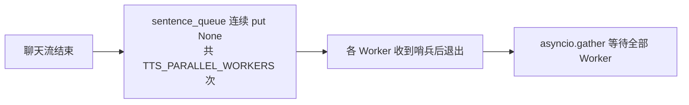
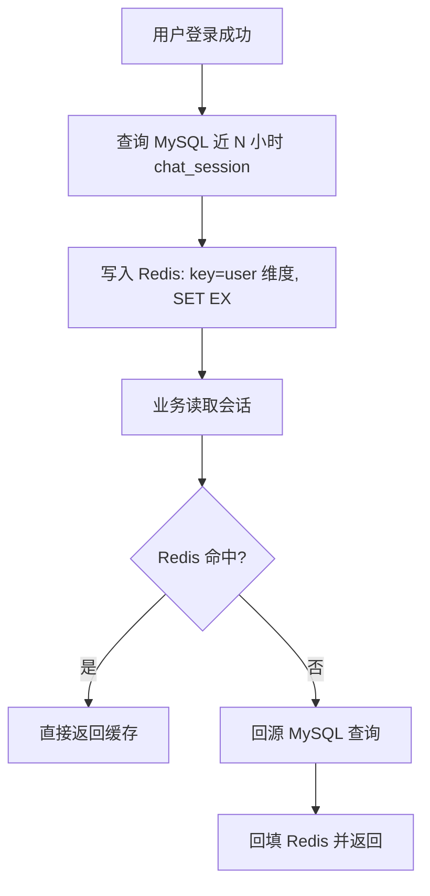

# 后端项目架构说明

## 1. 总览

本仓库 **`PY/`** 目录承载基于 **FastAPI** 的应用层服务，默认通过 **`python main.py`** 或 **`uvicorn`** 监听 **`0.0.0.0:8000`**。服务在进程启动时加载 **`PY/.env`**（由 **`main.py`** 在导入路由前执行 `load_dotenv`），为 Ollama、GPT-SoVITS、Live2D 资源路径等提供配置。应用通过 **`CORSMiddleware`** 允许常见本机开发 Origin；若前端运行在不同端口或域名，可在环境变量 **`CORS_ORIGINS`** 中逗号追加（与代码中默认列表合并，见 **`PY/main.py`**）。

核心职责可概括为三类：

1. **对话与驱动数据**：通过 WebSocket 接收用户文本，调用 **Ollama** 完成「动作/表情决策」与「聊天回复」两类推理，并将结构化结果与流式正文下发浏览器。  
2. **语音合成**：在对话流式输出过程中，将待朗读文本分段提交至 **GPT-SoVITS** HTTP 接口，并将生成的 **WAV** 推送到与用户会话绑定的 **`/ws/tts`** 连接。  
3. **周边能力**：可选挂载 **语音识别** WebSocket、**Live2D 数据库** HTTP API 等扩展路由。

以下表述若未特别说明，均默认服务已成功启动且依赖服务（Ollama、按需启用的 GPT-SoVITS）可达。

---

## 2. 分层与模块划分

| 层次 | 说明 | 主要位置 |
|------|------|----------|
| **入口与生命周期** | 创建 FastAPI 实例；在 `lifespan` 中调用 `init_catalog()`，对 **`LIVE2D_PACKAGE`** 默认模型包做一次资源索引预热；并 **`await start_long_memory_consolidator()`** 启动长期记忆后台循环（退出时 **`stop_long_memory_consolidator()`**）。 | `PY/main.py` |
| **WebSocket 对话与 TTS 编排** | `/ws/chat` 接单轮用户消息，串行执行动作 LLM、聊天流式生产、切段入队；**多协程并行 TTS**（**`TTS_PARALLEL_WORKERS`**）+ **`_tts_flush_ordered`** 保序发往 `/ws/tts`。 | `PY/router/wschat.py` |
| **Live2D 资源目录索引** | 按 **Resources 下子目录（模型包）** 扫描 `expressions` / `exp` 与 `motions`，生成供动作 LLM 阅读的上下文与 `catalog` 载荷；结果按包名 **懒加载并缓存**，避免重复读盘。 | `PY/utils/live2d_catalog.py` |
| **TTS 客户端** | 以 HTTP POST 调用 GPT-SoVITS 默认 `/` 接口，上传文本与语言等参数，返回 WAV 二进制。 | `PY/utils/tts.py` |
| **语音识别** | 单独路由，供浏览器端语音输入等场景（具体协议见对应路由实现）。 | `PY/router/asr_ws.py`（含子模块） |
| **Live2D 数据库 API** | REST 风格接口，与 `live2d_db` 包内持久化、存储等逻辑配合。 | `PY/live2d_db/http_api.py` 等 |
| **记忆分层** | Redis 瞬时/短期列表读写、长期 Redis 字符串、拼装进对话 system；长期 MySQL 行与 Redis 缓存一致性由固化工序维护。 | `PY/live2d_db/memory_layers.py`、`PY/router/wschat.py` |
| **长期记忆固化** | 后台按模块常量周期扫描：从 **`chat_session`** 窗口读入 → 规则合并为叙述文本 → 调用 **Ollama** 写入 **`long_memory.period_overview`**（含修补/扩写等）→ **`upsert`** 并 **`write_long_memory_text`** 刷新 Redis。手动全量回填：`python -m live2d_db.long_memory_consolidator`。 | `PY/live2d_db/long_memory_consolidator.py` |

---

## 3. 运行时架构：WebSocket 与双通道

### 3.1 会话与模型包

- 浏览器为一次页面访问生成 **`session`**（UUID 等），并在 **`/ws/chat`** 与 **`/ws/tts`** 的 Query 中传入 **相同** 的 `session`（或 `sid`），服务端用字典 **`_session_tts_ws[session_id]`** 持有当前 TTS 专用 WebSocket。  
- **`package`**（或 `live2d_package` / `model`）表示 **`Demo/public/Resources/<package>`** 下的 Live2D 模型包目录名。连接 **`/ws/chat`** 时解析该参数（经安全校验，禁止 `..` 与路径分隔符），得到 **`get_catalog_for_package(package)`** 的索引结果，用于：连接建立后立即下发的 **`type: catalog`**、以及本条用户消息对应的 **动作/表情 LLM** 上下文。  
- 同一进程内 **不同 `package` 各自缓存一份** `Live2dCatalog`，首次访问某包时扫描磁盘，后续命中缓存。
- `chat_session` 已引入 **`package_key`** 字段；同一 `user_id` 下按 **`package_key + session_key`** 区分会话，避免 A/B 模型的历史对话互相混入。

### 3.2 `/ws/chat` 行为概要

1. **`accept`** 后根据 **`session` + `package`** 记录日志并 **`send_json(catalog)`**。  
2. 循环 **`receive_json`**，读取 **`message`**。  
3. 在线程池中调用 **`OLLAMA_ACTION_MODEL`**（非流式），解析得到 **`expression` / `motion`**；经规范化、集合校验与可选 **单侧补全回退**（见下文环境变量）后，与后续聊天流的第一段文本一起通过 **`_chunk_json(..., expression=, motion=)`** 下发。  
4. 使用 **异步队列 + 线程池** 消费 Ollama **`stream=True`** 的聊天输出，按 token 迭代写入缓冲区；**仅首条 `chunk` 携带 `expression`/`motion`**，其余增量仅含 **`content`**。  
5. 与此同时，将缓冲区按 **句末标点**（及可选的 token 兜底策略）切句，为每句分配序号后入 **`sentence_queue`**，由若干个 **`tts_worker`** 协程（数量由 **`TTS_PARALLEL_WORKERS`** 配置）并行调用 **`gpt_sovits_tts`**，经 **`_tts_flush_ordered`** 向 **`_session_tts_ws[session]`** 按 **`index`** 从小到大发送 **`type: audio_chunk`**，再发送 **二进制 WAV**（详见 **第 6 节**）。  
6. 流结束发送 **`type: done`**；异常路径发送 **`type: error`**。

因此：**文本流始终经 `/ws/chat` 下发**；**朗读音频经同会话的 `/ws/tts` 下发**，二者通过 **`session`** 配对，而非在同一条 WebSocket 上混传 JSON 与音频。

**合并流式 TTS（MiMo 等）**：当 **`wschat`** 判定 **`merged_stream`** 为真（例如已配置 MiMo 且引擎走合并路径）时，语音帧可在 **`/ws/chat`** 上以 **`type: chunk_audio`**（JSON 含 **`index` / `text` / `size`** 等）后紧跟 **二进制 WAV** 下发，浏览器侧见 **`docs/聊天TTS与Live2D口型同步.md`**。此时 **`/ws/tts`** 仍可并存于其它合成路径；具体以当前 **`PY/router/wschat.py`** 分支为准。

### 3.3 `/ws/tts` 行为概要

连接后注册到 **`_session_tts_ws`**，本体仅需维持连接以接收服务端推送的 **`audio_chunk` 元数据 + 二进制帧**；不负责上传合成文本（合成由 `/ws/chat` 侧逻辑触发）。

---

## 4. 大模型职责划分

| 角色 | 环境变量 | 输入特点 | 输出用途 |
|------|-----------|----------|----------|
| **聊天模型** | `OLLAMA_MODEL` | 仅用户句 + 短 system（`OLLAMA_CHAT_SYSTEM`），**不**附带全量表情/动作表 | 流式自然语言回复正文 |
| **动作/表情模型** | `OLLAMA_ACTION_MODEL` | System 为 **`action_llm_system_text`**（含当前包内可引用资源说明） | 严格 JSON：`expression`、`motion`、`reason`；经服务端解析与回退后，写入 **本轮第一条文本 `chunk`** |

两套调用相互独立：先完成动作/表情决策，再启动聊天流式；聊天内容 **不再** 反向写入表情/动作字段。

---

## 5. Live2D 目录索引与 `catalog`

- **扫描根**：默认 **`Demo/public/Resources`**（可用 **`LIVE2D_RESOURCES_ROOT`** 覆盖）。  
- **表情**：`<package>/expressions/`、`<package>/exp/` 下递归 **`*.exp3.json`**。  
- **动作**：`<package>/motions/` 下递归 **`*.motion3.json`**。  
- **`ws_catalog_message()`** 提供：`package_key`、`expression` / `motion` 标识名数组、对应相对路径数组。标识名由文件名去掉约定后缀得到，与 **`model3.json` 中 `Name` 字段及前端 `setExpression` 所用 id** 应对齐。

**`init_catalog()`**：启动时加载 **`LIVE2D_PACKAGE`** 指定包；**`get_catalog_for_package(key)`**：按连接参数动态加载并缓存各包。

---

## 6. 语音合成切段策略

- **默认**：按 **`TTS_FLUSH_EVERY_N_SENTENCE_END`**（默认 **3**）累计 **句末标点**（**`？。！；` 及英文 `.;` 等**，与代码中 **`_SENTENCE_PUNC`** 一致）次数，**满 N 次**再将当前缓冲**整段**送 TTS，并**清空缓冲与计数**，后续正文重新攒；本轮回复**流结束**时若仍有残留，**不足 N 次也会刷净**并同样清空。  
- **可选**：**`TTS_FLUSH_EVERY_N_SENTENCE_END=1`**：恢复「每遇到一处句末标点即切段」；此时 **`TTS_MIN_CHARS_PER_CHUNK`**（默认 **8**）可避免极短一句单独送 TTS。  
- **可选**：**`TTS_MAX_TOKENS_WITHOUT_PUNC`**：超长无标点时仍可按 token 数强制切段（**≥4**）；为 **`0`** 或未设则不启用。  
- 语速、语言等由 **`TTS_SPEED`**、**`TTS_TEXT_LANGUAGE`** 等环境变量控制（见代码内读取处）。

### 6.1 当前实现：切段 → 队列 → 多协程并行合成 + 保序发送

实现位于 **`PY/router/wschat.py`**：

- 流式正文按标点（及可选 token 上限）切成 **句子字符串**；每句入队前分配 **固定序号** `1..N`，以 **`(index, text)`** 形式 **`put`** 进 **`sentence_queue`**。  
- **`TTS_PARALLEL_WORKERS`**（默认 **2**，范围 **1～8**）个 **`tts_worker`** 协程从队列取任务，各自 **`asyncio.to_thread(gpt_sovits_tts, ...)`**；多句可 **同时推理**。  
- 合成结果写入 **`tts_completed[index] = (text, wav)`**，再调用 **`_tts_flush_ordered()`**：在 **`tts_send_lock`** 下循环，**仅当** **`tts_next_send` 对应序号已有结果** 时才向 **`/ws/tts`** 发送 **一条 JSON + 一段 WAV**，然后 **`tts_next_send += 1`**；若 **`index == 3`** 先算完而 **`2` 未就绪**，则 **3** 暂存在字典中，**不会**抢先下发。  
- **`TTS_PARALLEL_WORKERS=1`** 时等价于单 worker 串行推理（仍走同一套保序逻辑）。  
- 合成异常或 **`/ws/tts` 未连接** 时，该句 **`wav` 为空 `bytes`**，仍占用 **`index`** 并尽力发送（**`size` 可为 0**），避免 **`next_send`** 永久阻塞。

### 6.2 下行 `audio_chunk` 与 `index`

每条语音对应先发一条 JSON，再发二进制帧（实现见 **`_try_send_json` / `_try_send_bytes`**）：

| 字段 | 含义 |
|------|------|
| **`type`** | 固定 **`audio_chunk`**。 |
| **`index`** | 正整数，**本会话本轮内按切段顺序从 1 递增**，与入队序号一致；并行合成时仍 **按该序号从小到大** 出现在 WebSocket 上。 |
| **`text`** | 本段合成的原文句子。 |
| **`size`** | 紧随其后的 WAV 字节长度（失败或未连接时可能为 **0**）。 |

前端宜按 **`index`** 衔接播放；服务端已保证 **`index` 在信道上的递增顺序**。

### 6.3 引擎侧并行与线程安全（补充）

- **`_tts_flush_ordered`** 只保证 **协议层** 发往 **`/ws/tts`** 的顺序；若 GPT-SoVITS 服务端或 PyTorch **不支持**多请求并发，可能出现排队、显存压力或错误，可将 **`TTS_PARALLEL_WORKERS`** 设为 **1**，或从部署侧限制并发。

### 6.4 流程图

下图可在支持 **Mermaid** 的编辑器或 GitHub 预览中渲染。若环境不支持，可对照图中节点与 **第 6.1 节** 文字说明理解。

**（1）切段 → 队列 → 并行合成 → 保序发往 `/ws/tts`**


**说明**：任一 Worker 在写入 **`tts_completed`** 后都会调用 **`_tts_flush_ordered()`**；当较小序号先完成时，同一次或后续 **`flush`** 即可从 **`tts_next_send`** 起连续发送多段。

**（2）本轮流结束时的收尾（示意）**



---

## 7. 主要环境变量一览

| 变量 | 含义 |
|------|------|
| `OLLAMA_HOST` / `NO_PROXY` | Ollama 客户端连接与代理例外 |
| `OLLAMA_MODEL` / `OLLAMA_ACTION_MODEL` | 聊天与动作/表情模型名 |
| `OLLAMA_NUM_PREDICT` | 可选；若设置则为聊天流式 **num_predict** 上限。未设置则**不限制**（由 Ollama/模型上下文决定） |
| `OLLAMA_CHAT_SYSTEM` | 聊天 system 提示词 |
| `GPTSOVITS_API_BASE` | GPT-SoVITS HTTP 基址 |
| `LIVE2D_PACKAGE` | 启动预热用的默认模型包名 |
| `LIVE2D_RESOURCES_ROOT` | Resources 根目录绝对路径（可选） |
| `LIVE2D_ACTION_FALLBACK_IF_EMPTY` | 动作解析一侧为空时是否启用补全逻辑 |
| `LIVE2D_FALLBACK_EXPRESSION` / `LIVE2D_FALLBACK_MOTION` | 单侧缺省时的优先默认标识（可选） |
| `TTS_SPEED` / `TTS_TEXT_LANGUAGE` / `TTS_MAX_TOKENS_WITHOUT_PUNC` | TTS 参数与切段策略 |
| `TTS_FLUSH_EVERY_N_SENTENCE_END` | 累计 **N 个句末标点**再整段送 TTS（默认 **3**）；送完后清空再攒；**1**=每遇句末标点一切（配合下项防过短） |
| `TTS_MIN_CHARS_PER_CHUNK` | 仅在 **`TTS_FLUSH_EVERY_N_SENTENCE_END=1`** 时生效：句末切段时**最少字数**（默认 **8**） |
| `TTS_PARALLEL_WORKERS` | 同一会话内并行 TTS 协程数（默认 **2**，**1** 为串行推理；上限 **8**） |
| `REDIS_URL` | Redis 连接串（优先于 host/port 配置） |
| `REDIS_HOST` / `REDIS_PORT` / `REDIS_DB` / `REDIS_PASSWORD` | Redis 直连参数（未设置 `REDIS_URL` 时使用） |
| `REDIS_CHAT_LOGIN_LOOKBACK_HOURS` | 登录缓存回溯窗口（小时，默认 **24**） |
| `REDIS_CHAT_LOGIN_MAX_ROWS` | 登录缓存最多会话条数（默认 **1000**） |
| `REDIS_CHAT_LOGIN_TTL_SECONDS` | 登录缓存 TTL（秒，默认 **86400**） |
| `REDIS_CHAT_SESSION_KEY_PREFIX` | 登录缓存 key 前缀（默认 `chat_session:recent24h:user`） |

### 7.1 登录后 `chat_session` 缓存策略

当前实现中，`POST /api/users` 命中“用户名已存在且密码正确”的登录分支后，会把该用户近 24 小时（可配）的 `chat_session` 回写到 Redis，供后续会话场景快速读取。

**缓存键结构（示例）**

- 默认 key：`chat_session:recent24h:user:12`
- 可通过 `REDIS_CHAT_SESSION_KEY_PREFIX` 改前缀，user_id 始终作为末尾分片。

**缓存值结构（示例）**

```json
[
  {
    "session_id": 101,
    "user_id": 12,
    "package_key": "Xiaozi",
    "session_key": "web-8c2f",
    "user_input": "今天有点紧张",
    "ai_reply": "先别急，我们一步一步来。",
    "emotion_tag": "焦虑",
    "create_time": "2026-05-02T01:21:33"
  }
]
```

**TTL 与失效策略**

- 默认 TTL：`86400s`（24 小时），由 `REDIS_CHAT_LOGIN_TTL_SECONDS` 控制。
- 登录时采用“覆盖写”策略：重新计算近窗数据并 `SET + EX` 覆盖旧值，避免增量拼接导致脏数据累积。
- Redis 不可用/未安装时降级：只记录日志，不影响登录主流程。

**命中与回源流程（建议）**



---

## 8. 客户端请求与下行消息类型（摘要）

**上行（`/ws/chat`）**：`{"message": "<用户文本>"}`。

**下行 JSON `type`**：

- **`catalog`**：连接后首包，全量可选表情/动作与路径。  
- **`chunk`**：首条可含 **`content` + `expression` + `motion`**；后续仅 **`content`**。  
- **`chunk_audio`**（可选）：合并流开启时，声明本段音频元数据后紧跟 **二进制 WAV**（与 **`docs/聊天TTS与Live2D口型同步.md`** 一致）。  
- **`done`**：本轮结束。  
- **`error`**：业务或上游错误。

**TTS 通道**：若未走合并流，朗读仍通过 **`/ws/tts`**：**`audio_chunk`**（JSON，含 **`index` / `text` / `size`**，见 **第 6.2 小节**）后紧跟 **二进制 WAV**；并行合成与保序发送见 **第 6.1～6.3 小节**。

---

## 9. 后端 HTTP 接口总表（当前实现）

> 说明：以下均来自 `PY/live2d_db/http_api.py`，统一前缀为 `/api`。  
> `PY/router` 下目前为 WebSocket（`/ws/chat`、`/ws/tts`、`/ws/asr`），不属于 HTTP 接口清单。

### 9.0 统一响应格式约束（`code/message/data`）

`/api/*` 接口通过路由级封装统一响应结构：

- 成功（HTTP 2xx）：
  - `code = 0`
  - `message = "ok"`
  - `data = 原接口业务数据（对象/数组/计数对象等）`
- 失败（HTTP 非 2xx）：
  - `code = HTTP 状态码（如 400/404/500）`
  - `message = 错误信息（优先取异常 detail）`
  - `data = null`

示例（成功）：

```json
{
  "code": 0,
  "message": "ok",
  "data": {
    "total": 12
  }
}
```

示例（失败）：

```json
{
  "code": 404,
  "message": "用户不存在",
  "data": null
}
```

### 9.1 Users

| Method | Path | 说明 |
|---|---|---|
| POST | `/api/users` | 创建用户；若用户名已存在且密码正确，按“登录”处理并将该用户近 24h `chat_session` 写入 Redis 缓存 |
| GET | `/api/users` | 用户列表（支持分页） |
| GET | `/api/users/count` | 用户总数 |
| GET | `/api/users/resolve` | 按用户名或手机号解析用户 |
| GET | `/api/users/{user_id}` | 获取单个用户 |
| PUT | `/api/users/{user_id}` | 更新用户 |
| DELETE | `/api/users/{user_id}` | 删除用户 |

### 9.2 Chat Sessions

| Method | Path | 说明 |
|---|---|---|
| POST | `/api/chat-sessions` | 创建会话记录 |
| GET | `/api/chat-sessions` | 会话列表（按用户、模型包 `package_key`、会话键 `session_key`、分页） |
| GET | `/api/chat-sessions/count` | 会话总数（按用户，可附加 `package_key`、`session_key`） |
| GET | `/api/chat-sessions/{session_id}` | 获取单条会话 |
| PUT | `/api/chat-sessions/{session_id}` | 更新会话 |
| DELETE | `/api/chat-sessions/{session_id}` | 删除会话 |

### 9.3 Long Memories

| Method | Path | 说明 |
|---|---|---|
| POST | `/api/long-memories` | 创建长期记忆 |
| GET | `/api/long-memories` | 长期记忆列表（按用户、分页） |
| GET | `/api/long-memories/count` | 长期记忆总数（按用户） |
| GET | `/api/long-memories/{memory_id}` | 获取单条长期记忆 |
| PUT | `/api/long-memories/{memory_id}` | 更新长期记忆 |
| DELETE | `/api/long-memories/{memory_id}` | 删除长期记忆 |

### 9.4 Personas

| Method | Path | 说明 |
|---|---|---|
| POST | `/api/personas` | 创建人设（全局模板） |
| GET | `/api/personas` | 人设列表（`enabled_only` / `status` / 分页等查询参数见实现） |
| GET | `/api/personas/count` | 人设总数 |
| GET | `/api/personas/by-package/{package_key}?user_id=` | 读取某用户在某模型包上的人设；无记录时返回占位 |
| GET | `/api/personas/package-bound?user_id=` | 列出该用户全部「按包绑定」人设 |
| POST | `/api/personas/expand-from-hints` | 根据简短关键词调用 LLM 扩写 `character_desc` / `tone_style`（**不入库**，供表单预览） |
| PUT | `/api/personas/by-package/{package_key}?user_id=` | Upsert 包级人设（请求体见 `PersonaPackageUpsert`） |
| GET | `/api/personas/{persona_id}` | 获取单个人设 |
| PUT | `/api/personas/{persona_id}` | 更新人设 |
| DELETE | `/api/personas/{persona_id}` | 删除人设 |

### 9.5 User Profiles

| Method | Path | 说明 |
|---|---|---|
| GET | `/api/user-profiles/by-user/{user_id}` | 按用户获取画像 |
| PUT | `/api/user-profiles/by-user/{user_id}` | 按用户 Upsert 画像 |
| GET | `/api/user-profiles/{profile_id}` | 按画像 ID 获取 |
| DELETE | `/api/user-profiles/{profile_id}` | 删除画像 |

### 9.6 Remind Triggers

| Method | Path | 说明 |
|---|---|---|
| POST | `/api/remind-triggers` | 创建提醒触发器 |
| GET | `/api/remind-triggers` | 触发器列表（按用户/触发状态、分页） |
| GET | `/api/remind-triggers/count` | 触发器总数（按用户/触发状态） |
| GET | `/api/remind-triggers/pending-scan` | 拉取待扫描触发器列表 |
| GET | `/api/remind-triggers/pending-count` | 待扫描触发器数量 |
| GET | `/api/remind-triggers/{trigger_id}` | 获取单个触发器 |
| PUT | `/api/remind-triggers/{trigger_id}` | 更新触发器 |
| DELETE | `/api/remind-triggers/{trigger_id}` | 删除触发器 |

#### 9.6.1 `user_profile` 与 `remind_trigger` 的边界说明

二者是**互补关系**，不是重复建模：

- `user_profile`（尤其 `user_tags`）用于保存用户长期画像标签，例如“考研党”“压力大”“晚间活跃”，回答“用户是谁、长期倾向是什么”。  
- `remind_trigger` 用于保存具体待执行事项，包含 `trigger_time`、`trigger_content`、`is_triggered`，回答“何时做什么、是否已执行”。  

为避免冲突，约定如下：

- 画像表不保存具体时间点任务；
- 待办表必须包含触发时间与执行状态；
- 标签用于“召回与策略”，待办用于“调度与执行”。

### 9.7 Live2D TTS 参考音频

用于为 **GPT-SoVITS / 克隆音色路径**等保存「参考 wav + 提示文本」；音频可经 **ffmpeg** 转为标准 PCM WAV 后写入对象存储。

| Method | Path | 说明 |
|---|---|---|
| GET | `/api/live2d-tts-refers` | 列表；可按 `user_id` + 可选 `package_key` 筛选 |
| POST | `/api/live2d-tts-refers/upload` | 表单：`user_id`、`package_key`、`prompt_text`、`prompt_language`、上传文件 `refer_audio` |

> **说明**：历史上文档曾列出 **`/api/live2d-actions`** CRUD；**当前 `http_api.py` 已不再挂载该组路由**。若需对接旧表请自行恢复路由或查版本历史。

### 9.8 System Config

| Method | Path | 说明 |
|---|---|---|
| POST | `/api/system-config` | 创建配置项 |
| GET | `/api/system-config` | 配置项列表 |
| GET | `/api/system-config/key/{config_key}` | 按配置键读取 |
| PUT | `/api/system-config/key/{config_key}` | 按配置键更新 |
| GET | `/api/system-config/{config_id}` | 按配置 ID 读取 |
| PUT | `/api/system-config/{config_id}` | 按配置 ID 更新 |
| DELETE | `/api/system-config/key/{config_key}` | 按配置键删除 |
| DELETE | `/api/system-config/{config_id}` | 按配置 ID 删除 |

### 9.9 Live2D Model Assets

| Method | Path | 说明 |
|---|---|---|
| POST | `/api/live2d-model-assets` | 创建模型资源索引记录 |
| POST | `/api/live2d-model-assets/upload-zip` | 上传模型 zip，自动解包、上传对象存储并重建该包索引 |
| GET | `/api/live2d-model-assets` | 资源索引列表（按用户、包名、类型、分页） |
| GET | `/api/live2d-model-assets/count` | 资源索引总数（按过滤条件） |
| GET | `/api/live2d-model-assets/packages` | 按用户聚合已有包：文件数、`asset_types`、是否含入口 model3、是否已有 TTS 参考 |
| GET | `/api/live2d-model-assets/download-url?asset_id=...` | 生成单资源临时下载链接（返回 `url`、`expires_in`） |
| DELETE | `/api/live2d-model-assets/by-package/{package_key}` | 按包删除该用户资源索引；**同步删除**该用户该包的包级人设行，并清理 Redis 内 MiMo 导演人设缓存（若有） |
| GET | `/api/live2d-model-assets/{asset_id}` | 获取单条资源索引 |
| PUT | `/api/live2d-model-assets/{asset_id}` | 更新资源索引 |
| DELETE | `/api/live2d-model-assets/{asset_id}` | 删除资源索引 |

### 9.10 模型上传入库流程（当前实现）

该流程对应“上传 → 存储 → MySQL 入库 → 前端按需取临时 URL”，用于替代手工放置本地 `Resources` 目录：

1. 前端或管理端向 **`POST /api/live2d-model-assets/upload-zip`** 提交表单：`user_id`、可选 `package_key`、`model_zip`。  
2. 服务端校验 zip 合法性与路径安全（过滤空路径、`..`、非法前缀）。  
3. 解析包内 `*.model3.json` 入口与 `FileReferences`（`Moc`、`Textures`、`Physics`、`DisplayInfo`、`Expressions`、`Motions`），提取模型引用关系。  
4. 将 zip 内文件上传到对象存储（MinIO/S3），记录 `object_key`，并保留兼容用 `public_url`。  
5. 清理该用户该包在 `live2d_model_asset` 的旧索引行，再批量写入新索引（含 `asset_type`、`logical_name`、`motion_group`、`is_listed_in_model3`、`is_entry_model` 等字段）。  
6. 前端读取资源索引后，通过 **`GET /api/live2d-model-assets/download-url`** 按 `asset_id` 获取临时可下载地址（`url` + `expires_in`），用于加载 model3/moc3/贴图/动作/表情。  
7. 整体路径改为“索引持久化 + 按需签名放行”，不再依赖“先拷贝到本地静态目录再手工扫描”。

关键落库表：`live2d_model_asset`（文件级索引，包含对象存储键、类型、动作组、是否被 model3 引用等）。

> 合计：以 **`PY/live2d_db/http_api.py`** 中 **`@router` 路由计数为准**，当前为 **61** 条（`GET 31`、`POST 10`、`PUT 10`、`DELETE 10`）。

---

## 10. 实现索引

| 内容 | 文件 |
|------|------|
| WebSocket 对话、动作 LLM、聊天流、TTS 队列 | `PY/router/wschat.py` |
| 聊天 TTS 口型与 `chunk_audio`（前后端约定） | `docs/聊天TTS与Live2D口型同步.md` |
| MinIO 客户端、预签名、`MINIO_REGION` | `PY/live2d_db/minio_storage.py` |
| 资源扫描、`catalog`、动作 LLM 系统提示拼接 | `PY/utils/live2d_catalog.py` |
| GPT-SoVITS HTTP 封装 | `PY/utils/tts.py` |
| 应用入口与 `lifespan`、CORS | `PY/main.py` |
| 数据库 HTTP 接口 | `PY/live2d_db/http_api.py` |
| 记忆分层（瞬时/短期/长期 Redis） | `PY/live2d_db/memory_layers.py` |
| 长期记忆固化后台任务 | `PY/live2d_db/long_memory_consolidator.py` |

与 GPT-SoVITS 部署、联调的细节可参考同目录 **`GPT-SoVITS与PY服务对接.md`**（若仓库内存在）。
