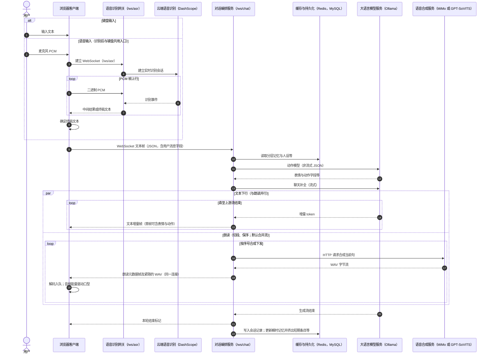
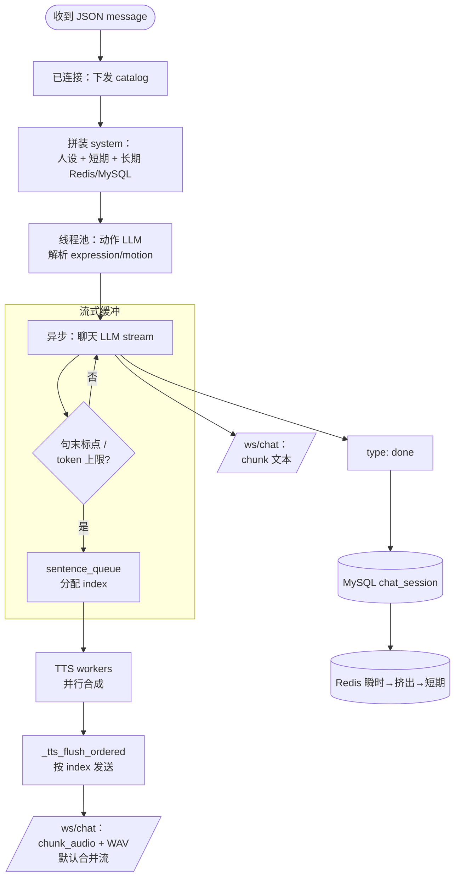
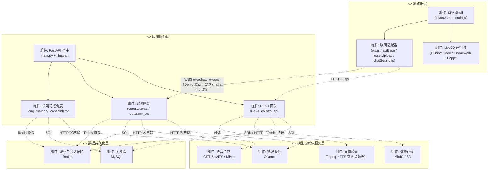

# 架构与时序图

本文档给出与本仓库实现相对应的顺序图、流程图、分层组件图（UML 组件图风格）及 **UML 用例图**（Mermaid 绘制）。其中 **§1** 主对话顺序图对应论文 **§3.4 用例与交互流程**、**§3.6 数据流与时序**：键盘与语音仅在「得到用户 utterance 文本」之前分叉，**进入 `/ws/chat` 的载荷均为同一形态的文本消息**。可在 VS Code、GitHub、GitLab 等支持 Mermaid 的 Markdown 预览中渲染。

---

## 1. 顺序图：主对话端到端（键盘 / 语音汇合为文本）

**概念**：用户在界面上的输入路径有两种——直接键盘输入，或先经麦克风由 ASR 转为终稿字符串；二者在前端汇合为 **`sendChatMessage` → `/ws/chat`** 的 **`{ "message": "..." }`**，其后链路完全一致：**读 Redis/MySQL 记忆与人设 → Ollama 动作模型 → Ollama 聊天流式 → 服务端切段调用 TTS → 下行播放与口型**。

**与附带 Demo 一致的路径**：朗读帧默认经 **同一条 `/ws/chat`** 下发：先 JSON **`chunk_audio`** 元数据帧，**再紧随二进制 WAV**（合并流）；浏览器侧解码入队驱动播放与口型；**不依赖**独立朗读连接。字段语义以实现代码为准。



**配置提示**：ASR 依赖 **`DASHSCOPE_API_KEY`**；前端可通过 **`VITE_ASR_WS_URL`** 覆盖 **`/ws/asr`** 地址（见 `Demo/src/api/wsConfig.js`）。

---

## 2. 流程图：`/ws/chat` 一轮请求（逻辑主干）



---

## 3. 分层架构图（UML 组件图风格）

`<<layer>>` 表示架构层；虚线箭头表示运行时依赖方向；连接器上标注主要协议。



---

## 4. UML 用例图（核心用例）

参与者：**用户**（主要）；**定时扫描 / 提醒任务**（次要，对应库表 `remind_trigger` 等业务侧的待扫描逻辑，具体触发方式以实现为准）。

用例图中 **`«include»`** 表示语音路径在识别完成后 **包含** 将文本送入与文本对话相同的会话链路。

```mermaid
usecaseDiagram
    left to right direction

    actor "用户" as U
    actor "定时扫描与提醒任务" as S

    rectangle "Live2D 数字人系统" {
        usecase "登录 / 注销" as UC_Login
        usecase "文本对话" as UC_Text
        usecase "语音对话" as UC_Voice
        usecase "切换 Live2D 模型" as UC_Model
        usecase "接收主动关怀推送" as UC_Care
        usecase "查看历史会话" as UC_History
        usecase "上传模型音色与角色定义" as UC_AssetPersona
    }

    U --> UC_Login
    U --> UC_Text
    U --> UC_Voice
    U --> UC_Model
    U --> UC_Care
    U --> UC_History
    U --> UC_AssetPersona

    S --> UC_Care

    UC_Voice ..> UC_Text : «include»\n(ASR 结果进入对话)
```

**与实现的粗略对应（便于写论文「实现章节」对照）**

| 用例 | 典型前端 / 后端触点 |
|------|---------------------|
| 登录 / 注销 | `Login.html`、`live2d_info`、`POST /api/users`（登录分支） |
| 文本对话 | `ws.js` → `/ws/chat`（文本 `chunk`；朗读默认 `chunk_audio` + WAV 同连接） |
| 语音对话 | `SpeechRecognition.js`、`/ws/asr` → 终稿文本再走文本对话 |
| 切换 Live2D 模型 | 工具栏切换、`setLive2dPackage`、`reconnectChatWebSocketsForNewPackage` |
| 接收主动关怀推送 | `remind_trigger` + 业务推送通道（若当前仅为 REST 查询待触发项，可在正文注明「数据模型已具备，推送通道可扩展」） |
| 查看历史会话 | `chatSessions.js` → `GET /api/chat-sessions` |
| 上传模型 / 音色与角色定义 | `upload-zip`、`live2d-tts-refers/upload`、`characterDef.html` / `/personas/by-package` |

---

## 相关文档

- 后端模块与 HTTP 清单：`docs/后端项目正文.md`
- 前端与 WebSocket：`docs/前端项目正文.md`
- 记忆分层与长期固化：`docs/聊天双层记忆与Redis摘要.md`
- TTS 与口型：`docs/聊天TTS与Live2D口型同步.md`
