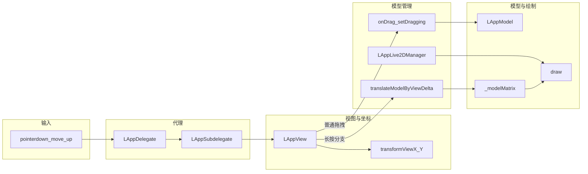

# 模型平移与长按拖拽

本文档说明本 Demo 中 **「在画布上平移整个 Live2D 模型」** 的原理、矩阵与名词含义，以及 **长按后拖拽平移** 的架构与关键函数。另见应用级架构说明：[DemoArchitecture.md](DemoArchitecture.md)。

---

## 一、概述

在本项目中存在两条不同的「跟手」行为，请勿混淆：

| 行为 | 本质 | 典型入口 |
|------|------|----------|
| **参数拖拽**（转头、眼球等） | 修改模型 **参数**（如 `AngleX`、`EyeBallX`），由 Framework 的 `setDragging` 驱动 | `LAppLive2DManager.onDrag` → `LAppModel.setDragging` |
| **模型平移**（整个人在画面上移动） | 修改 **`CubismModelMatrix`（`_modelMatrix`）** 的平移分量 | `LAppLive2DManager.translateModelByViewDelta` → `getModelMatrix().translateRelative` |

**长按平移**是在用户 **长按** 且命中模型区域后，进入第二种路径；平移过程中不再调用 `onDrag`（避免与参数拖拽叠加）。

---

## 二、名词解释（术语表）

### Projection（投影矩阵）

在 [lapplive2dmanager.js](../Demo/src/lapplive2dmanager.js) 的 `onUpdate` 中，局部变量 `projection` 为 `CubismMatrix44` 实例。根据画布宽高比调用 `scale`，用于把绘制空间与 **画布像素宽高比** 对齐（竖屏/横屏分支见源码）。随后会 **右乘** `_viewMatrix`（见下）。

### View Matrix（`_viewMatrix`）

位于 [lappview.js](../Demo/src/lappview.js) 的 `CubismViewMatrix` 实例，表示 **镜头/视口** 侧变换：例如滚轮缩放时 `onWheel` 里调用 `adjustScale`。每帧渲染前通过 `lapplive2dmanager.setViewMatrix(this._viewMatrix)` 传入管理器，在 `onUpdate` 中并入 `projection`。

### Model Matrix（`_modelMatrix`）

`LAppModel` 继承自 Framework 的 `CubismUserModel`，内部持有 **`CubismModelMatrix`**。模型 JSON 中的 **layout** 在加载流程里通过 `setupFromLayout` 作用到该矩阵，决定 **初始位置与缩放**。在画面上「拖动整个人」时，应对该矩阵做 **平移累加**（本 Demo 使用 `translateRelative`）。

### MVP 链在本 Demo 中的拼接顺序

`onUpdate` 中（简化）：

1. 构造 `projection`（比例适配等）；
2. `projection.multiplyByMatrix(this._viewMatrix)` —— 得到 **含镜头** 的矩阵；
3. `model.draw(projection)` 内再执行 `matrix.multiplyByMatrix(this._modelMatrix)`。

因此从语义上可记为：**最终作用于顶点的矩阵 = Projection × View × Model**（具体左乘/右乘顺序以实现为准，与 `multiplyByMatrix` 的约定一致）。参考：

- [lapplive2dmanager.js `onUpdate`](../Demo/src/lapplive2dmanager.js)（`projection` 与 `_viewMatrix`）
- [lappmodel.js `draw`](../Demo/src/lappmodel.js)（`matrix.multiplyByMatrix(this._modelMatrix)`）

### 逻辑坐标 / 视图坐标

`LAppView.transformViewX` / `transformViewY` 把 **设备像素坐标**（已乘 `devicePixelRatio` 的指针坐标）先经 `_deviceToScreen` 再经 `_viewMatrix.invertTransform*`，得到与 **`hitTest`、`onTap` 一致** 的坐标系。长按平移的 **增量 `dx, dy`** 也在此坐标系下计算，才能保证与手指移动一致。

### devicePixelRatio

浏览器报告的 `window.devicePixelRatio` 用于把 **CSS 像素** 换算为 **画布物理像素**，与 `TouchManager`、`_deviceToScreen` 使用的坐标一致。长按 **slop**（`LongPressSlopPx`）会乘以该比例后再与移动距离比较。

### Slop（容差）

在长按定时器触发前，若手指移动超过一定距离，则 **取消长按**，改回普通的参数拖拽（`onDrag`）。常量见 [lappdefine.js](../Demo/src/lappdefine.js) 中的 `LongPressSlopPx`。

---

## 三、原理：为何平移要改模型矩阵

- 模型顶点先经 **模型空间** 变换，再进入 **视图/投影**。若只想在屏幕上「挪动立绘整体」，应改变 **模型在世界/场景中的位姿**，即 **`_modelMatrix`**，而不是去改 `ParamAngleX` 等 **表情/骨骼参数**。
- **`onDrag` → `CubismUserModel.setDragging`**（Framework）会把指针位置交给内部 **`CubismTargetPoint`**，在 `update()` 里影响 **参数**，实现 **转头、转眼珠** 等，**不会**把整个人平移到另一处。

---

## 四、架构与数据流

**分岔点** 仅在 [lappview.js](../Demo/src/lappview.js)：

- `_modelTranslateActive === true`：按帧计算视图坐标差，调用 `translateModelByViewDelta`，**不**调用 `onDrag`。
- 否则：沿用原有逻辑（`onTouchesMoved` 末尾 `lapplive2dmanager.onDrag(viewX, viewY)`）。

---

## 五、长按平移交互（状态要点）

配置常量（[lappdefine.js](../Demo/src/lappdefine.js)）：

| 常量 | 含义 |
|------|------|
| `LongPressModelMs` | 长按判定时间（毫秒），默认 450 |
| `LongPressSlopPx` | 长按等待期间允许的最大移动（CSS 像素），超过则取消长按 |

**命中条件**：`LAppLive2DManager.isPointOnModel(x, y)` 与 `onTap` 使用的规则一致（Head/Body `hitTest` 或备用矩形）。

**抬起时跳过 `onTap`**：若 `_modelDragDidMove` 或 `_longPressFired` 为真，则本次 **不** 调用 `onTap`，避免与「切换表情 / 播放动作」的点击冲突。长按生效时会先 `onDrag(0, 0)` 清零参数拖拽状态。

---

## 六、函数说明（表格）

### LAppLive2DManager（[lapplive2dmanager.js](../Demo/src/lapplive2dmanager.js)）

| 函数 | 作用 |
|------|------|
| `onDrag(x, y)` | 调用 `model.setDragging(x, y)`，驱动 **参数** 拖拽（转头/眼球等） |
| `isPointOnModel(x, y)` | 判断逻辑坐标是否在模型可交互区域（与 `onTap` 一致） |
| `translateModelByViewDelta(dx, dy)` | 对当前模型的 `getModelMatrix().translateRelative(dx, dy)`，**画布平移** |
| `onUpdate` | 组装 `projection` 与 `_viewMatrix`，调用 `model.draw(projection)` |

### LAppView（[lappview.js](../Demo/src/lappview.js)）

| 函数 | 作用 |
|------|------|
| `transformViewX` / `transformViewY` | 设备坐标 → 与 `hitTest` 一致的逻辑坐标 |
| `onTouchesBegan` | 若在模型上则启动长按定时器；记录起始状态 |
| `onTouchesMoved` | 若已进入平移模式则累加 delta 并 `translateModelByViewDelta`；若在 pending 长按且未超 slop 则只更新 TouchManager；否则进入 `onDrag` |
| `onTouchesEnded` | `onDrag(0,0)`；若未 `skipTap` 则 `onTap`；重置手势状态 |
| `_clearLongPressTimer` | 清除 `setTimeout`，避免泄漏与误触发 |

### LAppModel（[lappmodel.js](../Demo/src/lappmodel.js)）

| 函数 | 作用 |
|------|------|
| `draw(matrix)` | `matrix.multiplyByMatrix(this._modelMatrix)` 后设置 MVP 并绘制 |

### Framework（参考）

| 类型/方法 | 说明 |
|-----------|------|
| `CubismUserModel.setDragging` | 设置内部拖拽目标点，驱动参数，非平移矩阵 |
| `CubismModelMatrix.translateRelative` | 在当前模型矩阵上叠加平移 |

---

## 七、与滚轮缩放的关系

`_viewMatrix` 负责 **镜头缩放**（`onWheel`），`_modelMatrix` 负责 **模型在场景中的位移**。两者在每帧相乘，可同时生效。若平移速度随缩放变化不符合预期，可在 `translateModelByViewDelta` 内对 `dx, dy` 乘以统一系数做手感微调（可选）。

---

## 八、相关文件索引

| 路径 | 说明 |
|------|------|
| [Demo/src/lappview.js](../Demo/src/lappview.js) | 坐标变换、长按与平移逻辑 |
| [Demo/src/lapplive2dmanager.js](../Demo/src/lapplive2dmanager.js) | `onUpdate`、`translateModelByViewDelta`、`onDrag` |
| [Demo/src/lappdefine.js](../Demo/src/lappdefine.js) | `LongPressModelMs`、`LongPressSlopPx` |
| [Demo/src/lappmodel.js](../Demo/src/lappmodel.js) | `draw` 与 `_modelMatrix` |
| [Framework/src/model/cubismusermodel.ts](../Framework/src/model/cubismusermodel.ts) | `setDragging` |
| [Framework/src/math/cubismmodelmatrix.ts](../Framework/src/math/cubismmodelmatrix.ts) | `CubismModelMatrix`、`translateRelative` |
